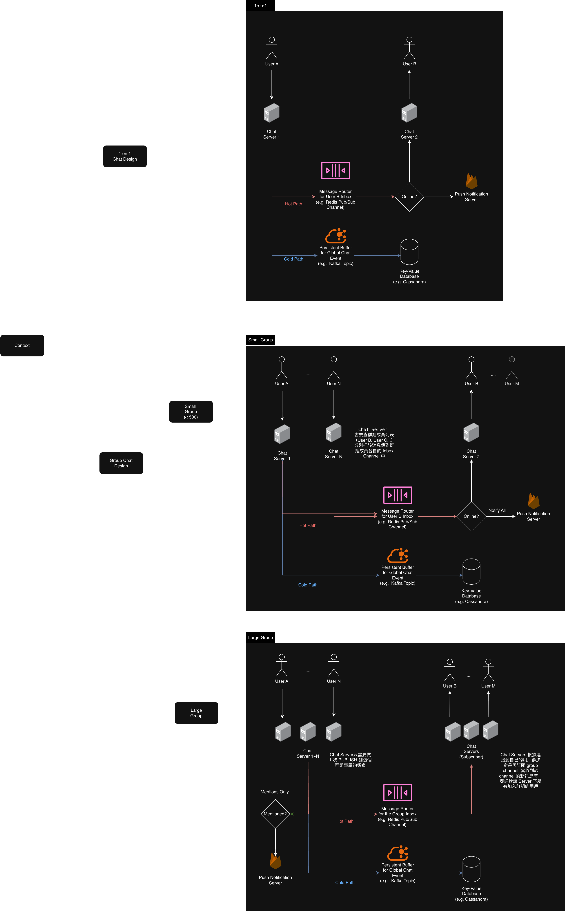

# Chat 系統設計

1. 為了支撐千萬級的高併發，我們採用 WebSocket 取代 Long Polling 來大幅降低握手開銷與延遲，並採用 Dual-Path Routing 架構：熱路徑利用 Redis 實現毫秒級轉發，冷路徑則透過 Kafka 非同步寫入 Cassandra 確保資料持久化。

2. 獨立出 Presence Server 的關鍵在於將狀態擴散的繁重計算與訊息傳遞解耦，確保當大量用戶上下線時，通知好友的負載不會影響到核心聊天的即時性。(狀態變更的成本 (Fan-out)： 當 User A 斷線時，系統不只是要改 User A 的狀態，還要去通知 User A 的 1000 個好友「A 下線了」)，我們可以透過 WebSocket 斷線來更新 User 的上線狀態，而透過 Presence Server 的狀態擴散來通知好友 User A 下線了進行解耦

## High Level Design
### Chat Service Design

### Storage Design
| 通訊軟體 | 核心儲存 (Core Storage) | 技術演進與現狀 |
| :--- | :--- | :--- |
| **Discord** | **ScyllaDB** (C++ Cassandra) | 從 MongoDB -\> Cassandra -\> **ScyllaDB**。 這是最標準的 Wide-Column 用法，利用 Partition Key (Channel) + Clustering Key (MessageID) 來存取。 |
| **Facebook Messenger** | **HBase** (MyRocks/ZippyDB) | 在 2010 年就**棄用 Cassandra** 改用 HBase。 現在更進一步演進為 **Iris** 架構 (基於 HBase + Log) 以及新一代的 ZippyDB (基於 RocksDB)。 |
| **Instagram DM** | **Cassandra** & **HBase** | 早期重度依賴 Cassandra，但隨著 Meta 推動「Unified Messaging (互通訊息)」，後端架構已與 Messenger (HBase/ZippyDB) 大量融合。 |
| **LINE** | **HBase** + **Redis** | LINE 的架構非常標準：**Redis** 做熱緩存與佇列，**HBase** 做海量訊息的永久儲存。 |
| **WeChat (微信)** | **HBase** (修改版) | 微信後端使用的是自行修改過的 HBase 內核，搭配一致性強的 PaxosStore，專門應對 10 億級別的併發。 |
| **WhatsApp** | **Mnesia** (Erlang Native) | **唯一的異類。** 他們使用 Erlang 語言內建的資料庫 Mnesia。 這不是 Wide-Column，而是與 Application Process 緊密結合的 Row-based DB，非常非主流但極其高效。 |

> Facebook 雖然發明了 Cassandra (AP)，但為了 Messenger 追求的「強一致性」以避免刪除的訊息又跑出來，他們最終轉向了能保證資料同步且能直接複用自家龐大 HDFS 基礎建設的 HBase (CP)

> Discord 為了支撐即時且大量的訊息串流，優先選擇了能「線性擴展」且「無單點故障」的 AP 架構 (ScyllaDB)，並透過 Snowflake ID 在前端解決順序問題，以換取比 HBase 更高的寫入吞吐量與服務可用性。

## Trade-off Cheat Sheet
### 核心訊息傳遞與儲存 (Core Messaging & Storage)

| 問題場景   | 採用方案     | 核心技術/機制    | 優點 (Pros) | 缺點/權衡 (Cons) |
| :-------- | :--------- | :-------------- | :--------- | :----------------- |
| **即時訊息轉發** | **Redis Pub/Sub**  | In-Memory 廣播，即發即棄 (Fire-and-Forget)。   | **極低延遲** (微秒級)、輕量、支援數百萬 Channels。    | **無持久化**、無 Offset，斷線即掉資料 (需靠 DB 補)。 |
| **訊息路由設計** | **User Inbox 模式**      | 每個用戶訂閱專屬的 Channel (`inbox:user_A` 是一個**專屬於接收者 (Recipient) 的信箱** )，發送者做 Fan-out。 | **連線數穩定** (1人1連線)、多裝置同步容易、擴展性強。 | 發送給大群組時，發送端 (Server) 負載較高，需寫擴散給多個 user_inbox, 因此通常在大群組中我們不使用user_inbox，而是使用group_channel |
| **海量訊息儲存** | **Wide-Column NoSQL**    | **Cassandra / ScyllaDB** (LSM Tree 結構)。     | **寫入極快**、線性擴展、適合 Time-Series Data。 | 查詢靈活性低 (只能依 Primary Key 查)、維運門檻高。 並且 AP 架構下，無法確保即時的一致性  |
| **訊息 ID 生成** | **Snowflake ID**   | 64-bit 整數 (時間戳 + 機器ID + 序列號)。 | **全域唯一**、**按時間排序** (對 DB 寫入友善)、佔用空間小。 | 依賴 Server 時鐘，需處理時鐘回撥 (Clock Skew) 問題。 |
| **斷線補漏資料** | **推拉結合 (Push-Pull)** | **Cursor-based Sync**。Client 連線時帶上 `last_msg_id` 向 DB 拉取。    | **保證資料不丟失**、邏輯清晰可靠。  | Client 端需實作 Buffer 處理與即時訊息的**競態條件 (Race Condition)**。 |

### 效能優化與擴展性 (Performance & Scalability)

| 問題場景 | 採用方案 | 核心技術/機制 | 優點 (Pros)     | 缺點/權衡 (Cons)    |
| :--------- | :---- | :------------------- | :-------- | :--------- |
| **群組訊息**   | **混合路由策略**     | 小群用 Inbox (寫擴散)；大群用 **Group Channel (讀擴散)**。    | 解決寫擴散的延遲問題，大群組發送成本 O(1)。   | 系統複雜度增加，Client 的 Chat Server 需同時訂閱 Inbox 與 Group Channel。 |
| **重連風暴 (Thundering Herd Problem)** | **三層防禦機制**     | Client: Backoff(第一次等 1秒，失敗等 2秒，再失敗等 4秒...) + Jitter(加上一個隨機數，讓 5 萬個用戶錯開時間) Server: **Graceful Shutdown** | 避免瞬間流量打掛 Server，將峰值抹平。   | 用戶斷線後恢復連線的時間會有些微隨機延遲。  |
| **已讀狀態多次更新** | **Write-Back (寫入合併)**  | **Redis Buffer + Watermark** (僅存最後已讀 ID)。  | 將 500 次 DB 寫入合併為 1 次，保護資料庫。    | **最終一致性**，對方看到「已讀」可能會有幾秒延遲。      |
| **在線狀態更新**     | **惰性更新 (Lazy Update)** | **Redis ZSET** + 條件寫入 (Lua Script)。    | 大幅降低 Redis 寫入量 (QPS)，避免心跳包癱瘓 Cache。 | 狀態不是 100% 即時 (可能有幾分鐘誤差)，需接受 Zombie 用戶。   |

### 搜尋與附加功能 (Search & Features)

| 問題場景   | 採用方案    | 核心技術/機制      | 優點 (Pros)   | 缺點/權衡 (Cons)     |
| :-------- | :-- | :------- | :------ | :------------- |
| **手機端搜尋**   | **Local SQLite**  | **FTS (Full-Text Search)** 模組。    | 體驗極快、無網路可用、隱私性高、Server 零成本。   | 會佔用手機儲存空間、換手機後索引需重建。     |
| **雲端歷史搜尋** | **Elasticsearch** | 非同步寫入 (Kafka -\> ES Consumer)。 | 可搜尋海量歷史資料、支援複雜查詢 (Fuzzy Search)。 | **成本高昂** (ES 很貴)、不適用於端對端加密 (E2EE) 場景。 |

### 小結
Chat 系統應該有以下組件：
1.  **Client:** WebSocket 連線，維護 Local DB (SQLite)，處理重連 Backoff
2.  **Gateway:** 維護長連線，利用 Redis Pub/Sub 做路由 (User Inbox)
3.  **Cache:** Redis 負責「暫存已讀」、「在線狀態 (ZSET)」、「即時訊息」
4.  **Worker:** 負責把 Redis 裡的資料 (如已讀狀態) 批量寫入 DB
5.  **DB:** Cassandra/ScyllaDB 負責永久儲存訊息 (Snowflake ID 排序)
6.  **Sync:** Client 斷線重連時，跳過 Redis，直接找 API 從 DB 拉取 (Pull) 舊資料

## Q. 為什麼不使用 Kafka 處理 Hot Path 聊天路由？
### Redis (Pub/Sub & Streams) vs. Kafka 在聊天系統中的權衡

| 評估維度    | Redis Pub/Sub    | Redis Streams   | Apache Kafka  |
| :--------- | :-------------------- | :---------------- | :---------------- |
| **核心設計哲學**  | **即時廣播** (訊號轉發)      | **輕量級日誌** (In-Memory Log)    | **高吞吐日誌** (Disk-based Log) |
| **1. Topic/Channel 成本** | **極低 (Zero Cost)** Channel 只是字串，不需要預先創建。支援 **數百萬/數億** 個動態 Channel (每個聊天室一個)。 | **低 (Low Cost)** 每個 Stream 是一個 Redis Key (佔記憶體)。適合大量但有限的佇列。    | **極高 (Heavyweight)** Topic 對應磁碟分區與 ZooKeeper Metadata。**不支援**數百萬個 Topic (會導致 Cluster 崩潰)。 |
| **2. 延遲 (Latency)**   | **微秒級 (Microseconds)** 純記憶體操作，不做任何儲存，速度最快。    | **微秒/毫秒級** 記憶體操作，但有資料結構開銷。   | **毫秒級 (Milliseconds)** 需經過 Page Cache 與磁碟順序寫入，適合大批量吞吐，單條轉發稍慢。     |
| **3. 持久化 (Persistence)**   | **無 (None)** 即發即棄，Consumer 不在線就遺失。   | **有 (Memory + Snapshot)** 存在記憶體中，可設定 RDB/AOF 落盤，但主要依賴記憶體大小。 | **強 (Disk-based)** 設計初衷就是持久化日誌，資料可靠性極高，可回放數月前的資料。   |
| **4. 消費模式**   | **Push (推)** 被動接收，Consumer 必須一直連線。   | **Pull (拉) / Block** 支援 Consumer Group，可讀取歷史，類似 Kafka。      | **Pull (拉)** Consumer 主動拉取，適合後端非同步處理，不適合直接推給手機端。  |
| **5. 擴展性瓶頸** | **CPU / 頻寬** 主要受限於網路頻寬和單執行緒 CPU 能力。  | **記憶體 (RAM)** 所有訊息都在 RAM，大量堆積會導致 OOM (Out of Memory)。  | **磁碟 I/O** 受限於硬碟讀寫速度與 Page Cache 大小。  |
| **6. 聊天系統適用場景** | ✅ **WebSocket 訊息路由** 將訊息瞬間推給在線用戶 (Hot Path)。  | ✅ **短期緩衝 / 跨服同步** 用於不穩定的網路環境，暫存最近 5 分鐘訊息。    | ❌ **不適合直接做聊天路由** ✅ **適合做後端解耦** (搜尋、大數據、推播)。 |

Kafka 背後有一個**致命的架構限制**，稱為 **Topic Explosion** 問題。

#### 1\. 粒度 (Granularity) 的差異
  * **Chat System 的需求：** 每個 User Inbox 和 Group 在邏輯上都需要一個獨立的通道。假設你有 5000 萬用戶，你可能會有 5000 萬以上的對話 Channels
  * **Redis Pub/Sub：** 對 Redis 來說，`PUBLISH "chat:user_A" "hello"` 裡的 `"chat:user_A"` 只是一個短暫的字串 Key。不管你有 10 個還是 1 億個 Channel，Redis 都能輕鬆處理，因為它不需要維護 Channel 的元數據 (Metadata)。
  * **Kafka：** Kafka 的 Topic 是實體的檔案目錄 (Partition)。如果你嘗試在 Kafka 建立 1 億個 Topic：
   * Zookeeper/Controller 會因為 metadata 過大而掛掉
   * OS 會因為打開太多 File Handles 而崩潰
   * 磁碟的隨機 I/O 會變得極慢

#### 2\. 消費模型的差異

  * **Chat System 的需求：** 手機端 (Client) 需要的是 Server **主動推 (Push)** 訊息過來
  * **Kafka 的設計：** Kafka 是設計給 Server **主動拉 (Pull)** 的。如果要用 Kafka 做聊天，你的 WebSocket Server 必須寫一個無窮迴圈不斷去 Kafka Pull 資料，這對即時性 (Real-time) 和 CPU 都是巨大的浪費

### 建議架構
| 組件  | 職責    | 選擇原因    |
| :-- | :--- | :--------------- |
| **Redis Pub/Sub** | **"The Router" (路由)**   | 唯一能處理「數億個動態 Channel」且延遲最低的方案      |
| **Redis Streams** | **"The Buffer" (緩衝)**   | (可選) 比 Pub/Sub 可靠一點，適合用來處理「斷線重連」那幾秒鐘的空窗期    |
| **Kafka**   | **"The Pipeline" (管線)** | 不做即時路由，而是做**後端任務的佇列**（如：把訊息送去 ElasticSearch 建立索引、送去 Data Warehouse 做分析） |

