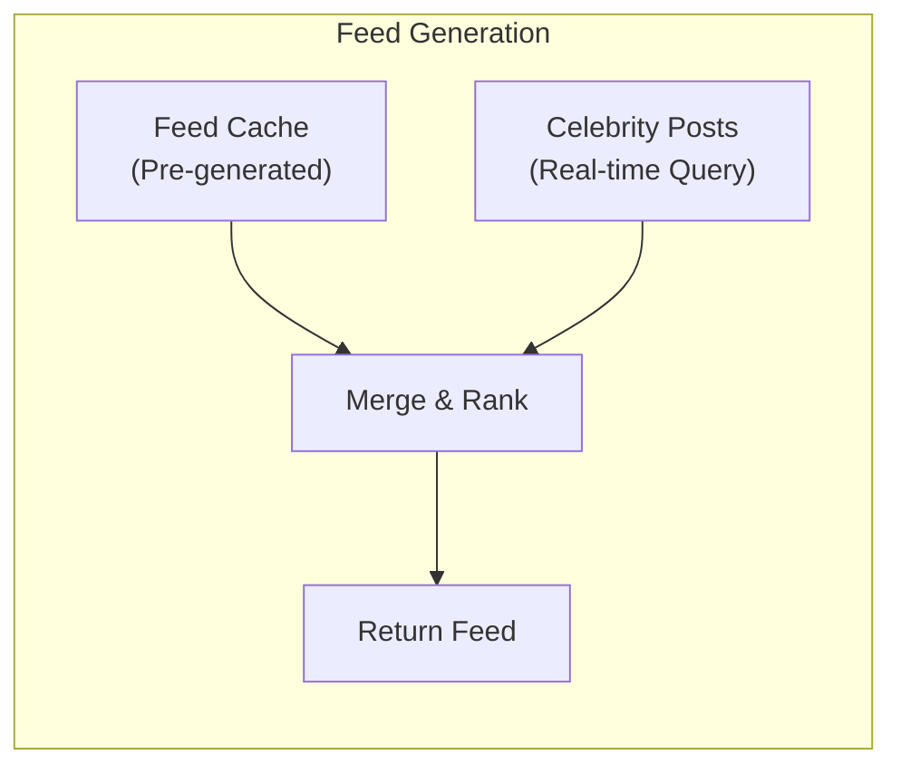
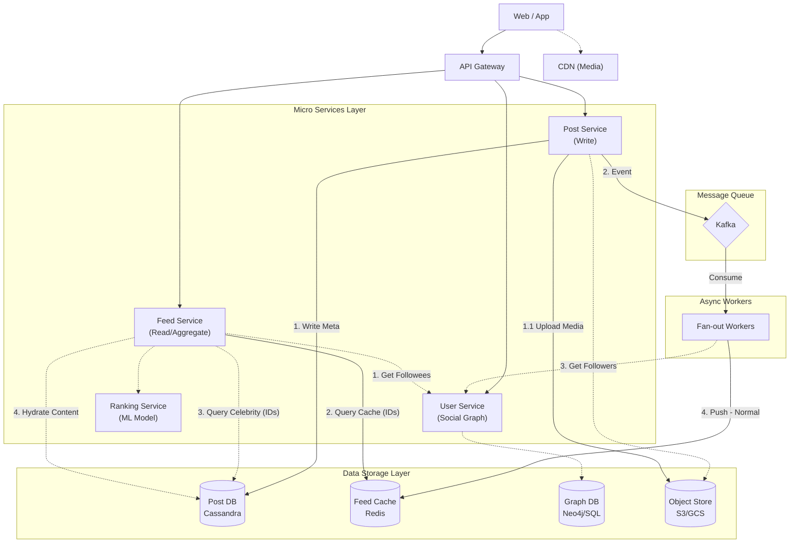

# News Feed 系統設計

News Feed (或 Timeline) 是社交媒體的核心功能，涉及複雜的資料模型、Fan-out 策略、和排序演算法。

## 1. 需求分析

### 1.1 功能需求

| 功能 | 說明 |
|:---|:---|
| **發布貼文** | 用戶可發布文字、圖片、影片 |
| **瀏覽動態** | 看到關注對象的貼文 (按時間/演算法排序) |
| **互動** | 按讚、留言、分享 |
| **即時更新** | 新貼文即時顯示 |

### 1.2 非功能需求

| 需求 | 目標 |
|:---|:---|
| **DAU** | 100 Million |
| **每用戶 Followee** | 平均 200 人 |
| **QPS (讀)** | 100M × 10 次/天 / 86400 ≈ 12,000 QPS |
| **延遲** | < 200ms |

---

## 2. 核心問題：Push vs Pull

| 策略 | 機制 (Description) | 優點 (Pros) | 缺點 (Cons) |
| :--- | :--- | :--- | :--- |
| **Pull Model**<br>(讀取時聚合 / Fan-out on Read) | **核心概念**：除非用戶主動讀取，否則系統不執行任何聚合操作。<br><br>**流程**：<br>1. User 請求 Feed。<br>2. 系統查詢所有 Followees (關注對象) 的最新貼文 (`SELECT ... WHERE created_at > last_seen`)。<br>3. 在記憶體中進行合併排序 (Merge & Sort)。<br>4. 回傳結果。 | ✅ **發布貼文即時 (O(1))**：寫入成本極低，只需存入 DB。<br>✅ **不浪費儲存**：無需為每個粉絲維護一份 Feed List。 | ❌ **讀取延遲高**：若關注 200+ 人，需執行大量 DB 查詢與聚合計算。<br>❌ **DB 壓力大**：高流量用戶頻繁刷新會導致 DB 負載過重。 |
| **Push Model**<br>(Fan-out on Write) | **核心概念**：將 Feed 預先計算好 (Pre-computed)，讀取時直接取用。<br><br>**流程**：<br>1. User A 發布貼文。<br>2. 系統找出所有 Followers。<br>3. 將 Post ID 寫入每個 Follower 的 Feed Cache (`feed:{follower_id}`)。<br>4. User B 讀取時，直接回傳 Cache 內容。 | ✅ **讀取極快 (O(1))**：不需要即時聚合，不僅快且保護 DB。<br>✅ **適合多讀少寫**：符合大多數社交媒體的使用模式。 | ❌ **寫入放大 (Write Amplification)**：名人發文 (e.g. 100萬粉絲) 會觸發百萬次寫入，導致「發送延遲」。<br>❌ **儲存成本高**：同一份資料被複製多份。 |

### 2.3 Hybrid Model (業界主流)

為了平衡 Push 與 Pull 模型的優缺點，業界（如 Instagram, Twitter/X, Weibo）通常採用 **混和模式 (Hybrid Model)**。此策略根據用戶的「影響力」（通常用粉絲數判定）來決定使用哪種分發方式。

| 用戶類型 | 採用模型 | 粉絲數門檻 | 寫入機制 (Write Path) | 讀取機制 (Read Path) | 核心考量 (Trade-off) |
| :--- | :--- | :--- | :--- | :--- | :--- |
| **普通用戶**<br>(Normal Users) | `Push Model` | **< 10K** | **Fan-out on Write**<br>發文時，立即將 Post ID 推送到所有粉絲的 `Feed Cache`。 | **Read Cache**<br>直接從 Cache 讀取，速度極快 **(O(1))**。 | ✅ **讀取效能優先**<br>因為粉絲少，寫入放大 (Write Amplification) 成本可控。 |
| **名人/大 V**<br>(Celebrities) | `Pull Model` | **> 10K** | **Write to DB Only**<br>僅寫入資料庫，**不**執行 Fan-out。 | **Real-time Query**<br>讀取 Feed 時即時查詢名人貼文，並與 Cache 進行 **Merge**。 | ✅ **避免寫入風暴**<br>若使用 Push 會觸發百萬次寫入 (Thundering Herd)。<br>⚠️ **增加讀取延遲**。 |

**核心公式**：
$$
\text{User Feed} = \text{Cached Posts} ( \text{from Normal Users}) +  Real-time Query (from Celebrities)
$$



---

## 3. High Level Architecture

1.  **User Service / Graph DB**: 
    *   **Fan-out Workers** 必須呼叫 User Service (或查詢 Graph DB) 取得貼文作者的粉絲名單 (Followers)，才能進行推送。
    *   **Feed Service** 必須呼叫 User Service 取得用戶的關注對象 (Followees) 列表，並區分哪些是「名人」以便進行混合查詢。
2.  **Hybrid Model 流程**:
    *   **Write Path**: Fan-out Worker 僅針對「普通用戶」的粉絲進行 Cache 推送 (Push)。對於名人貼文，Worker 會停止推送 (或僅更新 Celebrity timeline)，避免寫入放大。
    *   **Read Path**: Feed Service 同時讀取 Feed Cache (普通用戶動態) 與 Post DB (名人動態)，並在記憶體中進行合併 (Merge)。

**架構流程說明:**

1.  **用戶請求**: 用戶透過 **API Gateway** 存取服務，媒體資源 (圖片/影片) 則直接透過 **CDN** 讀取以降低延遲。
2.  **發文流程 (Write Path)**:
    *   **Post Service**: 接收發文請求，將媒體檔案上傳至 **Object Store (S3)**，並將 Metadata 寫入 **Post DB** (Cassandra)。
    *   **Kafka**: Post Service 發送「新貼文事件」至 Kafka，解耦後續處理。
    *   **Fan-out Workers**: 消費 Kafka 訊息，查詢粉絲名單，並將貼文 ID 推送至粉絲的 **Feed Cache** (Redis)。
3.  **讀取流程 (Read Path)**:
    *   **可以 ID-Only**: 為了節省記憶體，Feed Cache 通常只儲存 `post_id`。
    *   **Merge & Rank**: Feed Service 從 Cache 和 DB 撈出 IDs，交由 **Ranking Service** 進行排序（或簡單的時間排序）。
    *   **Hydration (填充)**: 排序完成後，針對最終的 Top N 筆 ID，批量查詢 Post DB 獲取完整內容 (Content, User Info)，過濾已刪除貼文，最後回傳給 Client。

---

## 4. 資料模型

### 4.1 Post Table (Cassandra)

```sql
CREATE TABLE posts (
    user_id BIGINT,
    post_id BIGINT,  -- Snowflake ID (時間排序)
    content TEXT,
    media_keys LIST<TEXT>, -- 指向 Object Store (S3) 的 Keys
    created_at TIMESTAMP,
    like_count BIGINT,
    comment_count BIGINT,
    
    PRIMARY KEY ((user_id), post_id)
) WITH CLUSTERING ORDER BY (post_id DESC);
```

### 4.2 Feed Cache (Redis)

```
Key: feed:{user_id}
Value: Sorted Set (Score = Post Timestamp/Snowflake ID)

ZADD feed:123 1609459200 "post:456"
ZADD feed:123 1609459100 "post:457"

ZREVRANGE feed:123 0 20  -- 取最新 20 條
```

### 4.3 Social Graph (關注關係)

```sql
-- 選項 1: Traditional RDBMS
CREATE TABLE follows (
    follower_id BIGINT,
    followee_id BIGINT,
    created_at TIMESTAMP,
    PRIMARY KEY (follower_id, followee_id)
);

-- 選項 2: Graph Database (Neo4j)
(User:A)-[:FOLLOWS]->(User:B)
```

---

## 5. Fan-out 流程

### 5.1 發布貼文

```python
def publish_post(user_id, content):
    # 1. 寫入 Post DB
    post_id = snowflake.generate()
    post_db.insert(user_id, post_id, content)
    
    # 2. 發送到 Kafka
    kafka.send("new_posts", {
        "user_id": user_id,
        "post_id": post_id,
        "follower_count": user.follower_count
    })
```

### 5.2 Fan-out Worker

```python
def fanout_worker(message):
    user_id = message.user_id
    post_id = message.post_id
    
    # 判斷是否為大 V
    if message.follower_count > 10000:
        # 大 V: 不 Fan-out，僅標記為 celebrity post
        cache.sadd("celebrity_posts", post_id)
        return
    
    # 普通用戶: Fan-out 到所有 Followers
    followers = social_graph.get_followers(user_id)
    
    for batch in chunks(followers, 1000):
        for follower_id in batch:
            redis.zadd(f"feed:{follower_id}", {post_id: timestamp})
            redis.zremrangebyrank(f"feed:{follower_id}", 0, -1001)  # 保留最新 1000 條
```

---

## 6. Feed 讀取

```python
def get_feed(user_id, cursor=None, limit=20):
    # 1. [IDs] 從 Cache 取得候選 Post IDs
    cached_ids = redis.zrevrange(f"feed:{user_id}", 0, limit * 2) # 多取一點以免被過濾
    
    # 2. [IDs] 取得追蹤的大 V 最新貼文 IDs
    celebrity_followees = get_celebrity_followees(user_id)
    celebrity_ids = []
    for celeb_id in celebrity_followees:
        ids = post_db.get_recent_ids(user_id=celeb_id, limit=5)
        celebrity_ids.extend(ids)
    
    # 3. [IDs] Merge & Rank (僅排序 ID)
    ranked_ids = merge_and_rank(cached_ids, celebrity_ids)
    
    # 4. [Content] Hydration (填充內容)
    # 批量查詢 Post DB (或 Post Cache) 獲取完整內容
    posts = post_service.multi_get_posts(ranked_ids[:limit])
    
    # 5. 過濾已刪除或無效貼文
    valid_posts = [p for p in posts if p and not p.is_deleted]
    
    # 6. Pagination (Cursor-based using timestamp)
    return paginate(valid_posts, cursor)
```

### 6.1 分頁策略 (Pagination)
*   **為什麼不使用 Offset?** (`SELECT * FROM table LIMIT 10 OFFSET 1000`)
    *   **效能問題**: Offset 越大，DB 掃描越慢。
    *   **資料不一致**: 在讀取過程中若有新貼文插入，Offset 會導致讀取到重複的貼文 (Shift problem)。
*   **Cursor-based Solution**:
    *   使用 `(timestamp, post_id)` 作為 Cursor。
    *   Client 記錄最後一則貼文的 Cursor。
    *   Next Request: `SELECT * ... WHERE (timestamp, post_id) < (last_timestamp, last_post_id) LIMIT 10`.
    *   Redis `ZREVRANGEBYSCORE` 或 Cassandra Clustering Key 天然支援此查詢。

---

## 7. 排序演算法 (Ranking)

### 7.1 時間順序 (Chronological)

$$
\text{Score} = \text{Post Timestamp}
$$
- ✅ 公平、透明
- ❌ 垃圾/不相關內容充斥

### 7.2 參與度排序 (Engagement-based)

$$
\begin{aligned}
\text{Score} &= (\text{Likes} \times 1) + (\text{Comments} \times 3) + (\text{Shares} \times 5) + (\text{TimDecay}) \\
\text{TimDecay} &= \frac{1}{1 + \text{hours\_since\_post}^{1.5}}
\end{aligned}
$$

### 7.3 機器學習排序 (ML Ranking)

```
Features:
- 作者與讀者的互動歷史
- 貼文類型 (影片/圖片/文字)
- 用戶偏好 (停留時間、點擊率)
- 社交關係強度

Model: LightGBM / Deep Neural Network
Output: 預測用戶參與機率

> **Note**: 由於 ML Ranking 計算成本高，通常會拆分為獨立的 **Ranking Service**。
> Workflow: Feed Service 傳送候選 IDs -> Ranking Service 計算分數 -> 回傳排序後的 IDs。
```

---

## 8. 即時更新

### 8.1 Polling

```javascript
// Client 每 30 秒拉取一次
setInterval(() => {
    fetch('/api/feed/new?since=' + lastPostId)
}, 30000)
```

### 8.2 Long Polling

```
Client → Server: Do you have new posts?
Server → (等待，直到有新貼文或 timeout)
Server → Client: New posts!
Client → Immediately reconnect
```

### 8.3 WebSocket / SSE

```
Client ←→ Server: Persistent Connection
Server pushes new posts in real-time
```

---

## 9. 快取策略

### 9.1 多層快取

```
L1: CDN (Static assets: Images, Videos)
L2: Local Cache (Application memory)
L3: Redis (Feed cache, Hot user profiles)
L4: Database
```

### 9.2 快取失效

```python
def on_unfollow(user_id, unfollowed_id):
    # 從 Feed Cache 移除該用戶的貼文
    posts_to_remove = get_posts_by_user(unfollowed_id)
    for post_id in posts_to_remove:
        redis.zrem(f"feed:{user_id}", post_id)
```

### 9.3 不活躍用戶優化 (Inactive Users)
*   **問題**: 若用戶 30 天未登入，Fan-out worker 仍持續寫入其 Redis Cache，浪費記憶體。
*   **解法**: 設定 **TTL (Time-To-Live)**。
    *   Redis Key 設定 Expiration (e.g. 7天)。
    *   若用戶 7 天沒上線，Cache 自動清空。
    *   **Fallback**: 當用戶因為 TTL 被清空後再次登入，觸發 **Cache Miss** 流程 (見 9.4)。

### 9.4 Cache Miss / Cold Start
*   **情境**: 新用戶註冊、或不活躍用戶回歸 (Cache 已過期)。
*   **流程**:
    1.  讀取 `feed:{user_id}` 發現是空的 (Miss)。
    2.  系統降級為 **Pull Model** (Synchronous Fallback)。
    3.  即時查詢最近 N 天關注對象的貼文。
    4.  計算 Merge & Rank。
    5.  回傳結果給用戶，並**非同步 (Async)** 回填 (Hydrate) 到 Redis Cache，以加速下次讀取。

### 9.5 刪除處理 (Deletions)
*   **策略**: **Don't delete from Feed Cache immediately.**
    *   用戶刪除貼文時，只在 DB 標記 `is_deleted = true`。
    *   不主動遍歷幾萬個粉絲的 Redis List 去移除 ID (太昂貴)。
    *   **Read Time Filter**: 在 **Hydration** 階段 (4.3 節)，讀取代碼檢查 `is_deleted` 狀態，若為 true 則丟棄該 ID。
    *   (Optional) Async Cleanup: 另外的 Worker 會定期清理或在讀取時順便從 Cache 移除無效 ID。

---

## 10. 擴展性

### 10.1 分片策略

| 資料 | 分片 Key | 原因 |
|:---|:---|:---|
| Posts | user_id | 同用戶貼文儲存在一起 |
| Feed Cache | user_id | 每個用戶的 Feed 獨立 |
| Social Graph | follower_id | 查詢「我追蹤誰」高效 |

### 10.2 地理分佈

```
US Users → US Data Center
EU Users → EU Data Center

跨區域複製:
- Celebrity Posts: 全球複製
- Normal User Feed: 僅本區域
```

---

## 11. Trade-offs 總結

| 決策 | 選項 A | 選項 B | 推薦 |
|:---|:---|:---|:---|
| Fan-out 策略 | Push Only | Hybrid (Push + Pull) | **Hybrid** |
| 排序 | Chronological | ML Ranking | 依產品需求 |
| 即時更新 | Polling | WebSocket | WebSocket (若支援) |
| Feed 儲存 | 全部 | 最近 N 條 | **最近 N 條** |

---

## 12. Reference
- [System Design Interview - Alex Xu, Chapter 11](https://www.amazon.com/System-Design-Interview-insiders-Second/dp/B08CMF2CQF)
- [Scaling Instagram Infrastructure](https://instagram-engineering.com/instagram-engineering-blog-bab6f3b8e4)
- [Twitter's Recommendation Algorithm](https://blog.twitter.com/engineering/en_us/topics/open-source/2023/twitter-recommendation-algorithm)
