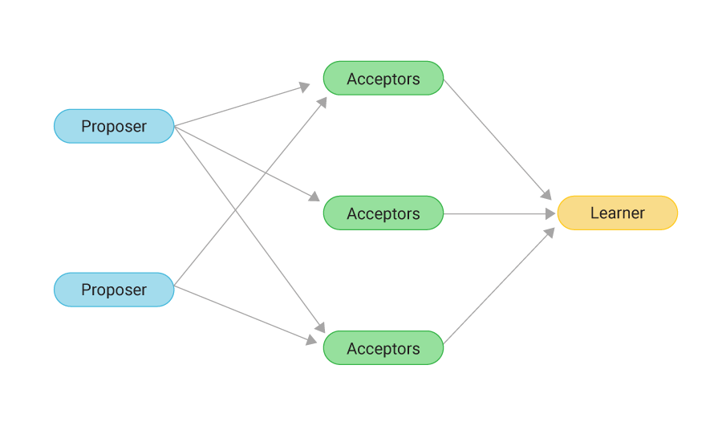

# Paxos 深度解析：從演算法原理到應用維度

## 1\. 什麼是 Paxos？

Paxos 是分散式系統中的 **共識演算法（Consensus Algorithm）**。

它的目的只有一個：
**在不可靠的網路環境中（機器可能當機、訊息可能延遲），讓一群節點對「某一個值（Value）」達成一致。**
**那個「值」是什麼並不重要**，它可以是一條 log、一個變數的數值，或者是一個 Leader Sever。

## 2\. Paxos 的核心運作 (The Protocol)
Paxos 的運作就像是一個「議會投票」。為了確保即便有議員缺席（節點掛掉），議會還能運作，它依賴的是 **多數決（Majority / Quorum）**。

### 角色扮演

| 角色 (Role) | 職責 (Description) |
| :--- | :--- |
| **Proposer (提案者)** | 想發起變更的人（例如想寫入資料的 Server）。 |
| **Acceptor (接受者/投票者)** | 負責儲存狀態並投票的人。 |
| **Learner (學習者)** | 一旦議會達成共識，負責執行結果的人。 |

### 兩階段提交 (The 2-Phase Protocol)

**第一階段：Prepare (搶奪發言權)**
- 1a. **Proposer** 產生一個編號 $N$（Proposal ID），向所有 Acceptors 喊話：「我要提案，編號是 $N$，你們能聽我說嗎？」
- 1b. **Acceptor** 檢查：如果 $N$ 比我之前承諾過的所有編號都大，我就承諾：「好，我等你，而且我保證不再接受比 $N$ 小的提案。」

**第二階段：Accept (確認提案值)**
- 2a. **Proposer** 收到超過半數（Quorum）的承諾後，發出真正的提案：「既然大家都聽我的，我提議的值是 $V$。」
- 2b. **Acceptor** 收到請求，如果自己沒有違背承諾（沒被更高編號的人搶走），就將 $V$ 寫入硬碟（Accepted）。
- 3\.  **達成共識：** 當 $V$ 被超過半數的 Acceptor 接受，這個值就被「選定（Chosen）」了。

## 3\. 從 Basic 到 Multi-Paxos (工程上的妥協)
上面的 Basic Paxos 有個致命缺點：**太慢了**。每次寫入都要經過兩階段（2 RTT），而且如果多人同時搶發言權，會一直重來（活鎖）。

**解決方案：Multi-Paxos**
* **核心概念：** 我們不要每次都搶發言權了。我們先用一次 Paxos 選出一個 **Leader**。
* **特權：** 只有 Leader 可以提案。
* **效果：** Leader 擁有長期的「發言權」。以後的寫入直接進入第二階段（Accept），略過第一階段。效能大幅提升。

## 4\. 關鍵區分：Paxos 的兩種使用維度
雖然底層都是跑上面的 Proposer/Acceptor 流程，但在系統設計上，我們將 Paxos 用在兩個截然不同的維度：

### 維度一：用來選 Leader (Identity Consensus)
這是為了解決 **"Who"** 的問題。
* **Paxos 決議的值 (Value)：** 「節點 ID (例如 Node-A)」。
* **應用場景：** 系統剛啟動、Master 當機、網路分區。
* **特點：**
    * 這是**政治手段**。
    * 目的是為了產生一個唯一的協調者，避免腦裂（Split-brain）。
    * 一旦選出來，Paxos 就暫時功成身退，直到 Leader 掛掉。
* **代表案例：** ZooKeeper (ZAB), Etcd (Raft), **DynamoDB (Partition Leader)**.

### 維度二：用來確認資料版本 (State Consensus)
這是為了解決 **"What"** 的問題。
* **Paxos 決議的值 (Value)：** 「具體的操作指令 (例如 SET X=100)」。
* **應用場景：** 每一次的用戶寫入請求 (Write Request)。
* **特點：**
    * 這是**數據一致性手段**。
    * 目的是確保每一個副本（Replica）的 Log 順序和內容完全一樣。
    * 如果不做這件事，使用者可能會讀到髒資料。
* **代表案例：** Google Spanner, OceanBase, Cassandra (僅限 LWT 模式).

## 5\. 實務對照表：DynamoDB vs. Spanner
利用這個區分，我們可以精準地描述不同資料庫的架構哲學：

| 特性 | **Amazon DynamoDB** | **Google Spanner** |
| :--- | :--- | :--- |
| **選 Leader 用 Paxos 嗎？** | **YES** (維度一) | **YES** (維度一) |
| **確認資料版本用 Paxos 嗎？** | **NO** (依靠 Leader 的權威 + LWW) | **YES** (依靠 Paxos Log 同步 + TrueTime) |
| **設計哲學** | **可用性優先 (Availability)**  選好 Leader 後，Leader 說了算，直接覆蓋舊資料 (LWW)。 | **一致性優先 (Consistency)**  Leader 寫入每一筆資料都要經過多數派確認 (Paxos)，保證版本絕不錯亂。 |
| **優點** | 寫入速度極快，適合高併發。 | 數據絕對準確，適合金融交易。 |

### 小結
當我們說「這個 DB 使用 Paxos」時，作為資深工程師，我們必須進一步追問：
**「它是用 Paxos 來決定『誰是老大』，還是用 Paxos 來決定『這筆錢剩多少』？」**
  * 如果是前者（選 Leader），那是為了 **高可用（HA）**
  * 如果是後者（確認版本），那是為了 **強一致（Consistency）**

DynamoDB 是典型的 **「用 Paxos 選 Leader，但用 LWW 處理資料」** 的混合體。

## Reference
- https://www.youtube.com/watch?v=6c52pe4bt1g