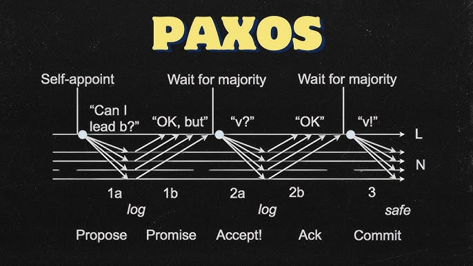

# Paxos 深度解析：從演算法原理到應用維度

## 1\. 什麼是 Paxos？

Paxos 是分散式系統中的 **共識演算法（Consensus Algorithm）**，由 Lamport 所提出。

它的目的只有一個：
**在不可靠的網路環境中（機器可能當機、訊息可能延遲），讓一群節點對「某一個值（Value）」達成一致。**
**那個「值」是什麼並不重要**，它可以是一條 log、一個變數的數值，或者是一個 Leader Sever。

## 2\. Paxos 的核心運作 (The Protocol)
Paxos 的運作就像是一個「議會投票」。為了確保即便有議員缺席（節點掛掉），議會還能運作，它依賴的是 **多數決（Majority / Quorum）**。

### 角色扮演

| 角色 (Role) | 職責 (Description) |
| :--- | :--- |
| **Proposer (提案者)** | 想發起變更的人（例如想寫入資料的 Server）。 |
| **Acceptor (接受者/投票者)** | 負責儲存狀態並投票的人。 |
| **Learner (學習者)** | 一旦議會達成共識，負責執行結果的人。 |

### 兩階段提交 (The 2-Phase Protocol)

**第一階段：Prepare (搶奪發言權)**
- 1a. **Proposer** 產生一個編號 $N$（Proposal ID），向所有 Acceptors 喊話：「我要提案，編號是 $N$，你們能聽我說嗎？」
- 1b. **Acceptor** 檢查：如果 $N$ 比我之前承諾過的所有編號都大，我就承諾：「好，我等你，而且我保證不再接受比 $N$ 小的提案。」

**第二階段：Accept (確認提案值)**
- 2a. **Proposer** 收到超過半數（Quorum）的承諾後，發出真正的提案：「既然大家都聽我的，我提議的值是 $V$。」
- 2b. **Acceptor** 收到請求，如果自己沒有違背承諾（沒被更高編號的人搶走），就將 $V$ 寫入硬碟（Accepted）。
- 3\.  **達成共識：** 當 $V$ 被超過半數的 Acceptor 接受，這個值就被「選定（Chosen）」了。

## 3\. 從 Basic 到 Multi-Paxos (工程上的妥協)
上面的 Basic Paxos 有個致命缺點：**太慢了**。每次寫入都要經過兩階段（2 RTT），而且如果多人同時搶發言權，會一直重來（活鎖）。

**解決方案：Multi-Paxos**
* **核心概念：** 我們不要每次都搶發言權了。我們先用一次 Paxos 選出一個 **Leader**。
* **特權：** 只有 Leader 可以提案。
* **效果：** Leader 擁有長期的「發言權」。以後的寫入直接進入第二階段（Accept），略過第一階段。效能大幅提升。

## 4\. 關鍵區分：Paxos 的兩種使用維度
雖然底層都是跑上面的 Proposer/Acceptor 流程，但在系統設計上，我們將 Paxos 用在兩個截然不同的維度：

### 維度一：用來選 Leader (Identity Consensus)
這是為了解決 **"Who"** 的問題。
* **Paxos 決議的值 (Value)：** 「節點 ID (例如 Node-A)」。
* **應用場景：** 系統剛啟動、Master 當機、網路分區。
* **特點：**
    * 這是**政治手段**。
    * 目的是為了產生一個唯一的協調者，避免腦裂（Split-brain）。
    * 一旦選出來，Paxos 就暫時功成身退，直到 Leader 掛掉。
* **代表案例：** ZooKeeper (ZAB), Etcd (Raft), **DynamoDB (Partition Leader)**.

### 維度二：用來確認資料版本 (State Consensus)
這是為了解決 **"What"** 的問題。
* **Paxos 決議的值 (Value)：** 「具體的操作指令 (例如 SET X=100)」。
* **應用場景：** 每一次的用戶寫入請求 (Write Request)。
* **特點：**
    * 這是**數據一致性手段**。
    * 目的是確保每一個副本（Replica）的 Log 順序和內容完全一樣。
    * 如果不做這件事，使用者可能會讀到髒資料。
* **代表案例：** Google Spanner, OceanBase, Cassandra (僅限 LWT 模式).

## 5\. 實務對照表：DynamoDB vs. Spanner
利用這個區分，我們可以精準地描述不同資料庫的架構哲學：

| 特性 | **Amazon DynamoDB** | **Google Spanner** |
| :--- | :--- | :--- |
| **選 Leader 用 Paxos 嗎？** | **YES** (維度一) | **YES** (維度一) |
| **確認資料版本用 Paxos 嗎？** | **NO** (依靠 Leader 的權威 + LWW) | **YES** (依靠 Paxos Log 同步 + TrueTime) |
| **設計哲學** | **可用性優先 (Availability)**  選好 Leader 後，Leader 說了算，直接覆蓋舊資料 (LWW)。 | **一致性優先 (Consistency)**  Leader 寫入每一筆資料都要經過多數派確認 (Paxos)，保證版本絕不錯亂。 |
| **優點** | 寫入速度極快，適合高併發。 | 數據絕對準確，適合金融交易。 |

當我們說「這個 DB 使用 Paxos」時，作為資深工程師，我們必須進一步追問：
**「它是用 Paxos 來決定『誰是老大』，還是用 Paxos 來決定『這筆錢剩多少』？」**
  * 如果是前者（選 Leader），那是為了 **高可用（HA）**
  * 如果是後者（確認版本），那是為了 **強一致（Consistency）**

DynamoDB 是典型的 **「用 Paxos 選 Leader，但用 LWW 處理資料」** 的混合體。

## Paxos 的缺陷與複雜之處：
這是一個在分散式系統領域中被討論了幾十年的話題。Paxos 之所以在實作上被視為惡夢，並不是因為它的數學證明不對，而是因為它**太過「學術化」與「抽象」**。以下是 Paxos 難以實作的四個核心原因：

### 1. 單個決議 vs. 連續日誌 (The Gap between Single-Paxos & Multi-Paxos)

這是 Paxos 最致命的實作陷阱。

* **學術論文 (Single-Paxos)**：
    Lamport 的論文主要證明了「如何讓多個節點對 **一個數值** 達成共識」。例如，大家一起決定 $X$ 到底是 1 還是 2。一旦決定了，這輪就結束了。
* **工程現實 (Multi-Paxos)**：
    現實世界的資料庫（如 Dynamo, Spanner）需要的是 **「一連串的指令日誌」**（Log Replication）。我們需要對第 1 個、第 2 個......第 N 個指令分別達成共識。
* **實作困難點**：
    為了效能，你不能對每一個 Log Entry 都重新跑一次完整的 Paxos 兩階段流程（那樣太慢了）。你需要將它優化成 **Multi-Paxos**（一次選主，多次提交）。
    **問題是：Lamport 根本沒有詳細定義 Multi-Paxos 該長什麼樣。** 每家公司（Google, Amazon, Microsoft）只能自己腦補這中間的優化細節，導致寫出來的 Paxos 都不一樣，且容易出錯。

### 3. 日誌空洞與亂序提交 (Holes in the Log)

這也是為什麼後來 Raft 會誕生的主因。

* **Paxos 的特性**：
    Paxos 允許並發確認。比如 Log 1、Log 2 還沒確認，Log 3 卻已經先達成共識了。這時候 Log 序列中就會出現**空洞 (Holes)**。
* **實作惡夢**：
    應用層的狀態機（State Machine）通常需要**按順序執行**（先執行 $X=1$ 再執行 $X=X+1$）。
    如果你的底層 Log 是亂序的（有空洞），你的程式碼必須非常小心地處理：
    * 暫存那些「超前」的指令。
    * 回頭去補齊那些「空洞」的指令。
    * 萬一補不齊怎麼辦？
    Raft 直接強制規定「Log 必須連續」，消滅了這個問題，但 Paxos 的實作者必須自己處理這種複雜的狀態管理。

### 4. 成員變更與快照 (Membership Change & Snapshots)

這是 Lamport 論文中完全略過，但工程上必不可少的部分。

* **成員變更**：
    如果叢集從 3 台機器擴容到 5 台，或者壞了一台要換新的，「多數派 ($N/2+1$)」的定義會改變。如何在「飛機飛行中更換引擎」且不破壞一致性？這非常難，處理不好會導致 **腦裂 (Split-Brain)**。
* **日誌壓縮 (Snapshot)**：
    Log 不能無限增長，硬碟會爆。你必須定期把狀態做成快照 (Snapshot) 並刪除舊 Log。Paxos 論文沒教你怎麼做，這涉及到底層 IO 和狀態機的鎖定，極容易產生 Bug。

## 什麼是 Multi-Paxos？

簡單來說，**Multi-Paxos 就是「為了連續寫入日誌而優化過」的 Paxos。**

如果 Single-Paxos 是「大家開會決定**一件事情**」，那 Multi-Paxos 就是「大家選出一個主席，然後由主席快速決定**接下來的一連串事情**」。

### 1. 為什麼需要 Multi-Paxos？
在原始的 **Basic Paxos (Single-Paxos)** 中，要決定一個值（比如 Log Index 1 是什麼），必須經過兩個階段：
1.  **Phase 1 (Prepare/Promise)**：搶奪提案權（誰是老大？）。
2.  **Phase 2 (Propose/Accept)**：投票表決具體的值（把資料寫進去）。

如果你要寫入 100 筆資料，按照 Basic Paxos，你必須把這兩個階段跑 100 次，每次都要選出一個 Leader。

### 2. Multi-Paxos 的解決方案 

Multi-Paxos 的核心思想是：**既然 Phase 1 是為了選出「誰有權利提案」，那我們能不能只做一次？**
只要選出了一個 Leader，並且沒有其他人出來挑戰（沒有發生衝突），這個 Leader 就可以**跳過 Phase 1，直接連續執行 Phase 2**。

#### 流程對比：
* **Basic Paxos (笨重)**
    * Log 1: Phase 1 (選老大) $\rightarrow$ Phase 2 (寫資料)
    * Log 2: Phase 1 (選老大) $\rightarrow$ Phase 2 (寫資料)
    * Log 3: Phase 1 (選老大) $\rightarrow$ Phase 2 (寫資料)

* **Multi-Paxos (高效)**
    * **Phase 1 (選老大 - 只做一次)**：                
    * **Phase 2 (寫資料 - 連續執行)**：
        - Log 1: 直接寫入
        - Log 2: 直接寫入
        - Log 3: 直接寫入

**結果**：除了第一筆，後面的寫入都只需要 **1 個 RTT (Round Trip Time)**，效能直接翻倍。

### 3. 技術實現的關鍵點
為了實現這個機制，Multi-Paxos 引入了幾個概念：

1.  **Instance ID (實例編號)**：
    因為 Paxos 本質上只能決定「一個值」，所以我們對 Log 的每一個位置（Index 1, Index 2...）都跑一個獨立的 Paxos Instance (針對某一個特定位置（Slot）的數值，所進行的一整套共識討論過程)。
2.  **Stable Leader (穩定的領導者)**：
    Leader 在完成 Phase 1 後，會持續持有「提案權」。只要 Leader 不變，後續的 Log Index 都不需要重新跑 Phase 1。
3.  **Piggyback (夾帶訊息)**：
    為了進一步優化，Leader 會在發送「Log 2 的提案」時，順便夾帶「Log 1 已經確認提交（Commit）」的訊息。這樣就減少了專門的確認封包。

### 4. Multi-Paxos 的最大問題：缺乏標準
這就是我們之前提到的「實作惡夢」。Lamport 在論文中對於 Multi-Paxos 的描述非常簡略，大意是：「*只需要把 Phase 1 省略掉就可以了，你們自己看著辦。*」

這導致了工業界出現了截然不同的實作：
* **Google 的 Multi-Paxos**（用在 Chubby/Spanner）長這樣。
* **Apache ZooKeeper 的 ZAB 協議**（其實也是一種 Multi-Paxos 變體）長那樣。
* **早期的開源實作**（如 LibPaxos）又是另一個樣子。

### 總結：為什麼 Raft 是救星？
> **Raft 本質上就是一種「被嚴格定義、標準化、且加上了強力限制」的 Multi-Paxos。**
* **Multi-Paxos**：是一個**學術概念**，允許 Log 有空洞，允許亂序，只要能達成共識就行（自由度高，實作難）。
* **Raft**：是一個**工程規範**，強制 Log 必須連續，Leader 必須最強（自由度低，實作簡單）。

結合以上資訊，實作 Paxos 的工程師，實際上是在做以下事情：
1.  把 Single-Paxos 改成 Multi-Paxos（自己發明）。
2.  解決活鎖問題，加上 Leader 機制（自己發明）。
3.  處理 Log 的空洞和亂序（自己發明）。
4.  加上成員變更和快照功能（自己發明）。

因為大家都在「自己發明」，所以 Google 的 Paxos 和 Amazon 的 Paxos 長得完全不一樣。

**Raft 的偉大之處在於，它把上面這四點全部標準化了：**
* 它直接定義了 Multi-Paxos 的結構。
* 它內建強 Leader 機制。
* 它強制 Log 連續（不准有洞）。
* 它給出了明確的成員變更演算法。

這就是為什麼現在的新系統（Etcd, Consul, TiKV）首選 Raft，因為它把「未定義行為」變成了「標準規範」。

## Reference
- https://www.youtube.com/watch?v=6c52pe4bt1g