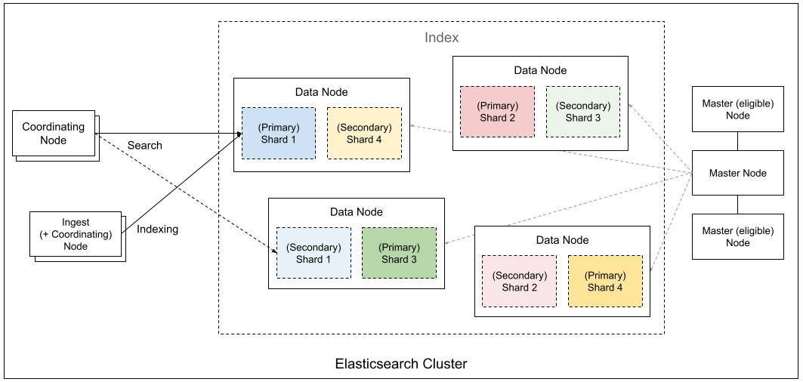

# Elasticsearch 核心架構與底層運作全解析

## 一、 基礎定位與分散式架構 (Distributed Architecture)

Elasticsearch (ES) 是一個基於 Apache Lucene (/ˈlu.sin/) 打造的分散式搜尋與分析引擎。它將 Lucene 複雜的底層操作抽象化，提供簡單的 RESTful API (透過 HTTP 傳遞 JSON) 讓開發者操作。

### 1. 節點角色分離 (Node Roles)
為了達到高擴展性，ES 叢集中的節點 (Nodes) 會分工合作。
<mark>為什麼要分離角色？因為不同的操作消耗的硬體資源不同，混在一起容易導致單一節點資源耗盡（例如繁重的聚合查詢吃光 CPU，導致叢集狀態無法更新）</mark>。

| 英文名稱 | 中文名稱 | 角色與職責 |
| :--- | :--- | :--- |
| **Master Node** | 主節點 | 負責「大腦」工作。管理叢集狀態、建立/刪除索引、決定分片要放在哪個節點。為了防單點故障，通常會配置多個 Master-eligible (具備候選資格) 的節點，但同時間只有一個 Active Master。 |
| **Data Node** | 資料節點 | 苦力擔當。儲存實際資料分片，並執行 CRUD (增刪改查)、搜尋與聚合運算。**硬體需求：** 高 CPU、大記憶體與極快的磁碟 I/O。 |
| **Ingest Node** | 攝入節點 | 資料進入前的加工站。負責執行 Pipeline（如 IP 轉地理位置、日誌字串切割）。將這部分工作獨立，可以避免在寫入尖峰時拖垮 Data Node 的資源。 |
| **Coordinating Node** | 協調節點 | 智能負載平衡器。所有節點預設都有此功能。它負責接收客戶端請求，將請求分發 (Route) 給擁抱相關資料的 Data Node，最後將各節點的回傳結果「組裝」後回傳給客戶端。 |

### 2. 索引與分片機制 (Indexing & Sharding)
| 英文名稱 | 中文名稱 | 定義與特性 |
| :--- | :--- | :--- |
| **Index** | 索引 | 邏輯上的資料集合，類似關聯式資料庫 (RDBMS) 的 Table。 |
| **Primary Shard** | 主分片 | **名詞解釋：** 實體存儲單元，本質上是一個獨立的 Lucene 實例。 為什麼建立索引後「不能更改」主分片數量？因為 ES 將文件路由到分片的公式是 `hash(routing_key) % number_of_primary_shards`。如果分片數量改變，所有現存資料的路由位置都會失效，必須進行極度消耗資源的 Reindex（重建索引）。 |
| **Replica Shard** | 副本分片 | 主分片的備份。 **作用：** 提供硬體故障時的容錯能力，並且能分擔「讀取 (Read/Search)」的併發壓力。 |

---

## 二、 共識演算法與資料一致性 (Consensus & Replication)

分散式系統最大的挑戰是「資料一致性」。ES 在設計上針對「叢集狀態」與「資料寫入」採用了兩種截然不同的因果邏輯：

1.  **叢集協調 (Raft-inspired):** `CP`
    * 為了防止「腦裂 (Split-Brain)」——即網路斷線導致叢集分裂出兩個 Master，各自寫入資料造成永久損壞。 <mark>ES 7.x 之後採用類似 Raft 的演算法，任何叢集狀態的改變（如新增索引）都必須經過半數以上 (Quorum) 的 Master 節點同意才能生效</mark>。
2.  **資料複製 (Primary-Backup 模型，類似 PacificA):** `AP`
    * 為什麼資料寫入不用 Raft？因為每一筆 Document 的寫入如果都要等半數節點同意，延遲 (Latency) 會高到無法接受。
    * **運作邏輯：** 客戶端寫入請求 -> 主分片 (Primary) 先執行並驗證 -> 平行轉發給所有「同步中的副本 (in-sync replica)」 -> 所有副本回報成功 -> 主分片才向客戶端確認寫入成功。如果有節點沒回應，Master 會直接將它踢出同步名單，以保持高吞吐量。

---

## 三、 Apache Lucene 底層與儲存機制

### 1. 倒排索引 (Inverted Index) 與 不可變性 (Immutability)
* **名詞解釋：** 關聯式資料庫通常是「正向索引」（文章 ID 找內容）。倒排索引則是「單字找文章」，它將文本拆解成單字 (Term)，並記錄這個單字出現在哪些文件 (Document IDs) 以及具體位置。
* **前因後果 (為什麼要設計成不可變？):** Lucene 的檔案 (Segment) <mark>一旦寫入磁碟就**絕對不修改**。</mark>
    * *好處：* 不需要讀寫鎖 (Lock-free)，效能極高；作業系統可以安心地將這些檔案塞進 Filesystem Cache 中，大幅加速搜尋。
    * *壞處與解法：* 怎麼更新或刪除？
        - 刪除時，Lucene 只是在另一個 `.del` 檔案中打個叉 (Soft delete)；
        - 更新則是「軟刪除舊版 + 寫入新版」。這導致了磁碟空間浪費與搜尋變慢。

### 2. Segment Merging (段合併) 與寫入放大
* 因為不可變性，每次記憶體緩衝區滿了就會生成一個新的小 Segment。搜尋時必須掃描所有 Segment 再合併結果，Segment 越多越慢。因此，ES 背景會有執行緒自動將小 Segment 合併成大 Segment，並在此時**真正物理刪除**被標示為 `.del` 的資料。
* **生產陷阱：** 大量寫入時，Segment Merging 會引發嚴重的 Disk I/O 飽和 (寫入放大)。實務上，在大批量匯入資料時，通常會暫時關閉 `refresh_interval`，避免提早生成過多小 Segment。

### 3. LSM Tree 的設計思想
LSM Tree 是一種為「高寫入吞吐量」設計的資料結構，常見於 Cassandra、RocksDB、HBase 等系統。它的核心思路是：寫入時先進入記憶體緩衝區（MemTable），而不是直接修改磁碟上的既有資料；當緩衝區滿了，再批次刷寫成磁碟上的不可變檔案。

### 4. 與 Elasticsearch / Lucene 機制的關聯
Lucene 不一定會直接用 LSM Tree 來描述自己，但它的 Segment 設計和 LSM Tree 的核心精神非常接近：

* **不可變性 (Immutability)：** Segment 一旦寫入磁碟就不再修改。新的資料會先累積在記憶體中，之後再形成新的 Segment，這和 LSM Tree 將 MemTable 刷寫成不可變檔案的概念一致。
* **追加寫入與軟刪除 (Append-only & Soft Delete)：** 刪除資料時，Lucene 不會直接改掉原始 Segment，而是透過 `.del` 檔案標記刪除；更新則是「標記舊版刪除 + 寫入新版」。這和 LSM Tree 透過 Tombstone 處理刪除、避免原地修改資料的思路相同。
* **背景合併 (Compaction / Segment Merging)：** Segment 變多會拖慢搜尋，因此 Lucene 會在背景將小 Segment 合併成大 Segment，並在合併時真正清掉已刪除的資料。這對應到 LSM Tree 的 Compaction 機制。

總結來說，Elasticsearch 依賴的 Lucene 儲存引擎，本質上是透過「不可變 Segment + 背景合併」來換取高寫入效能，這和 LSM Tree 的設計取捨高度相似。

### 5. 列式儲存：Doc Values 解決 OOM 問題
* 倒排索引很適合「搜尋」，但面對「排序 (Sort)」或「聚合 (Aggregation)」時卻是一場災難，因為引擎必須把所有的倒排資料反向載入記憶體 (過去稱為 Fielddata)，這經常導致 JVM Heap 被撐爆 (OOM)。
* **解決方案：** 引入 `doc_values`。這是一種在建立索引時就一併計算好的**磁碟列式儲存結構**。它將負擔從 JVM Heap 轉移到 OS Filesystem Cache，利用作業系統管理記憶體，既保持了接近記憶體的讀取速度，又避免了 Java 垃圾回收 (GC) 的停頓噩夢。

延伸比較：[Wide Column vs Elasticsearch Doc Values](../wide-column-vs-doc-values/README.md)。兩者都可以用 Key-Value 排列方向理解，但 Wide Column 以 Row / Partition 為中心，Doc Values 則以 Field / Column 為中心。

---

## 四、 文本分析與精準度陷阱 (Analysis & Query Semantics)

### 1. Analyzer (分析器) 的三大步驟
文字存入 ES 之前，會經過以下管線：
1.  **Character Filters (字元過濾):** 處理原始字串，例如把 HTML 標籤 `
` 拔掉。
2.  **Tokenizer (分詞器):** 核心步驟。按規則把字串切成 Token，例如遇到空格或標點就切開。
3.  **Token Filters (Token 過濾):** 處理切好的 Token，例如全部轉小寫 (Lowercase)、去除常見介系詞 "the", "a" (Stop words)、提取詞幹 (Stemming, 把 running 變成 run)。

### 2. 最大的地雷：`match` vs `term` 查詢
* **`match` (全文檢索):** 會將你輸入的搜尋字串，**先送進 Analyzer 處理**，再去倒排索引找。
* **`term` (精確比對):** **完全跳過 Analyzer**，拿你輸入的字串直接去硬碰硬比對。
* **因果陷阱：** 如果你的欄位是 `text` 型態，存入 "Quick Brown Fox" 時，會被切成 `[quick, brown, fox]`。這時如果你用 `term` 查詢找 "Quick Brown Fox"，會回傳 0 筆結果！因為倒排索引裡只有小寫的單字，沒有這個包含空格的大寫句子。
    - 找 `text` 請用 `match`；
    - 找 `keyword` (不分詞的標籤) 才能用 `term`。

---

## 五、 相關性評分：BM25 (Best Matching 25)

ES 用來決定「哪篇文章最符合使用者的搜尋」的底層數學模型。它解決了傳統 TF-IDF 的兩大痛點：

1.  **IDF (Inverse Document Frequency - 逆文檔頻率):** 詞彙越稀有，分數越高。（例如搜尋「量子力學」，「量子」的分數貢獻遠大於「的」）。
2.  **TF Saturation (詞頻飽和度):**
    * *傳統 TF-IDF 的缺點：* 單字出現 50 次的分數是出現 5 次的 10 倍，這會導致「關鍵字填充 (Keyword Stuffing)」作弊。
    * *BM25 的因果改良：* 引入常數 $k_1$（通常為 1.2）。當詞頻增加到一定程度後，分數的成長曲線會趨於平緩。出現 3 次跟出現 100 次的權重差異不會無限放大，這更符合人類的認知。
3.  **Document Length Normalisation (文件長度正規化):**
    * *前因後果：* 在 10 頁的論文中出現 3 次「機器學習」，跟在 1 頁的摘要中出現 3 次，後者的相關性絕對更高。
    * *改良：* 引入常數 $b$（通常為 0.75）。BM25 會將當前文章長度 $|D|$ 與全庫平均文章長度 $avgdl$ 進行比較，文章越長，對詞頻的懲罰越重。

其數學公式如下：
$$BM25(D, Q) = \sum_{t \in q} IDF(t) \cdot \frac{TF(t, d) \cdot (k_1 + 1)}{TF(t, d) + k_1 \cdot (1 - b + b \cdot \frac{|D|}{avgdl})}$$

Ref:
- [TFIDF 介紹](https://github.com/Aidenzich/road-to-master/tree/main/domains/natural_language_processing/information_retrieval/TFIDF)
- [BM25 介紹](https://github.com/Aidenzich/road-to-master/tree/main/domains/natural_language_processing/information_retrieval/BM25)

---

## 六、 次世代架構：向量搜尋與 ES|QL

### 1. 向量與混合檢索 (Hybrid Search)
* BM25 (Lexical matching) 只能做「字面比對」，找不到同義詞或概念相似的文章。
* **架構演進：** ES 引入了 HNSW (階層導航小世界) 圖形演算法來處理密集向量 (Dense Vector)。但因為純向量搜尋對於「精確料號 / 錯誤代碼」的檢索能力很差，所以現代 RAG (檢索增強生成) 系統大多採用 **混合搜尋 (Hybrid Search)**：同時跑 BM25 與向量搜尋，最後透過 RRF (Reciprocal Rank Fusion) 演算法將兩邊的分數融合，截長補短。

### 2. 分析痛點與 ES|QL 的誕生
* **傳統 Query DSL 的因果痛點：** 它是設計來「搜尋」的，執行邏輯是 `先過濾 -> 載入所有配對資料到記憶體聚合 -> 回傳`。這叫 Scatter-Gather，遇到海量日誌聚合時，JVM 記憶體經常被撐爆。
* **ES|QL 的變革：** 採用類似 Linux pipe `|` 概念的新查詢語言。底層捨棄了單筆處理，改採**區塊並發處理 (Block-by-Block)**。資料過了一關就丟棄不必要的記憶體，這從根本上解決了大量 telemetry (遙測) 與資安日誌分析時的 CPU/記憶體瓶頸。

---

## 七、 硬體規劃與生產環境鐵律 (Capacity Planning)

### 1. JVM Heap 記憶體「絕不超過 31GB」
* **前因後果 (為什麼是 31GB？)：** 這是受限於 Java 虛擬機的「壓縮物件指標 (Compressed Oops)」優化機制。
    * 當 Heap < 32GB 時，JVM 使用 32 位元指標，極度節省記憶體，且 CPU 快取命中率高。
    * 一旦跨過約 32GB 的門檻，JVM 被迫改用 64 位元指標，這會導致所有物件體積暴漲 1.5 倍。
    * **結果：** 給節點 32GB Heap 能裝載的實際資料量，反而比給 31GB 還少，且效能更差。
* **保留 50% 實體記憶體：** 剩下的實體記憶體必須留給 OS 作業系統，讓它作為 Filesystem Cache 來快取 Lucene 的 Segments 和 Doc Values。

### 2. 避免過度分片 (Oversharding)
* **因果關係：** 每個 Shard 本質上都是一個 Lucene 實例，會吃掉固定的 JVM 記憶體來維持 Cluster State 和 metadata。切了 1000 個 100MB 的小分片，會比切 3 個 30GB 的分片浪費極巨大的資源，甚至拖垮整個叢集。
* **解法：** 使用 **ILM (Index Lifecycle Management, 索引生命週期管理)**。不要無腦「每天」開一個新索引，而是設定條件：當分片大小達到 40GB 時，才自動 Rollover (滾動) 切換到下一個新索引。

---

## 八、 Elasticsearch vs RDBMS 的取捨 (ACID Compromise)
ES 為了追求橫向擴展與無結構搜尋的極速，完全捨棄了關聯式資料庫的 ACID 特性。
* **無 Transaction (交易) 概念：** 沒有回滾 (Rollback) 機制。一次寫 100 筆資料，第 50 筆失敗了，前面 49 筆依然會寫入。
* **無 Isolation (隔離性)：** 沒有 MVCC 機制，並行更新可能產生 Dirty Reads。
* **結論：** 絕對不要把 ES 當作具備強一致性的「主要資料庫 (System of Record)」。正確架構是：將 RDBMS 作為真理來源 (Single Source of Truth)，把需要複雜搜尋的資料反正規化 (Denormalize) 後同步給 ES 來加速查詢。
