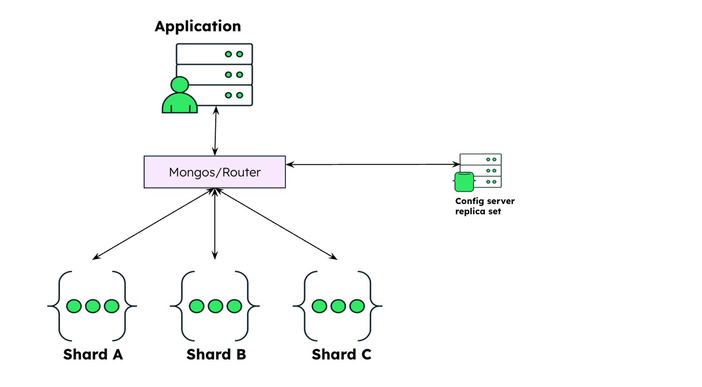
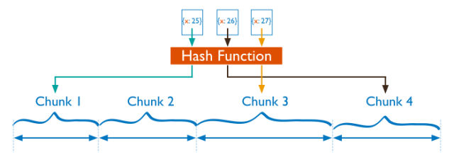

# MongoDB Sharding Patterns & Strategy (MongoDB 分片模式與策略)

## 1\. Hashed Sharding (雜湊分片)

當數據量巨大時，MongoDB 必須將數據分散到不同的機器 (Shards) 上。**Hashed Sharding** 是解決「寫入熱點 (Hot Spots)」的關鍵技術。MongoDB 不直接使用原始的 Shard Key（如 `user_id`），而是先計算其 **MD5 Hash** 值，再根據這個雜湊值將數據分配到 Chunk 中。
* **流程**: `Shard Key (原始值)` $\xrightarrow{MD5}$ `Hash Value (雜湊值)` $\rightarrow$ `Chunk (範圍)` $\rightarrow$ `Shard (實體機器)`

### 為什麼需要它？解決「單調遞增」問題

如果我們使用時間戳 (Timestamp) 或自增 ID 作為 Key 且**不使用雜湊**：

| Aspect | 說明 (Description) |
| :--- | :--- |
| **問題** | 所有最新的寫入都會落入「數值最大」的那個 Chunk。 |
| **後果** | 所有的寫入壓力都會集中在**最後一台 Shard** (Hot Shard)，其他 Shards 閒置。這會導致系統的寫入吞吐量受限於單台機器的效能。 |
| **解法** | 即使時間戳是連續的 (10:00, 10:01, 10:02...)，它們的 Hash 值會是完全隨機且分散的，因此寫入會均勻分佈到所有 Shards。 |

### 優缺點分析

| 特性 | 說明 | 影響 (Impact) |
| :--- | :--- | :--- |
| **寫入分佈 (Write Distribution)** | 
佳
 | 數據隨機打散，避免單點過載，寫入效能可線性擴展。 |
| **範圍查詢 (Range Query)** | 
差
 | 查詢 `time > 10:00` 時，因為連續的時間點被雜湊到不同機器，DB 必須詢問**所有** Shards (Scatter-Gather)，導致高延遲。 |

-----

## 2\. Sharding vs. Consistent Hashing (分片架構對比)

這是在系統設計面試中常見的對比：**MongoDB 的分片方式 (Chunk-based)** 與 **Dynamo/Cassandra 的分片方式 (Ring-based)** 有何本質不同？

| 比較維度 | MongoDB Sharding (Chunk-based) | Consistent Hashing (Ring-based / DHT) |
| :--- | :--- | :--- |
| **核心架構** | **中心化管理 (Centralized)** 依賴 **Config Servers** 紀錄「哪個 Chunk 在哪個 Shard」的對照表 (Metadata)。 | **去中心化 (Decentralized)** 使用 **Hash Ring**。沒有中央管理者，每個節點都知道算法，算出數據該去環上的哪個位置。 |
| **數據搬遷 (Rebalancing)** | **由 Balancer 協調** 當某個 Shard 數據過多，Balancer 會啟動並物理搬運 Chunk。這是一個**繁重 (Heavy)** 的操作，可能會影響效能。 | **最小化移動** 當新增節點時，只需從環上的鄰居分攤數據。只有 $1/N$ 的數據需要移動，網路風暴較小。 |
| **單點故障 (SPOF)** | **有 (Config Servers)** 若 Config Server 全掛，Metadata 無法讀取，叢集將無法進行 Chunk 分裂或遷移 (雖仍可讀寫現有數據，但管理功能癱瘓)。 | **無 (High Availability)** 節點對等，透過 Gossip Protocol 交換狀態。任一節點掛掉，環上的下一節點自動接手。 |
| **適用場景** | 強調 **CP (Consistency)** 需要強一致性、精確控制數據位置的系統。 | 強調 **AP (Availability)** 如 Cassandra、DynamoDB，容忍最終一致性，追求極致的高可用。 |

-----

## 3\. Designing Sharding Strategy (設計分片策略)

選擇 Shard Key 是「一但選錯，後悔成本極高」的決定。評估一個 Key 是否合格，需通過以下三大考驗：

| 考驗 (Test) | 定義 (Definition) | 原則 (Principle) | 案例與影響 (Examples & Impact) |
| :--- | :--- | :--- | :--- |
| **1. 基數** (Cardinality) | 這個欄位有多少種「不重複」的值？ | **必須高基數** (High Cardinality) | `region`。若只有 3 個值 ("US", "EU", "ASIA")，最多只能拆成 3 個 Chunks，限制了擴展性。 `user_id`, `uuid`。 |
| **2. 寫入頻率** (Write Distribution) | 寫入操作是否會集中在某個特定的 Key 值或範圍？ | **避免單調遞增** (Avoid Monotonicity) | `created_at`。會導致 "Last Chunk" 成為熱點。 **解法**: 改用 **Hashed Sharding** 或 **複合鍵** `{ region: 1, _id: 1 }`。 |
| **3. 查詢隔離** (Query Isolation) | 常用的查詢語句中，是否包含 Shard Key？ | **最大化 Targeted Queries** (針對性查詢) | **Targeted**: 查詢帶 Key，直接路由到特定 Shard (快)。 **Scatter-Gather**: 查詢無 Key，需廣播給所有 Shards (慢)。 **Trade-off**: Hash Key 雖解決寫入熱點，但會犧牲範圍查詢效能。 |

> **設計口訣**: "Cardinality 決定上限，Frequency 決定寫入瓶頸，Query Pattern 決定讀取延遲。"
