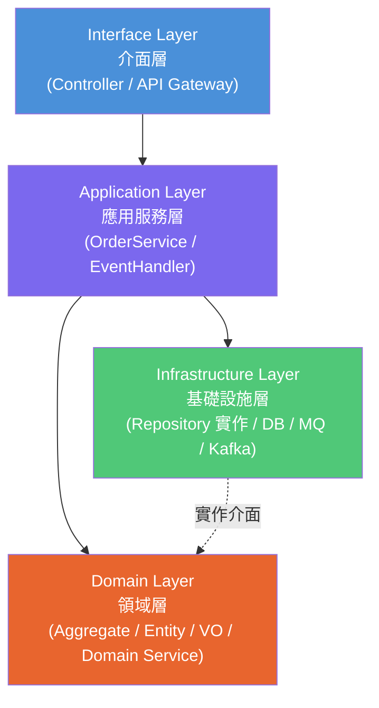

# 《DDD 領域驅動設計：從戰略到戰術的實務筆記》

## 壹、DDD 的核心精神

DDD（Domain-Driven Design）不是框架，而是一套把「業務知識」放在軟體中心的設計方法。

- 用**統一語言（Ubiquitous Language）**讓 PM、RD、QA 說同一種話。
- 用**邊界上下文（Bounded Context）**切分模型，避免同一名詞在不同子系統意義混亂。
- 用**聚合（Aggregate）與封裝**保護業務不變條件（Invariant）。
- 用**分層架構**隔離技術細節，讓資料庫、MQ、框架可替換。

DDD 解的是「業務複雜度」，不是「所有系統都物件化」。

### DDD 分層架構（Layered Architecture）



- **Interface 層**：接收外部請求（HTTP、gRPC），轉交 Application 層。
- **Application 層**：協調交易與流程，呼叫 Domain 與 Infrastructure。
- **Domain 層**：核心業務邏輯，不依賴任何外部技術。
- **Infrastructure 層**：實作 Domain 層定義的介面（如 Repository），負責 DB、MQ 等技術細節。

> 關鍵：依賴方向由外向內，**Domain 層不依賴任何其他層**。Infrastructure 層實作 Domain 層定義的介面（依賴反轉）。

## 貳、戰略設計（Strategic Design）

### 1. 子域切分（Subdomain）

- **Core Domain（核心域）：** 直接形成競爭優勢，最值得投資設計能力。
- **Supporting Subdomain（支撐域）：** 重要但非核心差異化能力。
- **Generic Subdomain（通用域）：** 可買現成方案或直接採通用實作。

### 2. 邊界上下文（Bounded Context）

同一詞在不同 Context 可有不同模型，例如 `Order` 在「訂單」與「物流」上下文的欄位與規則可不同，不應共用同一個巨型物件。

### 3. 上下文關係（Context Map）

常見整合關係：

- **Customer/Supplier：** 上游模型驅動下游整合節奏。
- **Conformist：** 下游直接服從上游模型。
- **ACL（Anti-Corruption Layer）：** 用轉換層保護本地模型，不被外部模型污染。
- **Published Language / Open Host Service：** 以公開契約穩定整合。

## 參、戰術設計（Tactical Design）

DDD 在程式碼層面反對貧血模型（只有 getter/setter），主張「資料 + 行為 + 規則」同時封裝。

### 1. Entity（實體）

- 有識別（ID）且生命周期中會變化。
- 判等通常依據 ID，而非全欄位值。

### 2. Value Object（值物件）

- 無識別，值相等即物件相等。
- 應保持不可變（Immutable），如 `Money`、`Address`。

### 3. Aggregate / Aggregate Root（聚合 / 聚合根）

- 聚合是一次一致性邊界。
- 聚合根是外界唯一入口，外界不直接修改內部 Entity。
- 不變條件在聚合根內被保證，例如「已付款訂單不可取消」。

#### 聚合內部結構：以 Order 為例

聚合（Aggregate）是由一組高度相關的物件組成的集合邊界，包含「實體（Entities）」與「值物件（Value Objects）」。以 `Order`（訂單）為例：

**1. 聚合根實體 (Root Entity)：`Order`**

- **全域唯一識別碼（Global Identity）**：外部系統可透過 `order_id` 直接查詢與操作。
- **職責**：作為聚合對外代表，是所有內部狀態改變的唯一守門員。

**2. 內部實體 (Local Entity)：`OrderItem`**

- **區域唯一識別碼（Local Identity）**：僅在聚合內有意義（如：該訂單的第 1 項、第 2 項）。
- **生命週期依附**：若 `Order` 被刪除，內部的 `OrderItem` 也隨之消滅。
- **存取限制**：外部系統**不能**直接透過 `item_id` 修改 `OrderItem`，必須透過聚合根呼叫 `order.change_item_quantity(item_id, new_quantity)`。

**3. 值物件 (Value Object)：`Address`、`Money`**

- **無識別、不可變**：用於描述特徵，如訂單的「送貨地址（ShippingAddress）」或品項的「單價（Price）」。

#### 聚合邊界結構圖

```text
[ Aggregate Boundary (聚合邊界) ]
│
├── Root Entity: Order (訂單)  ← 外部只能透過它操作
│   ├── ID: order_id
│   ├── Status: "PENDING"
│   ├── Value Object: ShippingAddress (送貨地址)
│   │
│   └── Local Entities: [OrderItem, OrderItem, ...] (訂單明細)
│       ├── OrderItem (實體 1)
│       │   ├── ID: item_id_1
│       │   ├── ProductId: "PROD_A"
│       │   └── Quantity: 2
│       │
│       └── OrderItem (實體 2)
│           ├── ID: item_id_2
│           ├── ProductId: "PROD_B"
│           └── Quantity: 1
```

**關鍵原則**：聚合根（Order）負責管理內部實體（OrderItem）與值物件，確保所有狀態變更都符合業務不變條件。

### 4. Domain Service（領域服務）

當規則不自然屬於某個 Entity/VO，且仍屬領域邏輯時，放在 Domain Service。

### 5. Application Service（應用服務）

負責流程協調（交易、呼叫 Repository、發送事件），不承載核心業務規則。

### 6. Repository（儲存庫）

Repository 是「領域層看待資料的集合介面」，不是 ORM 的別名。實務守則：

- 以**聚合根**為主要讀寫單位（可有查詢模型例外）。
- 負責持久化與重建聚合，隱藏儲存細節。
- 介面定義放在 Domain，實作放在 Infrastructure。

## 肆、Outbox Pattern（發件箱模式）與一致性

Outbox 用來解決 Dual Write（DB 成功但 MQ 失敗）：

1. 應用服務開啟交易。
2. 透過 Repository 寫入業務資料。
3. 同交易寫入 `outbox` 事件紀錄。
4. 提交交易，確保狀態與事件同生共死。
5. 背景派送器（Poller/CDC）把 Outbox 事件送到 Kafka/SQS。

### 實務流程詳解：訂單端 (Producer)

當訂單建立時，我們必須保證「訂單資料」與「領域事件」同時成功或同時失敗。

#### 1. 執行流程

1.  **應用服務 (OrderService)**：啟動資料庫交易。
2.  **聚合根 (Order)**：執行業務邏輯，產生 `OrderCreated` 事件並暫存於記憶體。
3.  **儲存庫 (OrderRepository)**：將 Order 狀態存入 `orders` 表，同時將事件存入 `outbox` 表。
4.  **提交交易**：兩者在同一個 Atomicity 邊界內完成。
5.  **派送器 (Dispatcher)**：背景程式每秒掃描 `outbox` 表，將未發送事件推送到 Kafka，成功後標記為 `processed`。

#### Python 偽代碼實作範例

<details>
<summary>點擊展開：訂單端完整偽代碼（Order Context）</summary>

```python
from dataclasses import dataclass, field
from datetime import datetime
from uuid import uuid4
from typing import List, Protocol

# ─── 基礎設施介面 (Infrastructure Interface) ───
class DatabaseSession(Protocol):
    """資料庫連線抽象，由 Infrastructure 層實作（如 SQLAlchemy Session）"""
    def execute(self, sql: str, params: tuple = ()) -> None: ...
    def query(self, sql: str, params: tuple = ()) -> list: ...
    def transaction(self): ...  # Context Manager

class KafkaProducer(Protocol):
    """Kafka 發送端抽象"""
    def publish(self, topic: str, payload: str) -> None: ...

# ─── 值物件 (Value Objects) ───
@dataclass(frozen=True)  # frozen=True 保證不可變
class Money:
    amount: float
    currency: str = "TWD"

@dataclass(frozen=True)
class ShippingAddress:
    city: str
    street: str
    zip_code: str

# ─── 領域事件 (Domain Event) ───
@dataclass(frozen=True)
class OrderCreatedEvent:
    event_id: str
    order_id: str
    user_id: str
    items: list          # [{product_id, quantity, price}, ...]
    occurred_at: datetime

# ─── 內部實體 (Local Entity)：OrderItem ───
@dataclass
class OrderItem:
    item_id: str                    # 區域唯一識別碼
    product_id: str
    quantity: int
    unit_price: Money

    def subtotal(self) -> float:
        return self.quantity * self.unit_price.amount

# ─── 聚合根 (Aggregate Root)：Order ───
class Order:
    def __init__(self, order_id: str, user_id: str,
                 items: List[OrderItem], address: ShippingAddress):
        self.order_id = order_id        # 全域唯一識別碼
        self.user_id = user_id
        self.items = items              # 內部實體集合
        self.address = address          # 值物件
        self.status = "PENDING"
        self._events: list = []         # 暫存領域事件（記憶體內）

    @property
    def events(self) -> list:
        return self._events

    @staticmethod
    def create(user_id: str, raw_items: list, address: ShippingAddress) -> "Order":
        """工廠方法：建立訂單並產生領域事件"""
        order_id = str(uuid4())
        items = [
            OrderItem(
                item_id=str(uuid4()),
                product_id=i["product_id"],
                quantity=i["quantity"],
                unit_price=Money(i["price"]),
            )
            for i in raw_items
        ]
        order = Order(order_id, user_id, items, address)

        # 聚合根在記憶體裡暫存事件，等 Repository 一起寫出
        order._events.append(
            OrderCreatedEvent(
                event_id=str(uuid4()),
                order_id=order_id,
                user_id=user_id,
                items=[
                    {"product_id": it.product_id, "quantity": it.quantity}
                    for it in items
                ],
                occurred_at=datetime.utcnow(),
            )
        )
        return order

    def change_item_quantity(self, item_id: str, new_qty: int):
        """外部必須透過聚合根修改內部實體"""
        for item in self.items:
            if item.item_id == item_id:
                if new_qty <= 0:
                    raise ValueError("數量必須大於 0")
                item.quantity = new_qty
                return
        raise ValueError("找不到該品項")


# ─── 儲存庫 (Repository)：Dual Write ───
class OrderRepository:
    def __init__(self, db: DatabaseSession):
        self.db = db  # 透過建構子注入資料庫連線

    def save(self, order: Order):
        # ⚠️ 以下在同一個 DB Transaction 中執行：

        # (A) 儲存訂單主體 + 訂單明細
        self.db.execute("INSERT INTO orders (...) VALUES (...)", order)
        for item in order.items:
            self.db.execute("INSERT INTO order_items (...) VALUES (...)", item)

        # (B) 儲存發件箱事件 → 這就是 Outbox 的核心
        for event in order.events:
            self.db.execute(
                """INSERT INTO outbox
                   (event_id, aggregate_id, type, payload, created_at)
                   VALUES (?, ?, ?, ?, ?)""",
                (event.event_id, event.order_id,
                 "OrderCreated", to_json(event), event.occurred_at)
            )


# ─── 應用服務 (Application Service)：協調交易 ───
class OrderService:
    def __init__(self, db: DatabaseSession, repo: OrderRepository):
        self.db = db
        self.repo = repo

    def create_order(self, cmd: CreateOrderCommand):
        with self.db.transaction():  # 開啟交易邊界
            # 1. 聚合根執行業務邏輯，產生事件
            order = Order.create(cmd.user_id, cmd.items, cmd.address)
            # 2. Repository 同時寫入業務資料 + outbox 事件
            self.repo.save(order)
            # 3. Transaction commit → 兩者原子落庫


# ─── 背景派送器 (Outbox Dispatcher) ───
# 這是一個獨立的背景程式（可以是獨立 Thread、Process 或 K8s CronJob）
# 職責：把 DB 中的 outbox 事件「搬運」到 Kafka，完成 Outbox → Event Bus 的橋接
class OutboxDispatcher:
    def __init__(self, db: DatabaseSession, kafka: KafkaProducer):
        self.db = db
        self.kafka = kafka

    def poll_and_publish(self):
        """單次掃描：撈出未發送事件 → 推到 Kafka → 標記已處理"""
        rows = self.db.query("SELECT * FROM outbox WHERE processed = FALSE")
        for row in rows:
            # 把事件 payload 推送到 Kafka Topic
            self.kafka.publish(topic="order-events", payload=row.payload)
            # 推送成功後，標記該事件為已處理
            self.db.execute(
                "UPDATE outbox SET processed = TRUE WHERE event_id = ?",
                (row.event_id,)
            )

    def start(self):
        """以固定間隔持續輪詢（實務可用 APScheduler 或 Celery Beat）"""
        import time
        while True:
            self.poll_and_publish()
            time.sleep(1)  # 每秒掃描一次

# 啟動方式範例：
# dispatcher = OutboxDispatcher(db=session, kafka=producer)
# threading.Thread(target=dispatcher.start, daemon=True).start()
```

</details>

關鍵觀念：

- 聚合根在記憶體中暫存事件（`_events`），交由 Repository 在同一個 Transaction 中寫入 `outbox` 表。
- Outbox 保證「至少一次（at-least-once）」投遞，消費者必須做**冪等性檢查**。
- 事件需帶 `event_id`、`aggregate_id`、`occurred_at` 等欄位便於追蹤與去重。

## 伍、跨 Context 流程：Order -> Inventory（Saga）

跨資料庫時不要期待本地交易 rollback 全世界，通常改用 Saga 補償。

### Happy Path (監聽與處理流)

從訂單 (Order) 到庫存 (Inventory) 的完整流程可拆解為：**「發送 -> 訂閱 -> 重建 -> 處理 -> 持久化」**。

**資料流路徑：**
`Order 系統 (Outbox)` -> `Kafka (Topic: order-events)` -> **`Inventory Consumer`** -> **`Inventory EventHandler`** -> **`Inventory Repository`** -> **`Inventory Aggregate`** -> **`Inventory Repository (Save)`**

#### 庫存端 (Inventory) 的詳細步驟：

1.  **訂閱與接收 (Subscribe & Consume)**：背景 Kafka Consumer 盯著 `order-events` 主題，收到 `OrderCreatedEvent` 時將 JSON 轉為物件（如 Dataclass）。
2.  **派發給事件處理器 (Dispatch)**：Consumer 將事件轉交給應用服務層的 `InventoryEventHandler`。
3.  **透過 Repository 重建聚合根 (Reconstruct)**：處理器呼叫 `repo.get(product_id)`，從資料庫撈出資料並實體化為活生生的 `Inventory` 聚合根。**防腐關鍵：不直接寫 SQL UPDATE。**
4.  **聚合根執行業務邏輯 (Execute)**：呼叫 `inventory.reserve(quantity)`。聚合根在記憶體中檢查規則（如：剩餘量是否足夠）並更新自身狀態。
5.  **透過 Repository 存檔 (Save)**：處理器將狀態改變後的聚合根交還給 `repo.save(inventory)`，由 Repository 負責 SQL 交易與持久化。

#### Python 偽代碼實作範例

<details>
<summary>點擊展開：庫存端完整偽代碼（Inventory Context）</summary>

```python
from dataclasses import dataclass
from datetime import datetime

# ─── 庫存聚合根 (Aggregate Root)：Inventory ───
class Inventory:
    def __init__(self, product_id: str, total: int, reserved: int, version: int = 0):
        self.product_id = product_id   # 全域唯一識別碼
        self.total = total             # 總庫存量
        self.reserved = reserved       # 已預扣量
        self.version = version         # 樂觀鎖版本號
        self._events: list = []

    @property
    def available(self) -> int:
        """可用庫存 = 總量 - 已預扣"""
        return self.total - self.reserved

    def reserve(self, quantity: int):
        """預扣庫存：聚合根在此守護不變條件 (Invariant)"""
        if quantity <= 0:
            raise ValueError("預扣數量必須大於 0")
        if quantity > self.available:
            raise ValueError(
                f"庫存不足：可用 {self.available}，需求 {quantity}"
            )
        self.reserved += quantity
        self._events.append(InventoryReservedEvent(
            product_id=self.product_id, quantity=quantity
        ))

    def release(self, quantity: int):
        """釋放預扣（補償用）"""
        self.reserved = max(0, self.reserved - quantity)


# ─── 儲存庫 (Repository)：重建 + 持久化 + 樂觀鎖 ───
class InventoryRepository:
    def __init__(self, db: DatabaseSession):
        self.db = db

    def get(self, product_id: str) -> Inventory:
        """從 DB 載入資料並重建 (Reconstruct) 聚合根"""
        row = self.db.query(
            "SELECT product_id, total, reserved, version FROM inventory WHERE product_id = ?",
            (product_id,)
        )
        if not row:
            return None
        return Inventory(row.product_id, row.total, row.reserved, row.version)

    def save(self, inventory: Inventory):
        """將聚合根的新狀態寫回 DB（樂觀鎖：version 不符代表被其他交易搶先）"""
        old_version = inventory.version
        rows_affected = self.db.execute(
            """UPDATE inventory
               SET reserved = ?, version = version + 1
               WHERE product_id = ? AND version = ?""",
            (inventory.reserved, inventory.product_id, old_version)
        )
        if rows_affected == 0:
            raise ConcurrencyError("庫存已被其他交易修改，請重試")
        inventory.version = old_version + 1


# ─── 事件處理器 (Application Service) ───
class InventoryEventHandler:
    def __init__(self, db: DatabaseSession, repo: InventoryRepository):
        self.db = db
        self.repo = repo

    def handle_order_created(self, event: OrderCreatedEvent):
        """處理來自 Order Context 的整合事件（含冪等性檢查）"""
        # ─── 冪等性檢查：同一事件不重複處理 ───
        already = self.db.query(
            "SELECT 1 FROM processed_events WHERE event_id = ?",
            (event.event_id,)
        )
        if already:
            return  # 已處理過，直接跳過

        for item in event.items:
            # 1. 重建聚合根 (Reconstruct)
            inventory = self.repo.get(item["product_id"])
            if not inventory:
                raise ValueError(f"找不到商品 {item['product_id']} 的庫存")

            # 2. 執行業務邏輯（由聚合根自己把關）
            inventory.reserve(item["quantity"])

            # 3. 存檔持久化（樂觀鎖保護）
            self.repo.save(inventory)

        # 4. 記錄已處理事件（冪等性標記）
        self.db.execute(
            "INSERT INTO processed_events (event_id, processed_at) VALUES (?, ?)",
            (event.event_id, datetime.utcnow())
        )


# ─── Kafka Consumer（基礎設施層）───
class InventoryConsumer:
    """背景程式：持續監聽 Kafka，收到訊息後派發給 EventHandler"""
    def __init__(self, handler: InventoryEventHandler):
        self.handler = handler

    def start(self):
        consumer = KafkaConsumer(topic="order-events")
        for message in consumer:  # 持續輪詢
            event = deserialize(message.value, OrderCreatedEvent)
            self.handler.handle_order_created(event)
            consumer.commit()  # 確認消費成功
```

</details>

### 補償路徑

1. 下游失敗發布 `ReservationFailed` / `PaymentFailed`。
2. `Order` Context 消費後執行聚合行為（如 `cancel()`）。
3. 產生補償事件通知其他上下文回收資源。

## 陸、何時適合用 DDD

- **適合：** 規則多、名詞容易歧義、跨團隊協作頻繁的核心業務。
- **不適合：** 純 CRUD、小型一次性工具、主要瓶頸在 I/O 或演算法而非業務規則。

實務上常見做法是「局部 DDD」：只在 Core Domain 高強度使用，其他模組保持簡潔。

## 柒、DDD 重要術語中英對照表

| English                     | 中文          | 一句話定義                                 |
| --------------------------- | ------------- | ------------------------------------------ |
| Domain                      | 領域          | 問題空間與業務知識本體。                   |
| Subdomain                   | 子域          | 領域中的子問題區塊（核心/支撐/通用）。     |
| Ubiquitous Language         | 統一語言      | 團隊共享且可落在程式碼命名的業務詞彙。     |
| Bounded Context             | 邊界上下文    | 某套模型與語義生效的邊界。                 |
| Context Map                 | 上下文地圖    | 描述各 Context 關係與整合模式。            |
| Entity                      | 實體          | 有 ID 且隨時間演化的物件。                 |
| Value Object                | 值物件        | 無 ID、以值相等、通常不可變。              |
| Aggregate                   | 聚合          | 一組維護一致性的物件邊界。                 |
| Aggregate Root              | 聚合根        | 聚合對外唯一操作入口。                     |
| Repository                  | 儲存庫        | 提供聚合的讀寫抽象，隱藏持久化細節。       |
| Factory                     | 工廠          | 封裝複雜建構流程，確保物件初始合法。       |
| Domain Service              | 領域服務      | 不屬於單一實體但屬領域規則的服務。         |
| Application Service         | 應用服務      | 協調用例流程與交易邊界。                   |
| Domain Event                | 領域事件      | 描述「領域中已發生」的重要事實。           |
| Integration Event           | 整合事件      | 對外發布、供跨 Context 溝通的事件。        |
| Outbox Pattern (OutBox)     | 發件箱模式    | 以同交易寫業務資料與事件，避免雙寫不一致。 |
| Saga                        | Saga/補償交易 | 用事件編排長交易，以補償替代全域回滾。     |
| Anti-Corruption Layer (ACL) | 防腐層        | 隔離外部模型，保護本地語義。               |
| Invariant                   | 不變條件      | 在任一合法狀態都必須成立的業務規則。       |
| Specification               | 規格模式      | 可組合的業務規則判斷物件。                 |
| Domain Model                | 領域模型      | 對業務概念、規則與關係的程式化表示。       |
| Infrastructure              | 基礎設施層    | DB、MQ、外部 API、框架與技術實作。         |
