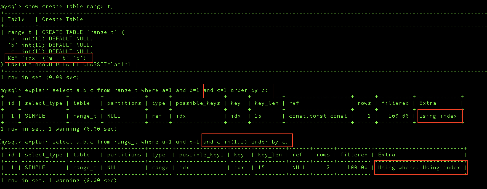

> 📌 此文件來自 https://ithelp.ithome.com.tw/users/20177857/ironman 的 IT 邦鐵人賽教程，僅針對個人學習用途進行筆記與修改。

## MySQL 的效能檢測 EXPLAIN

EXPLAIN 功能，可以在不實際執行 Query 的情況下，查詢 Optimizer 制定的 Query Plan 細節，Explain 出來的內容有：

### EXPLAIN 欄位概覽

執行 `EXPLAIN SELECT ...` 時，MySQL 會回傳包含以下欄位的表格：

| EXPLAIN 欄位 | 回答的問題 |
|-------------|----------|
| `id` | 查詢的序號（子查詢會有不同 id） |
| `select_type` | 查詢類型（SIMPLE、SUBQUERY、UNION 等） |
| `table` | 這一步查詢的表名 |
| `possible_keys` | Optimizer 在分析這個 Query 時，根據查詢條件和表的 index 定義，認為「理論上可以使用」的 index 列表。 |
| `key` | Optimizer **最後選了**哪個 index？ |
| `key_len` | 用到的 index 長度 |
| `ref` | 用**什麼值**去查 index？（常數？欄位？函數結果？） |
| `type` | **怎麼查**這個 index？（全掃？範圍？精確匹配？） |
| `rows` | 預估掃描的行數 |
| `filtered` | 過濾後剩餘比例 |
| `Extra` | 還有**額外做什麼**？（排序？過濾？用臨時表？） |




| 欄位 | 值 | 說明 |
|------|-----|------|
| **possible_keys** | - | Query 中可以使用的 index |
| **key** | - | Optimizer 選中的 index |
| **ref** | `const` | 使用常數比較 (e.g. `id = 5`) |
| | `column name` | 使用其他表的 column 比較 (e.g. `o.customer_id = c.customer_id`) |
| | `func` | 比較的 index key 有經過 function 處理 (e.g. `UPPER(name) = 'JOHN'`) |
| | `NULL` | 沒有等於比較 (e.g. `id > 5` 或全表掃描) |
| **type** | `system` | Table 裡只有一筆 row 或是空的 |
| | `const` | 只查詢一筆 |
| | `eq_ref` | 查詢條件來自其他表的唯一值 (JOIN) |
| | `ref` | = 查詢條件非唯一值 |
| | `range` | 範圍查詢 (BETWEEN, >, <, IN …) |
| | `index` | FULL Index Scan，掃描整個 Secondary Index Tree |
| | `ALL` | FULL Table Scan，掃描整個 Clustered Index Tree |
| **extra** | `using index` | 只用到 Secondary Index，不需回 Clustered Index Tree |
| | `using filesort` | 無法使用 index 排序，需在記憶體中排序 |
| | `using where` | index tree 無法過濾完資料，需在記憶體中過濾 |
| | `using temporary` | 使用臨時表 (Union/Sub Query)，會額外消耗記憶體或硬碟空間 |
| | `using MRR` | Multi-Range Read 優化，通常用在 Range 查詢 |
| | `using intersect/union/sort_union` | index merge 優化，通常用在不同欄位的 OR 條件 |
| | `using index condition` | 使用 composited index 的 ICP 優化 |

> **type 效能排序：** `system` > `const` > `eq_ref` > `ref` > `range` > `index` > `ALL`


### MMR (Multi-Range Read) 優化：
用 secondary index range 查詢且需要回 clustered index 找完整資料時，由於 secondary index 排序跟 primary key 排序不一樣，若依照 secondary index 排序回 clustered index 找資料會造成隨機 I/O，而 <span style="color: orange;">MMR 優化是將 secondary index 找到的資料 primary key 暫存到記憶體，排序後批次去 clustered index 查詢，將隨機 I/O 變成順序 I/O。</span>

### Index Merge 優化：
使用 OR 時，例如 `SELECT * FROM t WHERE a = 1 OR b = 2`，會分別查詢 `Index Tree` (a=1, b=2) 並把結果 Merge 起來並移除重複 Primary Key 資料，再用 Merge 的結果去 Clustered Index 找完整資料，降低去 Clustered Index 查找數量。

Index Merge (Union) 的運作流程如下：
1. 掃描 a=1 的 Index Tree，把符合的 Primary Key (id) 抓出來。
2. 掃描 b=2 的 Index Tree，把符合的 Primary Key (id) 抓出來。
3. <span style="color:red">【最花費資源的步驟】</span> 把這兩堆 id 丟到記憶體裡進行集合運算 (Set Operation)：合併、排序、去重 (De-duplicate)。
4. 最後拿著過濾好的 id 去 Clustered Index 撈資料。

### ICP (Index Condition Pushdown) 優化：
使用 index `(a, b, c)` 執行 `SELECT * FROM t WHERE a = ? AND b > ? AND c = ?` 時

由於 `b` 是範圍查詢，導致 `c` 欄位在範圍內並非全局有序，無法使用 Binary Search。這與 **Composite Index (聯合索引) 的儲存結構**有關。

**在 Index Tree 裡，資料是「階層式排序」的。只有當「前一個欄位值相同」時，後一個欄位才是有序的。**

舉個具體的例子，假設 `Index (a, b, c)`，且 `a=1` 固定：

| Row | a | b | c | 說明 |
| --- | - | - | - | --- |
| 1 | 1 | **10** | 1 | (b=10 裡面，c 是有序的) |
| 2 | 1 | **10** | 2 | |
| 3 | 1 | **10** | 3 | |
| 4 | 1 | **20** | <span style="color: red;">1</span> | (b=20 裡面，c 是有序的) |
| 5 | 1 | **20** | <span style="color: red;">2</span> | |
| 6 | 1 | **20** | <span style="color: red;">3</span> | |
| 7 | 1 | **30** | <span style="color: red;">1</span> | (b=30 裡面，c 是有序的) |
| 8 | 1 | **30** | <span style="color: red;">2</span> | |
| 9 | 1 | **30** | <span style="color: red;">5</span> | |

當執行 `WHERE a = 1 AND b > 10 AND c = 2` 時：
- `b > 10` 的範圍跨越了 distinct 的 `b` 值 (20, 30...)。
- `c` 的值在這個範圍內是 `1, 2, 3` -> `1, 2, 5`，呈現「局部有序，全局無序」的狀態。
- 因為無法形成連續的單調數列，MySQL **無法**對 `c` 進行 Binary Search。

此時因為 `SELECT *` 需要回 Clustered Index 找完整資料。

<span style="color: orange;">ICP (Index Condition Pushdown) 機制會將 `c = ?` 的判斷下推到 Storage Engine 層。</span>在掃描 Index Tree 時，雖然無法快速跳轉，但可以在讀取 Index 節點時<span style="color: orange;">直接檢查 `c` 是否符合，提早過濾掉不符合的資料，避免對這些無效資料進行昂貴的回表 (Clustered Index Lookup)</span>，從而大幅減少隨機 I/O 次數。

**rows & filtered** : Optimizer 根據 Index Tree 統計資料估數的查詢數量

- rows：預估會 scan 多少筆數
- filtered：預估 scan 出來的 row 有多少比例完全匹配查詢條件，filtered 率越高越好

**key_len**：預估使用到的 Index Key 長度，可用來判斷 Composite Index 是否所有欄位都用到

### EXPLAIN ANALYZE 觀測 query 實際執行的 CPU 和時間

EXPLAIN 主要是看 Optimizer 透過統計資料制定的 Query Plan，如果想看到實際 Query 的執行時間和 cost 分數，可以執行 **EXPLAIN ANALYZE**。

**EXPLAIN ANALYZE 會實際執行 Query 並輸出:**


- 執行計劃節點，也就是 Query 的步驟，以上面為例可以看到有四個步驟：
    - `Filter (u.country = 'US')` 資料
    - `users u Table` 的 Full Table Scan
    - `orders 表` 使用 **Index** 查詢 `user_id=u.id`
    - 將兩批資料使用 **Nested Loop Inner Join** 關聯起來
- Optimizer 預估資訊 (cost=1000.25 rows=5000)，cost 是成本分數，cost 越高可能會消耗越多 CPU ，rows 是預計 scan 筆數
- 實際執行資訊 (`actual time`=0.020..10.532 rows=100000 loops=1)
    - `actual time` 時間單位為 ms，讀到第一筆花 0.02ms，讀完最後一筆花 10ms
    - `rows` 實際總共 scan 的筆數
    - `loops` 這個節點被執行了幾次

### Optimizer 的預估與 EXPLAIN ANALYZE 的執行結果具有誤差的情況

由於 <span style="color: orange;">Optimizer 使用的統計數據是抽樣調查</span>，難免會有誤差，此時可透過`ANALYZE TABLE your_table;` 重新抽樣。

若如果單純看「唯一值的數量」(Cardinality) 沒辦法讓 Optimizer 選對執行路徑（通常是因為資料分佈不均），那就建立 Histogram 來告訴 Optimizer 詳細的資料分佈狀況：

`ANALYZE TABLE your_table UPDATE HISTOGRAM ON column_name WITH 100 BUCKETS;`

如果還是不準，最後可試 `ALTER TABLE your_table STATS_SAMPLE_PAGES=100;` 調整抽樣數量

> [!WARNING]
> 不過要注意 MySQL 執行抽樣統計是會消耗 `CPU` 的，尤其建立 Histogram 時是需要逐筆計算的，可能需要 Full Table Scan。

### 優化查詢效能 (Query Optimization)

了解 Optimizer 原理跟 EXPLAIN 語法能幫助定位效能問題，以下為幾個 queries 的優化案例

#### 善用 Union ALL 來優化查詢效能

**Query 1 - 避免觸發 Index Merge**
- 優化前
    ```sql
    SELECT * FROM t WHERE (user_id = 1 ) OR (receive_id = 1)
    ```
- 優化後
    ```sql
    SELECT * FROM t WHERE user_id = 1 UNION ALL SELECT * FROM t WHERE receive_id = 1
    ```

> [!TIP]
> 優化前查詢會用 `(user_id)` & `(receive_id)` Index 並觸發 **Index Merge** 消除重複資料。
> 但如果這兩個條件撈出來的資料量很大（例如各有 1 萬筆），那麼合併與排序就會非常消耗 CPU 和記憶體。
> 如果兩個 OR 查詢之間沒有太多交集資料，如果觸發 Index Merge 反而會多花 CPU 執行 Merge、Sort、De-duplicate，因此可改用 `UNION ALL` 避免觸發 Index Merge。

**Query 2 - 避免 Range 查詢**
- 優化前
    ```sql
    -- Example 1 Before
    SELECT * FROM orders WHERE user_id = 1 AND status IN (1,3,5) AND created_at > ?
    ```
    ```sql
    --- Example 2 Before
    SELECT * FROM t WHERE (user_id, receive_id) IN ((1, 2), (3, 4), (5, 6))
    ```

- 優化後
    ```sql
    --- Example 1 After
    --- Status 1
    SELECT * FROM orders WHERE user_id = 1 AND status = 1 AND created_at > ? 
    UNION ALL 
    --- Status 2
    SELECT * FROM orders WHERE user_id = 1 AND status = 3 AND created_at > ? 
    UNION ALL 
    --- Status 3
    SELECT * FROM orders WHERE user_id = 1 AND status = 5 AND created_at > ?
    ```
    ```sql
    --- Example 2 After
    SELECT * FROM t WHERE user_id = 1 AND receive_id = 2 
    UNION ALL 
    SELECT * FROM t WHERE user_id = 3 AND receive_id = 4 
    UNION ALL 
    SELECT * FROM t WHERE user_id = 5 AND receive_id = 6
    ```

> [!TIP]
> 優化前的 `IN` 條件，理論上等同於多個 `=` 的組合。
> 但當 `IN` 列表中的數值比較密集時，Optimizer 可能會為了縮短 Query Plan，將其優化為 **Range (範圍) 查詢** (例如將 `1,2,3` 視為 `BETWEEN 1 AND 3`)。
>
> 這樣做的風險在於：**Range 查詢會掃描整個範圍內的資料**（包含那些你不在乎的中間值），導致讀取過多無效資料。
> 改用 `UNION ALL` 可以強迫 MySQL 執行多個獨立的精確查詢 (`ref` 或 `const` access type)，確保只讀取真正需要的資料。

### 避免過大的 OFFSET

- 優化前
    ```sql
    SELECT * FROM t WHERE user_id = 1 LIMIT 100 OFFSET 9999999999
    ```

- 優化後
    ```sql
    SELECT * FROM t JOIN (SELECT id FROM t WHERE user_id = 1 LIMIT 100 OFFSET 9999999999) sub_query ON o.id = sub_query.id WHERE user_id = 1
    ```

> [!TIP]
> **為什麼會慢？ (無效回表)**
> 當執行 `LIMIT 100 OFFSET 1000000` 且包含 `SELECT *` 時，MySQL 必須先去 Clustered Index 撈出前 1,000,100 筆**完整資料**，然後**把前 1,000,000 筆丟掉**，只回傳最後 100 筆。這導致了大量的 I/O 浪費在讀取那些註定要被丟棄的資料上。
>
> **Deferred Join (延遲關聯) 解法：**
> 1.  **Subquery**: 先只 `SELECT id` (利用 Covering Index)。MySQL 可直接在 Index Tree 上快速跳過前 1,000,000 個節點 (**不用回表**)，只取出最後 100 個 `id`。
> 2.  **Join**: 拿著這 100 個真正需要的 `id` 去跟主表 Join，這時候才做這 100 次的「回表」讀取完整資料。
>
> 這樣就從「回表 1,000,100 次」變成只要「回表 100 次」，大幅提升效能。

### 強制 ORDER BY `primary_key` LIMIT N 使用特定 index 做查詢

- 優化前
    ```sql
    SELECT * FROM t WHERE uid = 123 ORDER BY id ASC LIMIT 100
    ```

- 優化後
    ```sql
    SELECT * FROM t force index(idx_uid) WHERE uid = 123 ORDER BY id ASC LIMIT 100
    ```

> [!TIP]
> **為什麼優化器會選錯 Index？**
> MySQL 優化器有一個迷思：它認為**全表掃描 (`Primary Key`) 是有序的**，所以如果你的 Query 有 `ORDER BY id LIMIT 100`，它會覺得：「我只要順著 Primary Key 掃描，找到前 100 個符合 `uid=123` 的資料就可以收工了，完全不用額外排序 (Filesort)」
>
> **風險：**
> 如果 `uid=123` 的資料分佈很稀疏（例如在第 100 萬筆才出現第一筆），原本想說「只要找 100 筆」，結果變成「掃描了 100 萬筆才湊齊 100 筆」。
> 這時候強迫使用 `FORCE INDEX(idx_uid)` 雖然需要額外排序 (因為 Index `uid` 對 `id` 沒排序)，但因為能精準定位資料，反而會比「賭博式」的全表掃描快得多。
>
> **關於 FORCE INDEX vs USE INDEX：**
> *   `USE INDEX`：只是給優化器一個「建議」參考這個 Index，但如果優化器堅持全表掃描更划算，它還是會忽略建議。
> *   `FORCE INDEX`：則是「強迫」優化器將全表掃描的成本設為無限大，除非真的沒招了（例如 Index 根本不存在），否則**一定要用你指定的 Index**。

### 妥善編排 Query 的執行順序

- 優化前
    ```sql
    SELECT COUNT(1), status FROM t WHERE uid = 1 GROUP BY status LIMIT 1000
    ```

- 優化後
    ```sql
    SELECT COUNT(1), status FROM 
        ( 
            SELECT status FROM t WHERE uid = 1 LIMIT 1000
        ) 
        GROUP BY status
    ```


> [!NOTE]
> 由於 `LIMIT` 執行順序在 `GROUP BY` 後，優化前寫法會 `GROUP BY` 所有資料，但其實需求只要 `GROUP BY` 前 1000 筆就好。
> 資料庫執行順序可[參考此篇](https://medium.com/@cindy20303705/sql%E6%9F%A5%E8%A9%A2%E5%9F%B7%E8%A1%8C%E9%A0%86%E5%BA%8F-4d62584d372d)。

### Composite Index 比 Single Column Index 好用

> [!TIP]
> 設計 Table Schema Index 時建議先從 **Composite Index** 著手，例如用 `(user_id, status)` 取代 `(user_id)`。
> 雖然 Composite Index 資料較多，但其實 Index Key 只多一個欄位可說是毫無差別。然而多一個欄位不僅能 cover 更多情境的查詢，還可觸發 **ICP 優化**降低回 Clustered Index 的 I/O 次數。

### 避免使用 sql function 在查詢欄位上
> [!CAUTION]
> **不要對 Index 欄位進行運算或使用函數**
> Index Tree 是根據**原始欄位值**排序的。一旦你對欄位做了運算（例如 `id + 1`）或函數轉換（例如 `UPPER(name)`），產生的新值在 Index Tree 中是**不一定有序**甚至是隨機的。
> MySQL 將無法利用 Binary Search 快速定位，只能被迫**把每一行資料都拿出來算一遍**，這就變成了**Full Table Scan**。

```sql
SELECT * FROM users WHERE id+1 > 100;
```
or
```sql
SELECT * FROM dtb_user_main WHERE UPPER(name) = 'vic';
```

