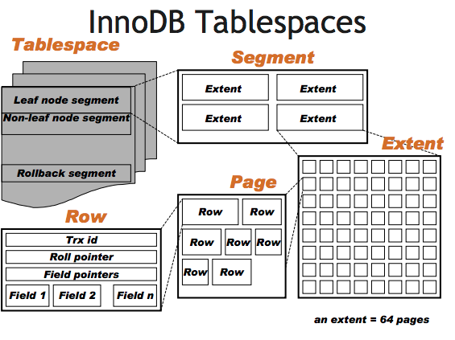

> 📌 此文件來自 https://ithelp.ithome.com.tw/users/20177857/ironman 的 IT 邦鐵人賽教程，僅針對個人學習用途進行筆記與修改。

## MySQL 的效能檢測 EXPLAIN

EXPLAIN 功能，可以在不實際執行 Query 的情況下，查詢 Optimizer 制定的 Query Plan 細節，Explain 出來的內容有：

### EXPLAIN 欄位概覽

執行 `EXPLAIN SELECT ...` 時，MySQL 會回傳包含以下欄位的表格：

| EXPLAIN 欄位 | 回答的問題 |
|-------------|----------|
| `id` | 查詢的序號（子查詢會有不同 id） |
| `select_type` | 查詢類型（SIMPLE、SUBQUERY、UNION 等） |
| `table` | 這一步查詢的表名 |
| `possible_keys` | Optimizer 在分析這個 Query 時，根據查詢條件和表的 index 定義，認為「理論上可以使用」的 index 列表。 |
| `key` | Optimizer **最後選了**哪個 index？ |
| `key_len` | 用到的 index 長度 |
| `ref` | 用**什麼值**去查 index？（常數？欄位？函數結果？） |
| `type` | **怎麼查**這個 index？（全掃？範圍？精確匹配？） |
| `rows` | 預估掃描的行數 |
| `filtered` | 過濾後剩餘比例 |
| `Extra` | 還有**額外做什麼**？（排序？過濾？用臨時表？） |




| 欄位 | 值 | 說明 |
|------|-----|------|
| **possible_keys** | - | Query 中可以使用的 index |
| **key** | - | Optimizer 選中的 index |
| **ref** | `const` | 使用常數比較 (e.g. `id = 5`) |
| | `column name` | 使用其他表的 column 比較 (e.g. `o.customer_id = c.customer_id`) |
| | `func` | 比較的 index key 有經過 function 處理 (e.g. `UPPER(name) = 'JOHN'`) |
| | `NULL` | 沒有等於比較 (e.g. `id > 5` 或全表掃描) |
| **type** | `system` | Table 裡只有一筆 row 或是空的 |
| | `const` | 只查詢一筆 |
| | `eq_ref` | 查詢條件來自其他表的唯一值 (JOIN) |
| | `ref` | = 查詢條件非唯一值 |
| | `range` | 範圍查詢 (BETWEEN, >, <, IN …) |
| | `index` | FULL Index Scan，掃描整個 Secondary Index Tree |
| | `ALL` | FULL Table Scan，掃描整個 Clustered Index Tree |
| **extra** | `using index` | 只用到 Secondary Index，不需回 Clustered Index Tree |
| | `using filesort` | 無法使用 index 排序，需在記憶體中排序 |
| | `using where` | index tree 無法過濾完資料，需在記憶體中過濾 |
| | `using temporary` | 使用臨時表 (Union/Sub Query)，會額外消耗記憶體或硬碟空間 |
| | `using MRR` | Multi-Range Read 優化，通常用在 Range 查詢 |
| | `using intersect/union/sort_union` | index merge 優化，通常用在不同欄位的 OR 條件 |
| | `using index condition` | 使用 composited index 的 ICP 優化 |

> **type 效能排序：** `system` > `const` > `eq_ref` > `ref` > `range` > `index` > `ALL`


### MMR (Multi-Range Read) 優化：
用 secondary index range 查詢且需要回 clustered index 找完整資料時，由於 secondary index 排序跟 primary key 排序不一樣，若依照 secondary index 排序回 clustered index 找資料會造成隨機 I/O，而 <span style="color: orange;">MMR 優化是將 secondary index 找到的資料 primary key 暫存到記憶體，排序後批次去 clustered index 查詢，將隨機 I/O 變成順序 I/O。</span>

### Index Merge 優化：
使用 OR 時，例如 `SELECT * FROM t WHERE a = 1 OR b = 2`，會分別查詢 Index Tree 並把結果 Merge 起來並移除重複 primary key 資料，再用 Merge 的結果去 Clustered Index 找完整資料，降低去 Clustered Index 查找數量。

### ICP (index condition pushdown) 優化：
使用 index `(a, b, c)` 執行 `SELECT * FROM t WHERE a = ? AND b > ? AND c = ?` 時

由於 b 是範圍查詢 c 欄位無法用 binary search，此時因為 `SELECT *` 要回 clustered index 找完整資料，就會觸發 ICP，ICP 會在 index (a, b, c) tree 中一筆筆比對 c = ? 的資料，藉此過濾掉更多資料，減少要回 clustered index 查找的數量，降低 I/O 次數。

**rows & filtered** : Optimizer 根據 Index Tree 統計資料估數的查詢數量

- rows：預估會 scan 多少筆數
- filtered：預估 scan 出來的 row 有多少比例完全匹配查詢條件，filtered 率越高越好

**key_len**：預估使用到的 Index Key 長度，可用來判斷 Composite Index 是否所有欄位都用到

### EXPLAIN ANALYZE 觀測 query 實際執行的 CPU 和時間

EXPLAIN 主要是看 Optimizer 透過統計資料制定的 Query Plan，如果想看到實際 Query 的執行時間和 cost 分數，可以執行 **EXPLAIN ANALYZE**。

EXPLAIN ANALYZE 會實際執行 Query 並輸出:


- 執行計劃節點，也就是 Query 的步驟，以上面為例可以看到有四個步驟：
    - users u Table 的 Full Table Scan
    - Filter (u.country = 'US') 資料
    - orders 表使用 Index 查詢 user_id=u.id
    - 將兩批資料使用 Nested loop inner join 關聯起來
- Optimizer 預估資訊 (cost=1000.25 rows=5000)，cost 是成本分數，cost 越高可能會消耗越多 CPU ，rows 是預計 scan 筆數
- 實際執行資訊 (actual time=0.020..10.532 rows=100000 loops=1)
    - actual time 時間單位為 ms，讀到第一筆花 0.02ms，讀完最後一筆花 10ms
    - rows 實際總共 scan 的筆數
    - loops 這個節點被執行了幾次

### Optimizer 的預估與 EXPLAIN ANALYZE 的執行結果具有誤差的情況

由於 Optimizer 使用的統計數據是抽樣調查，難免會有誤差，此時可透過
ANALYZE TABLE your_table; 重新抽樣，若發現光靠 cardinality 會不準，可透過

`ANALYZE TABLE your_table UPDATE HISTOGRAM ON column_name WITH 100 BUCKETS;`

建立 histogram 統計數據。

如果還是不準，最後可試 `ALTER TABLE your_table STATS_SAMPLE_PAGES=100;` 調整抽樣數量，不過要注意 MySQL 執行抽樣統計是會消耗 CPU 的，尤其建立 Histogram 時是需要逐筆計算的，可能造成 Full Table Scan。

### 優化查詢效能 (Query Optimization)

了解 Optimizer 原理跟 EXPLAIN 語法能幫助定位效能問題，以下為幾個 queries 的優化案例

#### 善用 Union ALL 來優化查詢效能

**Query 1 - 避免觸發 Index Merge**
- 優化前
```sql
SELECT * FROM t WHERE (user_id = 1 ) OR (receive_id = 1)`
```
- 優化後
```sql
SELECT * FROM t WHERE user_id = 1 UNION ALL SELECT * FROM t WHERE receive_id = 1
```

優化前查詢會用 (user_id) & (receive_id) Index 並觸發 Index Merge 消除重複資料，但其實兩個 OR 查詢並沒有太多交集資料，如果觸發 Index Merge 反而會多花 CPU 執行 Merge，因此可改用 UNION ALL 避免觸發 Index Merge。

**Query 2 - 避免 Range 查詢**
- 優化前
```sql
SELECT * FROM orders WHERE user_id = 1 AND status IN (1,3,5) AND created_at > ?

SELECT * FROM t WHERE (user_id, receive_id) IN ((1, 2), (3, 4), (5, 6))
```

優化後
```sql
SELECT * FROM orders WHERE user_id = 1 AND status = 2 AND created_at > ? UNION ALL SELECT * FROM orders WHERE user_id = 1 AND status = 3 AND created_at > ? ...

SELECT * FROM t WHERE user_id = 1 AND receive_id = 2 UNION ALL SELECT * FROM t WHERE user_id = 3 AND receive_id = 4 ...
```

優化前的 IN 條件，理論上要多個 = 比較，但發現變成 range 查詢，原因是 Optimizer 發現 IN 條件有連續性，用 Range 查詢可能比多個 = 重複查詢快，但實務上 range 查詢可能會 scan 到很多不相關的資料，因此可改用 UNION ALL 避免變成 range 查詢。

### 避免過大的 OFFSET

- 優化前
```sql
SELECT * FROM t WHERE user_id = 1 LIMIT 100 OFFSET 9999999999
```

- 優化後
```sql
SELECT * FROM t JOIN (SELECT id FROM t WHERE user_id = 1 LIMIT 100 OFFSET 9999999999) sub_query ON o.id = sub_query.id WHERE user_id = 1
```

優化前，因為有 SELECT * MySQL OFFSET 邏輯會變成從 secondary index 找到資料後，要回 clustered index 拿到完整資料，才跳過該筆資料，因此 OFFSET 量大就造成回 clustered index 量大，改成 SELECT id 就不需要回 clustered index 就能跳過資料。

### 強制 ORDER BY `primary_key` LIMIT N 使用特定 index 做查詢

- 優化前
```sql
SELECT * FROM t WHERE uid = 123 ORDER BY id ASC LIMIT 100
```

- 優化後
```sql
SELECT * FROM t force index(idx_uid) WHERE uid = 123 ORDER BY id ASC LIMIT 100
```

優化前，即便 uid 有 index，MySQL 仍選擇用 primary key 來查詢，原因在於優化器發現要先排序後取前 100 筆紀錄，如果直接用 primary key 就不用排序，可以直接取前 100 筆，應該會比較快，但如果表很大且 uid 基數很大時，使用 uid index 效能會更好

### 妥善編排 Query 的執行順序

- 優化前
```sql
SELECT COUNT(1), status FROM t WHERE uid = 1 GROUP BY status LIMIT 1000
```

- 優化後
```sql
SELECT COUNT(1), status FROM ( SELECT status FROM t WHERE uid = 1 LIMIT 1000) GROUP BY status
```

由於 LIMIT 執行順序在 GROUP BY 後，優化前寫法會 GROUP BY 所有資料，但其實需求只要 GROUP BY 前 1000 筆就好，執行順序[參考](https://medium.com/@cindy20303705/sql%E6%9F%A5%E8%A9%A2%E5%9F%B7%E8%A1%8C%E9%A0%86%E5%BA%8F-4d62584d372d)

### Composite Index 比 Single Column Index 好用

設計 Table Schema Index 時建議先從 Composite Index 著手，例如用 (user_id, status) 取代 (user_id)，雖然 Composite Index 資料較多，但其實 Index Key 只多一個欄位可說是毫無差別，然而多一個欄位不僅能 cover 更多情境的查詢，還可觸發 ICP 優化降低回 Clustered Index 的 I/O 次數

### 避免使用 sql function 在查詢欄位上

```sql
SELECT * FROM users WHERE id+1 > 100;
```
or
```sql
SELECT * FROM dtb_user_main WHERE UPPER(name) = 'vic';
```

由於要先修改值才能比對，因此 MySQL 無法使用 binary search 因為修改過後不一定是有序的，最終會變成 full table scan。