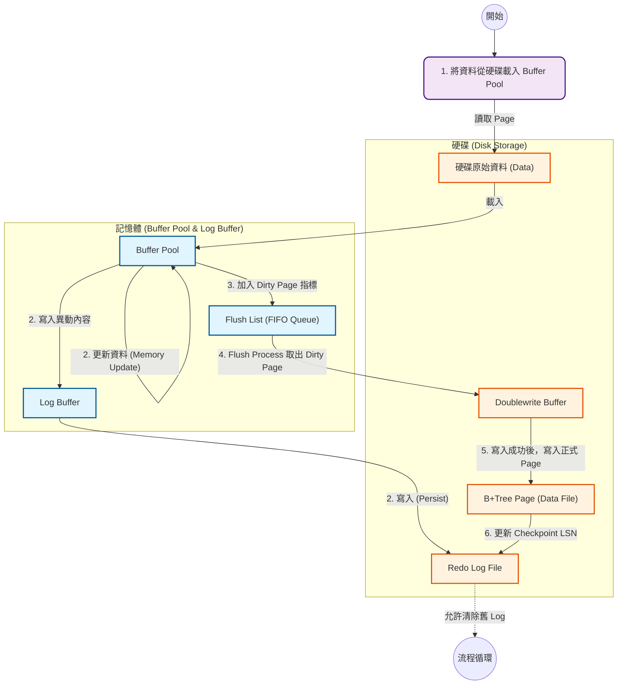

> 📌 此文件來自 https://ithelp.ithome.com.tw/users/20177857/ironman 的 IT 邦鐵人賽教程，僅針對個人學習用途進行筆記與修改。

# MySQL 的 Flush Process (快取資料寫入硬碟)

MySQL 寫入流程是：

1. 將資料從硬碟載入 Buffer Pool (記憶體)
2. MySQL 處理寫入請求：
   - **更新資料 (Memory Update @ Buffer Pool)**: MySQL 先在記憶體中直接修改資料頁（這時該頁變成 "Dirty Page"）。這是實際的邏輯運算。 (圖中的迴圈代表 In-memory Operation)
   - **寫入異動內容 (Log Buffer)**: 同時，MySQL 必須產生「這筆資料改了什麼」的紀錄（Redo Log Entry），暫存在記憶體的 Log Buffer。
   - **寫入 (Persist @ Redo Log File)**: 這是最重要的一步。為了保證 ACID 中的 D (Durability)，在交易 `Commit` 的瞬間，MySQL 必須把 `Log Buffer` 裡的內容強制寫入硬碟的 `ib_logfile`
3. 同時把異動後的 `Page (Dirty Page)` 記憶體指標放入 `Flush List (FIFO Queue)`
4. `Flush Process` 定期從 `Flush List` 拿出第一個 `Dirty Page` 並寫入 `Doublewrite Buffer`
5. `Doublewrite Buffer` 寫入成功後，在寫入 B+Tree 結構的 Page
6. `Flush Process` 寫入 Dirty Page 標記 Checkpoint LSN，讓 Redo Log 可清除資料

> [!TIP]
> **複習一下 Dirty Page**
> 
> 當一個 Data Page 在記憶體 (Buffer Pool) 中被修改，但尚未寫回硬碟 (Disk) 時，該 Page 即稱為「Dirty Page」。
> 為了效能，InnoDB 不會每次修改都馬上寫回硬碟，而是透過 Flush Process 批次寫入。

## 什麼是 Log Sequence Number (LSN)？用途為何？
復原資料時需要知道從哪一個起點開始重放，因此有 `Log Sequence Number (LSN)` 用來記錄 `Redo Log` 的寫入狀況，`Redo Log` 每次新增都會增加 LSN 的數字，這是一個 Global 遞增的數字。
- 例如: 某個 `INSERT` 的 LSN 為 100，代表到這次 `INSERT` 為止，總共寫了 100 bytes 的資料到 Redo Log 中。

每個 Page 中會記錄 `Oldest Modification LSN` 以及 `Newest Modification LSN`：

- `Oldest Modification LSN` — 該 Page 第一次變 Dirty Page 時的 LSN，`Flush List` 的順序會從最小的 Oldest Modification LSN 開始刷新到 Disk。
- `Newest Modification LSN` — 該 Page 最後一次被更新的 LSN，可以用來追蹤該 Page 是否短時間內被更新多次，是否需要先被刷新到 Disk。

當 Flush Process 將最小的 Oldest LSN 的 Dirty Page 寫入硬碟時，`Checkpoint LSN` 就會更新，例如：
- Dirty Page 1: `oldest_modification = 900`
- Dirty Page 2: `oldest_modification = 901`，寫入 Dirty Page 1 後，`Checkpoint LSN` 可往前推進到 901。

`Checkpoint LSN` 可用來當作 recover 資料起點，以及 `Redo Log` 會清除 LSN 在 Checkpoint 之前的資料。

> [!NOTE]
> **LSN 的物理意義**
> 
> LSN (Log Sequence Number) 的數值代表 **「Redo Log 總共寫入了多少 Bytes」**。
> 例如 LSN 由 $1000 \rightarrow 1050$，代表這期間寫入了 50 bytes 的 Log。因為寫入量只增不減，所以它是全域單調遞增 (Global Monotonically Increasing) 的:
> - 假設目前的 LSN 是 1000。
> - 如果你執行一個 SQL 產生了 50 bytes 的 Redo Log 紀錄，LSN 就會變成 1050。
> - 因為寫入的資料量只能累積，不會減少，所以這個數字是永遠往上增加的。
> 
> **Global (全域唯一性)**
> 
> 整個 MySQL InnoDB 引擎中只有 唯一的一個 LSN 計數器。 不管系統有多少個 Transaction 同時在執行，或是寫入不同的 Table，所有的操作都共用這同一個 LSN 時間軸。這確保了所有資料庫的變更操作（Operation）都能排出一個絕對的先後順序，對於資料還原（Recovery）至關重要。

除了 Checkpoint LSN，InnoDB 也會記錄不同重要時機的 LSN，這些 LSN 可用於確認同步進度並觀測目前寫入的效能，可透過 `show engine innodb status` 查看：

| LSN 狀態指標 | 說明 |
| :--- | :--- |
| **Log sequence number** | **當前最新的 LSN**。 代表系統產生的最新 Redo Log 序號，包含所有已產生但未必寫入 Buffer 的日誌。 |
| **Log buffer assigned up to** | **Log Buffer 分配到的最新 LSN**。 包含所有已寫入 Log Buffer 的日誌，其中可能包含尚未 Commit 的事務。 |
| **Log buffer completed up to** | **Log Buffer 中已 Commit 的最新 LSN**。 僅包含已經完成提交的事務日誌，確保事務的完整性。 |
| **Log written up to** | **寫入 Redo Log 文件 (OS Cache) 的 LSN**。 Log Buffer 內容已透過 `write` 寫入 OS Page Cache，但尚未強制刷入物理硬碟 (可能還未 `fsync`)。 |
| **Log flushed up to** | **寫入物理硬碟 (Disk) 的 LSN**。 Redo Log 已執行 `fsync`，確保資料已持久化到磁碟，掉電不會遺失。 |
| **Added dirty pages up to** | **Flush List 中最新髒頁 (Dirty Page) 的 LSN**。 對應 Flush List 頭部頁面的 `newest_modification` LSN，代表最近被修改的數據。 |
| **Pages flushed up to** | **Flush List 中最舊髒頁 (Dirty Page) 的 LSN**。 對應 Flush List 尾部頁面的 `oldest_modification` LSN，代表最早被修改但尚未刷入資料文件的數據。 |
| **Last checkpoint at** | **最後一次 Checkpoint 的 LSN**。 此 LSN 之前的數據頁 (Data Page) 皆已寫入磁碟。資料庫崩潰恢復 (Recovery) 時，會從此位置開始重放 Redo Log。此點之前的 Redo Log 空間可安全被覆蓋循環使用。 |

當 `Pages flushed up to - Added dirty pages up to` 數值很大時，代表有很多 Dirty Page 等待被 Flush，那麼: 
- **`Flush Process` 觸發的時機為何？**
- **如何避免太多 `Dirty Page` 阻塞？**

## Flush Process 觸發時機與模式

InnoDB 的 Flush Process 主要分為兩種觸發場景：

### 1. Sharp Checkpoint (資料庫關閉時)
- **觸發時機**：MySQL 正常關閉 (Shutdown) 時。
- **行為**：將 Buffer Pool 中**所有**的 Dirty Pages 強制寫回磁碟。
- **目的**：確保關機後的資料一致性。
- **參數**：可透過 `innodb_fast_shutdown` 控制行為。

### 2. Fuzzy Checkpoint (資料庫運行中)
- **觸發時機**：資料庫運行期間，由後台的 `Background Cleaner Thread` 定期執行。
- **行為**：為了不影響使用者操作效能，採**少量、分批**的方式將 Dirty Pages 寫入磁碟。
- **模式**：包含以下兩種主要刷新邏輯：

| 刷新模式 | 目的 | 運作機制 | Checkpoint LSN |
| :--- | :--- | :--- | :--- |
| **`BUF_FLUSH_LRU`** (釋放記憶體) | **確保 Free Pages** 讓 Buffer Pool 有空間載入新頁。 | **掃描 LRU Tail** Cleaner Thread 掃描 LRU 尾端，刷髒頁並釋放記憶體。 (深度由 `innodb_lru_scan_depth` 控制) | **不更新** |
| **`BUF_FLUSH_LIST`** (推進 Checkpoint) | **避免 Redo Log 滿** 縮短 Crash Recovery 時間。 | **Adaptive Flush (自適應)** 從 `Flush List` 找最舊髒頁 (Min Oldest LSN) 刷新。 演算法動態計算數量避免 IO 暴衝。 | **會更新** |

> [!TIP]
> **LSN 類型總整理 (Summary of LSN Types)**
> 
> 理解 MySQL Flush 機制的關鍵在於區分以下幾種 LSN：
> 
> | LSN 類型 | 範圍 | 定義與用途 | 對應 Status 指標 |
> | :--- | :--- | :--- | :--- |
> | **Log Sequence Number (LSN)** | Global | **當前最新的日誌序號** 代表 Redo Log 的總寫入量 (Bytes)。 | `Log sequence number` |
> | **Log Flushed LSN** | Global | **已持久化到硬碟的日誌序號** 只要 LSN < Log Flushed LSN，代表日誌已安全寫入 Disk。 | `Log flushed up to` |
> | **Checkpoint LSN** | Global | **檢查點 (安全水位)** 代表此點之前的 Dirty Page 皆已寫入 Data File，Redo Log 可被覆蓋。 | `Last checkpoint at` |
> | **Oldest Modification LSN** | Page | **Page 最早變髒的時間點** Flush List 排序依據，越小代表越早變髒，需優先刷入硬碟。 | `Pages flushed up to` |
> | **Newest Modification LSN** | Page | **Page 最近變髒的時間點** Page 每次修改都會更新此值。 | `Added dirty pages up to` |

### `BUF_FLUSH_LIST` (Adaptive Flush) 的算法細節

`n_pages` (本次需刷新的 Dirty Page 數量) 的計算由以下三個關鍵指標綜合評估，以決定刷新速度：

#### 1. 基於 IO Capacity 的比例 (`io_capacity_factor`)
計算目前系統負載壓力佔 `innodb_io_capacity` 的百分比。壓力來源取決於 **髒頁比例** 或 **LSN 落後程度** 兩者較大者：

$$
N_1 = \text{innodb\_io\_capacity} \times \frac{\max(\text{pct\_for\_dirty}, \text{pct\_for\_lsn})}{100}
$$

*   **`pct_for_dirty`**: 目前 Buffer Pool 髒頁比例 ($\frac{\text{modified\_pages}}{\text{total\_pages}} \times 100$)。
    *   若 $< \text{innodb\_max\_dirty\_pages\_pct\_lwn}$ (低水位)，則視為 0。
    *   若 $> \text{innodb\_max\_dirty\_pages\_pct}$ (高水位)，則視為 100 (全力 Flush)。

#### 2. 平均髒頁產生速率 (`avg_page_rate`)
評估系統產生 Dirty Page 的平均速率，採用移動平均平滑波動：

$$
N_2 = \frac{\frac{\text{sum\_dirty\_pages}}{\text{time\_elapsed}} + \text{avg\_page\_rate}_{old}}{2}
$$

#### 3. LSN 增長速率換算 (`pages_for_lsn`)
將 Redo Log 的 LSN 增長量 (Bytes) 換算為 Page 數量 (預設每 Page 約對應 2048 bytes Log)：

$$
N_3 = \frac{\text{current\_lsn} - \text{checkpoint\_lsn}}{2048}
$$

> [!NOTE]
> **關鍵參數與專有名詞定義表**
>
> | 名詞 / 參數 | 定義與物理意義 |
> | :--- | :--- |
> | **`innodb_io_capacity`** | **IO 能力基準值 (IOPS Baseline)** 設定 InnoDB 每秒可執行的 IO 操作數 (IOPS)。此值應根據磁碟 (SSD/HDD) 的效能設定，作為 Adaptive Flush 計算刷新速度的基準。 |
> | **`innodb_io_capacity_max`** | **IO 能力上限 (IOPS Max)** InnoDB 刷新髒頁的最大 IOPS 上限，防止 Flush 佔用過多 IO 資源影響正常查詢效能。 |
> | **`innodb_max_dirty_pages_pct`** | **髒頁比例上限 (Max Dirty Pages %)** 當 Buffer Pool 髒頁比例超過此值 (預設 75%~90%)，InnoDB 會觸發激進的刷新 (Aggressive Flush) 以釋放空間。 |
> | **`pct_for_dirty`** | **髒頁壓力指標** 計算公式：`Dirty Pages / Total Buffer Pool Pages`。數值越高代表記憶體中未寫入硬碟的資料越多，記憶體壓力越大。 |
> | **`pct_for_lsn`** | **Redo Log 空間壓力指標** 計算 Checkpoint LSN 落後的程度。若此值過高，代表 Redo Log 快寫滿了，需要加速推進 Checkpoint 以避免阻塞寫入。 |
> | **`innodb_lru_scan_depth`** | **LRU 掃描深度** 決定 Background Cleaner Thread 每次掃描 LRU List 的深度，用來尋找可釋放的冷資料頁 (Cold Pages)。 |
---

### 最終 `n_pages` 決策與參數調優

Adaptive Flush 會綜合上述指標 (取加權或平均) 計算出 `n_pages`，並確保不超過 `innodb_io_capacity_max`。

#### 效能調優指引

1.  **Checkpoint LSN 落後太多 (Redo Log 空間不足)**
    *   **症狀**: `pct_for_lsn` 過高，導致 IO 尖峰。
    *   **解法**:
        *   調大 `innodb_io_capacity` (增加基礎刷新能力)。
        *   調低 `innodb_max_dirty_pages_pct` (提早觸發較積極的刷新)。

2.  **Buffer Pool 髒頁堆積過多**
    *   **症狀**: Free List 不足，查詢需等待釋放 Page。
    *   **解法**:
        *   調大 `innodb_lru_scan_depth` (增加 `BUF_FLUSH_LRU` 的掃描深度，加速釋放記憶體)。

> [!TIP]
> 可透過 `show engine innodb status` 的 **BUFFER POOL AND MEMORY** 區塊查看 `Modified db pages`，監控當前 Dirty Page 數量。

