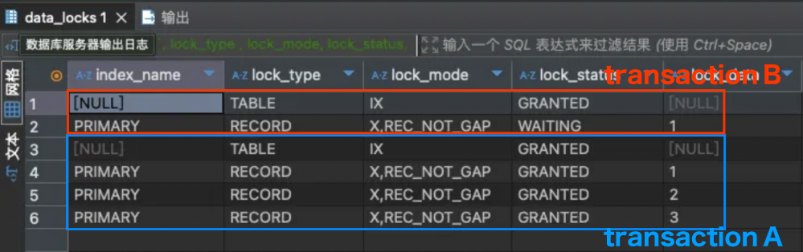
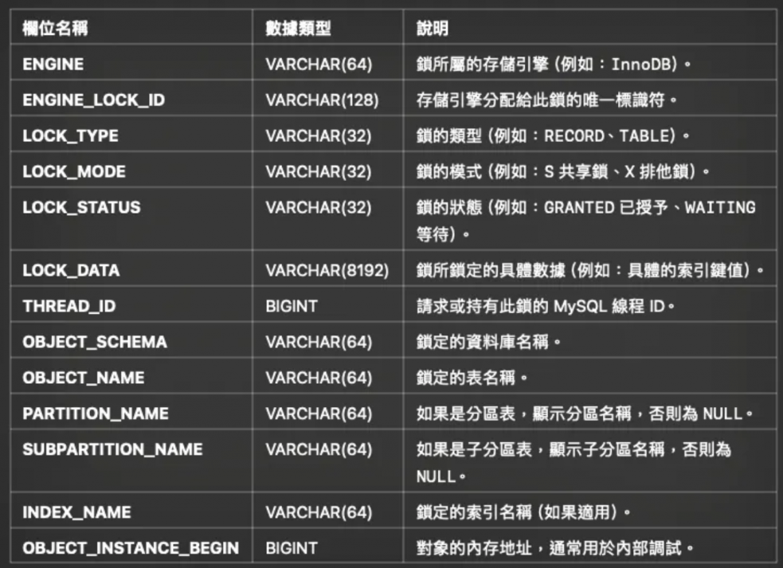
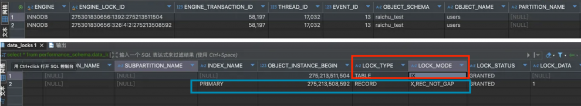
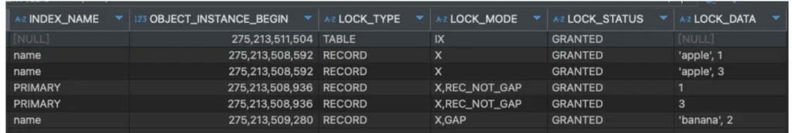
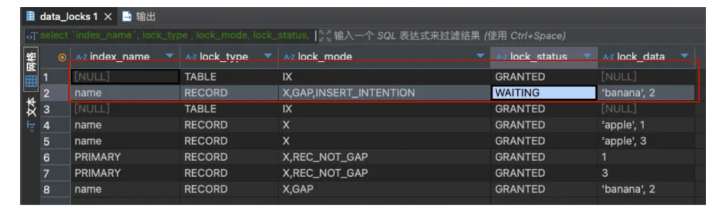
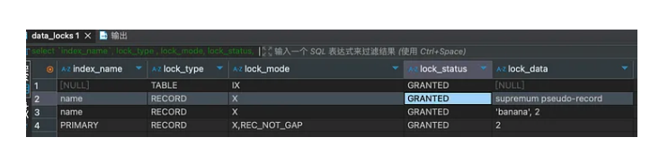

> 📌 此文件來自 https://ithelp.ithome.com.tw/users/20177857/ironman 的 IT 邦鐵人賽教程，僅針對個人學習用途進行筆記與修改。

# MySQL 的 Lock (Row Lock, Gap Lock & Next-Key Lock)
隔離等級 `Read Committed` & `Repeatable Read` 主要是解決 Transaction 併發時，Write Transaction 影響 Read Transaction 的問題，然而除了 Write 影響 Read，還有多個 Write Transaction 併發的情境要解決，例如 `Write Skew` & `Phantom Read`。

## 上鎖語法
在 MySQL 中，一般的 `SELECT` 是非阻塞的快照讀（Snapshot Read），若要實現「讀取並鎖定」以防止其他事務修改，需使用以下語法：
*   <span style="color: orange">**`FOR UPDATE` (排他鎖/寫鎖)**</span>：
    *   告訴 MySQL：「我現在要讀這幾行，而且我**準備要更新**它們，其他人不準動」。
    *   其他事務無法對這些 Row 加任何鎖（包括讀鎖與寫鎖）。
*   <span style="color: orange">**`LOCK IN SHARE MODE` (共享鎖/讀鎖)**</span>：
    *   告訴 MySQL：「我要讀這幾行，大家可以一起讀，但**誰都別想改**」。
    *   其他事務可以加讀鎖，但無法獲取寫鎖。

## 核心概念：三種行級鎖類型

在深入探討問題前，必須先理解 InnoDB 中三種基礎的行級鎖方案：


```
索引數據：    10          20          30
位置標記：    |           |           |
              ●-----------●-----------●

┌─────────────────────────────────────────────────────┐
│  Record Lock: 只鎖記錄本身                            │
│               不鎖間隙                               │
│                      [●]                            │
│                      20                             │
└─────────────────────────────────────────────────────┘

┌─────────────────────────────────────────────────────┐
│  Gap Lock: 只鎖間隙                                  │
│            不鎖端點記錄                               │
│              (---------)                            │
│              10        20                           │
└─────────────────────────────────────────────────────┘

┌─────────────────────────────────────────────────────┐
│  Next-Key Lock: 鎖間隙 + 右端點記錄 (左開右閉)          │
│                 InnoDB 默認鎖定方式                   │
│              (---------●]                           │
│              10        20                           │
└─────────────────────────────────────────────────────┘
```
*   `●` 代表索引記錄（實心圓點）
*   `[●]` 代表只鎖定該記錄
*   `(---)` 代表鎖定間隙，但不含兩端記錄（開區間）
*   `(---●]` 代表鎖定間隙加上右端記錄（左開右閉區間）


1.  **Record Lock (記錄鎖)**：
    *   **對象**：針對索引記錄本身上鎖。
    *   **作用**：鎖住特定的 Row，防止其他事務進行 `UPDATE` 或 `DELETE`。
    *   **範例**：`SELECT * FROM t WHERE id = 1 FOR UPDATE;` 會在 `id=1` 的索引記錄上加鎖（REC_NOT_GAP）。

2.  **Gap Lock (間隙鎖)**：
    *   **對象**：鎖住索引記錄之間的「間隙」，但不包含記錄本身。
    *   **作用**：防止其他事務在該間隙中 `INSERT` 資料，主要用於解決 Phantom Read。
    *   **範例**：若有 id 1, 5，則 `BETWEEN 1 AND 5` 的間隙鎖會防止插入 id=2, 3, 4。

3.  **Next-Key Lock (臨鍵鎖)**：
    *   **對象**：**Record Lock + Gap Lock** 的組合。
    *   **作用**：鎖住記錄本身及其前面的間隙（<span style="color: orange">**左開右閉區間**</span>）。
    *   **特性**：InnoDB 在 `Repeatable Read` 隔離級別下的<span style="color: orange">**默認鎖定單位**</span>。
    *   **範例**：若索引包含值 10, 20, 30，查詢 `WHERE id = 20 FOR UPDATE` 會產生 `(10, 20]` 的 Next-Key Lock，鎖住 10~20 的間隙以及 20 本身。


## 什麼是 Write Skew & Phantom Read 問題
### Write Skew
> [!NOTE]
> Write Skew 是多個 Transaction 同時讀取相同資料，用當下資料狀態判斷邏輯後更新，結果更新內容出現異常。
> 它是一種典型的 **Race Condition (競態條件)**，屬於 **Check-Then-Act (先檢查後執行)** 的類型。如果不加鎖，並發的事務會基於「各自看到的舊版本快照」進行判斷，導致錯誤的業務邏輯執行（如上述庫存變負數）。

例如扣庫存的 API 這樣實作：

```sql
BEGIN
  SELECT id, quantity FROM products WHERE id = ?;

  if quantity > 0 
    UPDATE products SET quantity = quantity - 1 WHERE id = ?
COMMIT
```

由於 `SELECT` 預設是<span style="color: orange">**快照讀 (Snapshot Read)**</span>，當多個 Transaction 同時執行時，它們可能都會讀取到相同的舊資料（例如 `quantity = 1`）。

這導致多個事務都通過了 `if quantity > 0` 的判斷，隨後各自執行 `UPDATE`，最終導致庫存變成負數（Lost Update）。要解決該問題，必須將讀取操作改為<span style="color: orange">**當前讀 (Current Read)**</span>，即加上 `FOR UPDATE` 語法：

```sql
BEGIN
  SELECT id, quantity FROM products WHERE id = ? FOR UPDATE; -- 加上了 FOR UPDATE

  if quantity > 0 
    UPDATE products SET quantity = quantity - 1 WHERE id = ?
COMMIT
```

此時 MySQL 會對讀取到的 products 紀錄上 row lock，先取得 lock 的 Transaction 會執行 update 成功，後面的 Transaction 會拿到更新後到 quantity 判斷 <= 0 則不 update。

除了加 `FOR UPDATE` 語法外也可寫成

```sql
UPDATE products SET quantity = quantity - 1 WHERE id = ? AND quantity > 0
```

`UPDATE` 語法同樣會上 row lock，瞬間多個 `UPDATE` 執行時也不會有問題。


### Phantom Read
> [!NOTE]
> Phantom Read 則是相同 Transaction 內，對範圍資料執行兩次 SQL 出現的結果不一樣。

例如我們想統計並處理 id 1~10 的訂單：

```sql
BEGIN
  -- 第一次查詢：原本只有 id=1, 3, 5 三筆資料
  SELECT * FROM orders WHERE id BETWEEN 1 AND 10 FOR UPDATE;
  
  -- 業務邏輯處理...
  
  -- 如果此時沒有 Gap Lock，另一個 Transaction 插入了 id=2
  -- INSERT INTO orders (id) VALUES (2);
  
  -- 再次查詢或更新：發現多了一筆 id=2 的資料（幻影）
  UPDATE orders SET status = 'DONE' WHERE id BETWEEN 1 AND 10;
COMMIT
```

原本預期只處理 3 筆，結果卻處理了 4 筆，這就是 Phantom Read。

> [!CAUTION]
> 如果只用一般的 `Record Lock` (鎖住 id=1, 3, 5) 能解決嗎？
> 答案是不能，因為 `INSERT id=2` 並沒有碰到任何現存的鎖，所以會成功插入，導致下一次查詢或更新範圍時出現「幻影」。


#### 那麼什麼樣的鎖可以解決 `Phantom Read` 問題？

MySQL 使用 <span style="color: orange">**Gap Lock (間隙鎖)**</span> 來解決 Phantom Read。它的核心思想是：**不僅鎖住存在的記錄，還要鎖住記錄之間的「空隙」，防止別人插入新資料**。

具體來說（以上述 orders 表為例）：

1.  **鎖定範圍**：
    當執行 `SELECT * FROM orders WHERE id BETWEEN 1 AND 10 FOR UPDATE` 時：
    *   除了對存在的 `id=2, 3, 5` 上 **Row Lock**。
    *   還會對 `(-∞, 2]`, `(2, 3)`, `(3, 5)`, `(5, 10]` 這些區間上 **Gap Lock**。
    *   結果：任何想要 `INSERT` 到這些範圍的動作（例如 `id=2` 或 `id=4`）都會被阻擋，從而消滅了幻讀。

2.  **Next-Key Lock**：
    在 Repeatable Read (RR) 級別下，InnoDB 預設使用的其實是 **Next-Key Lock**，也就是 **Row Lock + Gap Lock** 的組合。
    *   它鎖定的是一個「左開右閉」的區間。
    *   例如：鎖定 `(1, 3]` 代表鎖住 1~3 的間隙以及 3 本身。

3.  **無窮大鎖定 (Supremum)**：
    如果查詢條件是 `WHERE id > 10 FOR UPDATE`，為了防止別人在 10 之後插入任何新資料（例如 `id=100`），MySQL 會鎖住 `(10, +∞)` 的範圍。這在實現上是通過鎖定一個特殊的 `supremum pseudo-record` 來達成的。

## 什麼是意向鎖 (Intention Lock)？
> [!NOTE]
> 意向鎖（Intention Lock）是 InnoDB 中的一種 **Table Level Lock (表級鎖)**。
>
> 它的出現是為了解決 **Table Lock 與 Row Lock 的衝突問題**：
> 當 Transaction 想要對「整張表」加鎖（Table Lock）時，必須確保**這張表內沒有任何一行資料正在被鎖定**。
>
> 為了避免「逐行檢查」每一行是否有 Row Lock（效率太差），InnoDB 設計了意向鎖作為一個「表級訊號燈」：
> 當 Transaction 鎖住某行時，會先在表上掛一個 Intention Lock，告訴稍後想鎖整張表的人：「裡面有人正在忙（鎖住某些行），請你先在外面等」。


> [!TIP]
>| 縮寫 | 全名 (English) | 中文名稱 | 鎖定範圍 | 說明 |
>|---|---|---|---|---|
>| **IS** | **Intention Shared Lock** | 意向共享鎖 | Table (表級) | 預告「我**打算**去鎖（讀）某些 Row」。相容性高，不擋人。 |
>| **IX** | **Intention Exclusive Lock** | 意向排他鎖 | Table (表級) | 預告「我**打算**去鎖（改）某些 Row」。用來卡住 `LOCK TABLES`。 |
>| **S** | **Shared Lock** | 共享鎖 (讀鎖) | Table / Row | 大家都只能讀，不能改。 |
>| **X** | **Exclusive Lock** | 排他鎖 (寫鎖) | Table / Row | 只有我可以讀寫，其他人滾蛋（不能讀也不能寫）。 |


它分為兩種：
- **IS（Intention Shared）意向共享鎖**  
  - 意思是「這個交易**打算**在某些 `row` 上加共享鎖 `S`」。  
  - 舉例：執行 `SELECT * FROM users WHERE id=1 LOCK IN SHARE MODE;`
    1.  MySQL 先對 `users` 表加 **IS 鎖**。
    2.  接著才對 `id=1` 這行資料加 **S 鎖**。
- **IX（Intention Exclusive）意向排他鎖**  
  - 意思是「這個交易**打算**在某些 `row` 上加排他鎖 `X`」。  
  - 舉例：執行 `UPDATE users SET age=30 WHERE id=1;`
    1.  MySQL 先對 `users` 表加 **IX 鎖**。
    2.  接著才對 `id=1` 這行資料加 **X 鎖**。


### 為什麼需要意向鎖？（效能考量）

如果沒有意向鎖，當 **Transaction 1 想對整個表加 X 鎖**，而 **Transaction 2 持有 Row Lock** 時，效能差異巨大。
下表以 T1 (Table Lock) 與 T2 (Row Lock) 的互動為例：

| 動作階段 | 沒有意向鎖 | 有意向鎖 (Intention Lock) |
| :--- | :--- | :--- |
| **T2 加 Row Lock 時** | T2 默默鎖住某一行，不通知任何人 (Only Row Lock)。 | T2 在鎖行前，必須先在表頭掛上 **IS / IX 鎖** (插旗)。 |
| **T1 加 Table Lock 時** | T1 必須**逐行掃描 (Full Table Scan)** 確認沒人鎖住任何一行。 | T1 只需要**檢查表頭**有沒有被插旗 (IS / IX)。 |
| **判斷效率** | **O(n)**：資料越多越慢，效能災難。 | **O(1)**：瞬間完成，看到旗子就乖乖排隊。 |

**結論**：意向鎖就像是一個「入口處的紅綠燈」，讓想鎖整張表的人 (T1) 不用跑進去巡視一圈，就能知道裡面有沒有人 (T2)。

### 鎖模式相容矩陣

> [!WARNING]
> <span style="color: orange">**超重要，面試必背**</span>：


| Request \ Existing | IS (意向共享) | IX (意向排他) | S (共享鎖) | X (排他鎖) |
| :--- | :---: | :---: | :---: | :---: |
| **IS (意向共享)** | ✅ 相容 | ✅ 相容 | ✅ 相容 | ❌ 衝突 |
| **IX (意向排他)** | ✅ 相容 | ✅ 相容 | ❌ 衝突 | ❌ 衝突 |
| **S (共享鎖)** | ✅ 相容 | ❌ 衝突 | ✅ 相容 | ❌ 衝突 |
| **X (排他鎖)** | ❌ 衝突 | ❌ 衝突 | ❌ 衝突 | ❌ 衝突 |

- **IS/IX 之間完全相容**：
  因為它們都只是「意向」，代表「我打算鎖某幾行」。Transaction A 打算鎖 id=1 (加 IX)，Transaction B 打算鎖 id=2 (加 IX)，這兩件事在「表級」上是不衝突的，所以可以共存。
- **意向鎖會阻塞表級鎖**：
  表級 X 鎖（如 `LOCK TABLES ... WRITE`）會被任何 IS/IX 阻塞。
- **真正的衝突發生在 Row Level**：
  S / X 才是真正的讀寫鎖。雖然表上的 IX 和 IX 相容，但如果你們剛好都要鎖同一行 Row，那下面的 Row Lock (X) 就會互斥。

> [!TIP]
> 
> 這裡常容易混淆，我們必須釐清「鎖的屬性」與「鎖的模式」：
>
> 1.  **IS (意向共享) & IX (意向排他)**：
>     *   <span style="color: red">**永遠是表級鎖 (Table Lock)**</span>。
>     *   它們是掛在「表頭」上的旗標，用來表示「這張表裡面某處，有人正在（或打算）鎖定某些行」。
>
> 2.  **S (共享鎖) & X (排他鎖)**：
>     *   <span style="color: orange">**既可以是表級，也可以是行級**</span>，看語境：
>       *   **Row Level**：`SELECT ... FOR UPDATE` (X) 或 `UPDATE` (X) 是加在特定 **Row** 上的。
>       *   **Table Level**：`LOCK TABLES t WRITE` 是加在整張 **Table** 上的。
> 
> 意向鎖 (IS/IX) 的主要存在目的，就是為了擋住那種「想要鎖死整張表 (Table X)」的人。
>
> | 鎖類型 | 級別 | 作用 | 誰會擋誰？ (衝突點) |
> | :--- | :--- | :--- | :--- |
> | **IS / IX** | **Table Only** | 門口的號誌燈 (Flag) | 專門用來擋 **Table S / Table X** (例如 `LOCK TABLES`) |
> | **Row S / Row X** | **Row** | 真正的資料鎖 | 擋其他的 **Row S / Row X** (搶同一行資料時) |
> | **Table S / Table X** | **Table** | 鎖死整張表 | 擋住所有人 (如果表內有任何 IS/IX 都不行) |

## Wrap Up：鎖的模式與粒度

> 前面提到了很多鎖，這裡簡單總結一下，MySQL 中的鎖主要可以從「模式」與「粒度」兩個維度來分類：

### 1. 鎖的模式 (Lock Mode)
這決定了「大家能不能一起讀」或「能不能改」。
*   **Read Lock (讀鎖/共享鎖/S鎖)**：
    *   語法：`SELECT ... LOCK IN SHARE MODE`
    *   特性：大家可以一起讀 (Read Lock 之間相容)，但不能改 (跟 Write Lock 互斥)。
*   **Write Lock (寫鎖/排他鎖/X鎖)**：
    *   語法：`SELECT ... FOR UPDATE`, `UPDATE`, `DELETE`
    *   特性：只有我可以讀寫，其他人通通排隊 (跟 Read Lock & Write Lock 都互斥)。

### 2. 鎖的粒度 (Lock Granularity)
這決定了「鎖的範圍有多大」。
*   **Row Lock (行鎖)**：
    *   只鎖住特定的那幾行資料 (如 `UPDATE products WHERE id=1`)。
    *   併發度高，但在執行 Table Lock 時會造成判斷困難。
*   **Table Lock (表鎖)**：
    *   鎖住整張表 (如 `LOCK TABLE orders WRITE`)。
    *   主要用於 DDL (改表結構) 或特殊維護操作。

### 3. 意向鎖 (Intention Lock) 的角色
*   **問題**：當有人想要對整張表上 **Table Lock** (例如改表結構) 時，他必須確保「這張表裡面沒有任何一行被上鎖」。如果沒有意向鎖，他必須全表掃描 (Full Table Scan) 檢查每一行，效率極差。
*   **解法**：**Intention Lock** 就像是「在門口掛牌子」。
    *   當 Transaction 要鎖某一行 (Row Lock) 時，必須先在表頭掛一個 **Intention Lock** (IS 或 IX)。
    *   當有人要鎖整張表 (Table Lock) 時，只要看門口有沒有掛 **Intention Lock** (IS/IX) 的牌子就好，不用進去檢查每一行。
    *   **特性**：Intention Lock 之間不會互斥 (多人可以同時掛牌子)，它只會跟 Table Lock 互斥。

## 資料什麼時候會被上鎖?
基本上只有 `SELECT` 加上 `FOR UPDATE` / `LOCK IN SHARE MODE` 和 `DELETE` / `UPDATE` 等更新語法時會對資料上鎖，但**上鎖範圍**往往取決於是否命中索引。

### 1. 命中索引 vs 全表掃描

假如 `tasks` 表中有 10 筆 `status = '待處理'` 的任務，執行：
```sql
SELECT count(1) FROM tasks WHERE status = '待處理' FOR UPDATE;
```
會只鎖那 10 筆嗎？答案是不一定：

*   **有 Index (`status`)**：✅ 只鎖那 10 筆符合條件的 Row。
*   **沒有 Index**：❌ <span style="color: red">**會鎖住整張表 (Lock Table)**</span>。

> [!WARNING]
> **為什麼沒 Index 會鎖整張表？**
> 因為 MySQL 架構分為 SQL Layer 與 Storage Engine。
> 當沒命中 Index 時，Storage Engine 必須進行 **Full Table Scan**，而上鎖是在 Storage Engine 層完成的。它會將掃描到的**每一行都上鎖**，再交由 SQL Layer 過濾。雖然 SQL Layer 過濾後只剩 10 筆，但 Storage Engine 已經把整張表鎖死了。

### 2. Gap Lock (間隙鎖) 的觸發
Gap Lock 主要是為了防止 Phantom Read (幻讀)，鎖住「不存在的間隙」。常見觸發情境：

1.  **範圍查詢**：`WHERE id > 10 FOR UPDATE`。
2.  **非 Unique 索引**：`WHERE status = 1 FOR UPDATE` (鎖住值與前後間隙)。
3.  **查詢未命中 (Unique Key)**：
    *   例如 `WHERE id = 10 FOR UPDATE` (資料不存在)。
    *   即使 `id` 是 Unique Key，因為找不到資料，為了防止別人「趁機插入 `id=10`」，MySQL 會鎖住 `id=10` 所在的間隙。
    *   **範例**：若 id 只有 5 和 15，查詢 id=10 會鎖住 `(5, 15)`，導致 `INSERT VALUES (11)` 也被卡住。

此外，`UPDATE` / `DELETE` 針對不存在的資料，或是 `INSERT ... ON DUPLICATE KEY UPDATE` 發生衝突時，也都會觸發 Gap Lock。

### 3. Isolation Level 影響
如果 Isolation Level 設定為 **Serializable**：
*   雖能解決所有一致性問題 (Dirty Read, Phantom Read 等)。
*   但代價是自動把**所有** `SELECT` 都加上 `LOCK IN SHARE MODE` (讀鎖)，嚴重影響併發效能。

## MySQL 如何避免 DeadLock

使用 Lock 最大的風險就是 DeadLock，最常見案例是「互相持有並等待」：

```sql
-- transaction A:
BEGIN
  SELECT * FROM users WHERE id = 1 FOR UPDATE;  
  SELECT * FROM users WHERE id = 2 FOR UPDATE;  
  ...  
COMMIT;  
  
-- transaction B:  
BEGIN
  SELECT * FROM users WHERE id = 2 FOR UPDATE;  
  SELECT * FROM users WHERE id = 1 FOR UPDATE;  
  ...  
COMMIT;
```

當 A & B Transaction 同時執行：
- A 持有 `users id = 1` 資源並等待獲取 `users id = 2` 資源，
- B 持有 `users id = 2` 資源並等待 `users id = 1` 資源
- <span style="color: red">雙方互相等待對方釋放資源，造成 **DeadLock**。</span>

該 DeadLock 解法很簡單，將 Lock 順序改成一致就可以了：

```sql
-- transaction A:  
BEGIN
  SELECT * FROM users WHERE id = 1 FOR UPDATE;
  SELECT * FROM users WHERE id = 2 FOR UPDATE;
  ...  
COMMIT;  
  
-- transaction B:  
BEGIN
  SELECT * FROM users WHERE id = 1 FOR UPDATE;  
  SELECT * FROM users WHERE id = 2 FOR UPDATE;  
  ...  
COMMIT;
```

又或者可改成 
```sql
SELECT * FROM users WHERE id IN (1, 2) FOR UPDATE;
```

> [!TIP]
> **為什麼改成 `IN` 可以避免 DeadLock？**
> 
> 這是因為 MySQL 在處理 `IN (...)` 鎖定時，是由 **Index Scan 的順序**來決定上鎖順序，而不是依照 SQL 語法中參數的順序。
> 
> 也就是說，無論寫 `IN (1, 2)` 或 `IN (2, 1)`，InnoDB 都會依照 Index 的順序（例如 1 -> 2）依序上鎖。
> 當所有 Transaction 都遵循相同的上鎖順序（Ordered Locking），DeadLock 自然就消失了。

但當同時執行以下兩個 SQL 時，會 DeadLock 嗎？ `IN` 裡面的參數順序不同會導致 Lock 順序不一致嗎？ 
- `SELECT * FROM users WHERE id IN (1, 2, 3) FOR UPDATE;` 
- `SELECT * FROM users WHERE id IN (3, 2, 1) FOR UPDATE;` 

答案是不會 DeadLock，因為 MySQL 會依照 Index 的順序來決定上鎖順序。


當執行以下兩個 Transaction 時
```sql
-- Transaction A
BEGIN;  
SELECT * FROM users WHERE id IN (1, 2, 3) FOR UPDATE;  
...  

-- Transaction B
BEGIN;  
SELECT * FROM users WHERE id IN (3, 2, 1) FOR UPDATE;  
...
```

執行以下 SQL 可以看到 Lock 狀態：
```sql
SELECT * FROM performance_schema.data_locks;
```

得到結果如下圖，可以看到 Transaction A `id = (1,2,3)` 有上鎖成功，實際執行是拿到 Transaction B `id = 1` 的鎖卡住，由此可見上鎖順序跟 SQL 寫法無關。
理論上，如果上鎖順序是相反，會拿到 Transaction B `id = 3` 的鎖並卡住。



* **Row 4, 5, 6**
  - 屬於 **Transaction A**。狀態為 `GRANTED`（已獲得）。
  - 表示 Transaction A 已經成功取得了 id = 1, 2, 3 的 **排他鎖 (X Lock)**。這是造成資源佔用、導致 Transaction B 被阻塞的主因。
* **Row 2**
  - 屬於 **Transaction B**。狀態為 `WAITING`（等待中），鎖定資料為 `1`。
  - 這證實了 InnoDB 內部的加鎖機制：對於 `IN (...)` 類型的查詢，資料庫會依照 **索引順序**（由小到大 1 → 2 → 3）進行加鎖，而非 SQL 語句中的順序（3, 2, 1）。Transaction B 在嘗試鎖定排序後的第一筆資料 `id = 1` 時，發現已被 Row 4 (Transaction A) 佔用，因此卡在第一步。
* **Row 1, 3**
  - 分別屬於 **Transaction A 與 B**。類型為 **表級意向鎖 (IX, Intention Exclusive)**。狀態皆為 `GRANTED`。
這是事務進入表進行行鎖操作前的「入場券」。這兩個鎖表示 A 和 B 都「有意圖」修改表內資料。因為意向鎖之間互不衝突（大家都可以進大門），所以狀態都是成功獲得，它們只會擋住想要鎖死整張表的操作（如 `LOCK TABLES`）。


> [!NOTE]
> 上鎖順序取決於 **Index Tree Scan 的順序**。
> 而影響 Index Tree Scan 順序的主要因素有兩個：
> 1. SQL 語法中的 `ORDER BY` (ASC / DESC)。
> 2. 建立 Index 時定義的順序 (ASC / DESC)。
> 
> ### Order By
>id 的 Index 順序是 $1 \rightarrow 2 \rightarrow 3$ ，上鎖順序同樣會是 $1 \rightarrow 2 \rightarrow 3$，但如果第二個 SQL 加上 `ORDER BY` 上鎖順序就會相反了，會拿到 id=3 的鎖並卡住。
> 
> ```sql
> BEGIN;
>   SELECT * FROM users WHERE id IN (1, 2, 3) ORDER BY id DESC FOR UPDATE;
> COMMIT;
> ``` 
>
> ### 建立 Index 時定義的順序 (ASC / DESC)。
> 如果將所有 `index` 改成 `unique`，並將 `nick_name` index 順序設定成 `DESC`，
> 
> ```sql
> CREATE TABLE users (  
> 	id int auto_increment,  
> 	name varchar(100),  
> 	gender int,  
> 	nick_name varchar(100),  
> 	unique key (name),  
> 	unique key (nick_name DESC),  
> 	primary key (id)  
> );
>
> INSERT INTO users (id, name, nick_name, gender) VALUES
>  (1, 'apple', 'apple', 0),(2, 'banana', 'banana', 1);
>
> -- Transaction A：使用 name Index (預設 ASC) 
> BEGIN;  
> SELECT * FROM users WHERE name IN ('apple', 'banana') FOR UPDATE;  
> ....  
> COMMIT;
>
> -- Transaction B：使用 nick_name Index (預設 DESC) 
> BEGIN;  
> SELECT * FROM users WHERE nick_name IN ('apple', 'banana') FOR UPDATE;  
> ....
> COMMIT;
> ```
>
> 此時查詢 Lock 狀態會發現，由於 Transaction B 的 `nick_name` Index 是 `Desc`，所以會從 id = 2 (banana) 的資料開始上鎖，跟 Transaction A 的 `name` Index 順序相反，導致上面 SQL 看起來順序一致，但同時執行時卻造成了 DeadLock。
> - T1 (Transaction A) 搶到了 name='apple' 的鎖。
> - T2 (Transaction B) 搶到了 nick_name='banana' 的鎖。
> - T1 想要鎖 nick_name='banana'，但發現被 T2 鎖住了，開始等待。
> - T2 想要鎖 name='apple'，但發現被 T1 鎖住了，開始等待。
> - <span style="color:red">Deadlock</span>: MySQL 偵測到互相等待，強制 rollback 其中一個。

## 如何知道執行中 SQL 是怎麼上鎖的

`performance_schema` DB 中 `data_locks` table 可用來看當前所有 Lock 詳細狀況，該 Table Schema 為：



**Example:**

```sql
-- 建立一個 users table 有唯一主鍵 id 以及非唯一 index name  
CREATE TABLE users (  
	id int auto_increment,  
	name varchar(100),  
	gender int,  
	key (name),  
	primary key (id)  
);  
  
-- 建立三筆資料  
INSERT INTO users (id, name, gender) VALUES  
(1, 'apple', 0),(2, 'banana',1),(3, 'apple',1);  
  
-- 對 id = 1 唯一索引資料上鎖  
BEGIN;  
SELECT * FROM users WHERE id = 1 FOR UPDATE;  
....  
-- COMMIT; -- 先不 COMMIT
```

在 Transaction 不 COMMIT 時，執行以下 SQL 可以看到 Lock 狀態：

```sql
SELECT * FROM performance_schema.data_locks;
```

可以看到分別有兩筆 Lock：
1. **Intention Lock**: 第一行是 Lock Type 為 Table 且 Lock Mode 為 `(IX)` 的意向排他鎖 (Intention Exclusive Lock)。
2. **Row Lock**: 第二行是
   - `Lock Type` 為 `Record`
   - `Lock Index` 為 `PRIMARY`
   - `Lock Mode` 為 **X,REC_NOT_GAP**
     - `X` 排他鎖 (Exclusive Lock)
     - `REC_NOT_GAP` 代表不是 Gap Lock 只鎖單一 Record 不影響 `INSERT` 行為
   - `LOCK_DATA` 代表被鎖住的 Index 資料，也就是 `id=1` 的資料。




接下來：

```sql
-- 對 name = 'apple' 非唯一索引資料上鎖  
BEGIN;  
SELECT * FROM users WHERE name = 'apple' FOR UPDATE;  
...
```

再次執行 
```sql
SELECT * FROM performance_schema.data_locks;
```

可以看到出現四個 Lock：


1. **Intention Lock** : TABLE 的 Intention Lock 。
2. **Name Index Lock** : 使用 Name Index 對兩筆 name=apple 資料上
   - `Lock Type` 為 Record
   - `Lock Index` 為 name
   - `Lock Mode` 為 **X** , 因為是非唯一索引，會上 Gap Lock 所以沒有 `REC_NOT_GAP`
   - `LOCK_DATA` 代表被鎖住的 Index 資料，也就是 `name='apple'` 的資料。
3. **PRIMARY Index Lock** : 
   -  同時也需要對 `PRIMARY Index` `id=1` & `id=3` 上 Exclusive Record Lock (X)
   -  但 PRIMARY <span style="color: green">是唯一索引</span>沒有 Gap Lock 所以有 `REC_NOT_GAP`
4. **Gap Lock** : 最後會在 `name` Index 上一個 Exclusive Gap Lock，由於 name 排序是 apple => banana，所以 Gap Lock 會鎖住這段 [apple, banana] (包含 apple，不包含 banana) 範圍的 `insert` 行為

> [!TIP]
> - **唯一索引 (Unique):** 如果你用 WHERE id = 1 (唯一索引) 鎖定，資料庫能保證全表只會有一筆 id=1。只要鎖住這一行 (Record Lock)，就能阻止別人修改或刪除它；而別人想插入 id=1 也會被 Unique Constraint 擋住，所以不需要鎖間隙 (除非查詢的目標不存在)。
> - **非唯一索引 (Non-Unique Index):** 即使你鎖住了目前所有 `name='apple'` 的資料，並不代表不能有新的 name='apple' 被插入。
> 如果不鎖 Gap，另一個 Transaction 可能會插入一筆 id=99, name='apple'。
> 這樣當你再次查詢 name='apple' 時，就會憑空多出一筆資料 (幻讀)。
> 因此，InnoDB 必須鎖住 apple 索引紀錄前後的間隙 (Gap)，宣告「這個值的範圍內，暫時不准任何人插入新資料」。


隨後執行以下SQL在 `[apple, banana]` 範圍 Insert 資料
```sql
INSERT INTO users (name) VALUES ('apple'), ('apple2')` 
``` 

這實際上會被卡住，卡住後會發現 Lock 多了兩個：




1. **Intention Lock**: 多一個 Intention Lock，Intention Lock 跟 Intention Lock 不會互斥，所以是 GRANTED 狀態
2. **WAITING Lock**: 多一個 Exclusive, Gap, Insert Intention Lock 狀態是 WAITING，代表 Insert 操作被其他 Gap Lock 卡住了。

另外如果將 

```sql
-- SELECT * FROM users WHERE name = "apple" FOR UPDATE;

-- 換成 
SELECT * FROM users WHERE name = "banana" FOR UPDATE
```

由於排序上 `banana` 是最後一筆資料，Gap Lock 會變 `supremum pseudo-record`：



代表向上無限衍生且不存在的紀錄 ，對該紀錄上 Exclusive Lock 會導致 INSERT 資料若排序在 `banana` 後面都會卡住, 例如：
```sql
-- 會卡住
INSERT INTO users (name) VALUES ('dog'), ('cat')
```

> [!NOTE]
> ### 總結幾個常見的 Lock Mode
>
> | Lock Mode | 說明 |
> | :--- | :--- |
> | **X** | **Exclusive Lock**，也就是 Write Lock (寫鎖)。 |
> | **S** | **Shared Lock**，也就是 Read Lock (讀鎖)。 |
> | **I** | **Table Intention Lock**，表級意向鎖。 |
> | **REC_NOT_GAP** | 只鎖單筆資料，不鎖範圍 (Record Lock)。 |
> | **GAP** | 不鎖單筆資料，鎖一個範圍不能 Insert 新資料 (Gap Lock)。 |
> | **INSERT_INTENTION** | 代表 Insert 正在等其他 Gap Lock 釋放。 |
> | **X 搭配 supremum** | 對無限延伸的範圍上 Gap Lock。 |

## 除了順序情境外，還有什麼會造成 DeadLock 的情境嗎？

除了上述的「互斥鎖順序不一致」外，**併發 Upsert (Insert/Update)** 是另一個極常見的 DeadLock 來源。這類問題的核心原因在於 **Gap Lock**。

### 情境一：先 UPDATE 後 INSERT (Application-Level Upsert)

許多程式邏輯會這樣寫：先嘗試更新，如果更新不到（代表資料不存在），則執行新增。

```sql
-- transaction 1
BEGIN;
UPDATE users SET gender=0 WHERE id = 1;
-- 影響 row 數為 0 (資料不存在)，但獲得了 Gap Lock
...
-- 準備 INSERT
if users not found:
    INSERT INTO users (gender, id) VALUES (0 , 1);
COMMIT;
```

如果此時 Transaction B 也做一樣的事（針對 `id=2`）：

```sql
-- transaction 2
BEGIN;
UPDATE users SET gender=1 WHERE id = 2;
-- 影響 row 數為 0 (資料不存在)，但也獲得了 Gap Lock
...
-- 準備 INSERT
if users not found:
    INSERT INTO users (gender, id) VALUES (0 , 2);
COMMIT;
```

**DeadLock 分析**：
1. **Gap Lock 獲取**：
   - 當 `UPDATE` 不存在的資料時，InnoDB 會獲取該範圍的 **Gap Lock**。
   - 假設 `users` 表目前是空的，`id=1` 和 `id=2` 都落在 `(-∞, +∞)` 的 Gap 範圍內。
   - <span style="color: orange">**Gap Lock 之間是相容的**</span>，所以 T1 和 T2 都可以同時獲得 Gap Lock。
2. **INSERT 衝突**：
   - 當 T1 執行 `INSERT` 時，需要獲取 **Insert Intention Lock**（插入意向鎖）。
   - <span style="color: red">**Insert Intention Lock 與 Gap Lock 是互斥的**</span>。
   - T1 為了 Insert 想要獲取鎖，但發現 T2 持有 Gap Lock，所以 T1 等待 T2 釋放。
   - T2 為了 Insert 想要獲取鎖，但發現 T1 持有 Gap Lock，所以 T2 等待 T1 釋放。
   - **結果**：互相等待，**DeadLock**。

---

### 情境二：INSERT ... ON DUPLICATE KEY UPDATE

即使使用 MySQL 原生的 Upsert 語法，在高度併發下仍可能遭遇 DeadLock。

```sql
INSERT INTO users (id, gender) VALUES (1, 0) ON DUPLICATE KEY UPDATE gender=0;
```

當三個 Transaction 同時執行時：

```sql
-- T1
INSERT INTO users (id, gender) VALUES (1, 0) ON DUPLICATE KEY UPDATE gender=0;

-- T2
INSERT INTO users (id, gender) VALUES (2, 0) ON DUPLICATE KEY UPDATE gender=1;

-- T3
INSERT INTO users (id, gender) VALUES (3, 0) ON DUPLICATE KEY UPDATE gender=0;
```

**DeadLock 分析**：
1. **T1 獲取鎖**：T1 成功執行，並獲取了相關的 Gap Lock（若發生 Unique Key 衝突檢查）。
2. **T2 & T3 等待**：T2 和 T3 嘗試執行，同時獲取了 Gap Lock（Gap Lock 可共存），並等待 T1 完成（因為要確認 Unique Constraint）。
3. **T1 Commit & 釋放鎖**：T1 結束，釋放 Gap Lock。
4. **互卡**：
   - T2 想要真正的 `INSERT`，需要獲取 Insert Intention Lock，但發現 T3 持有 Gap Lock -> **等待 T3**。
   - T3 想要真正的 `INSERT`，需要獲取 Insert Intention Lock，但發現 T2 持有 Gap Lock -> **等待 T2**。
   - **結果**：T2 與 T3 互卡，**DeadLock**。

### ✅ 最佳解決方案

要解決上述「Gap Lock 互卡」造成的 DeadLock，建議調整邏輯：

**「先 INSERT，失敗後再 UPDATE」**

```python
try:
    # 1. 先嘗試 INSERT
    cursor.execute("INSERT INTO users (id, gender) VALUES (1, 0)")
except IntegrityError:
    # 2. 若發生 Duplicate Key Error，再執行 UPDATE
    cursor.execute("UPDATE users SET gender=0 WHERE id = 1")
```

雖然這樣可能會產生較多的 Error Log，但能有效避免 Gap Lock 造成的 DeadLock。若想避免頻繁出現 Error，可用 Redis 等 In-Memory Cache 紀錄一個 flag 來初步過濾。

## Foreign Key 造成的 DeadLock

這是一個非常經典但容易被忽略的 DeadLock 案例，發生在 **Parent-Child Table (主從表)** 關係中。

假設資料結構：
- `customers` (主表)：`id` 為 PK。
- `orders` (子表)：`customer_id` 為 FK，關聯到 `customers.id`。

### 問題情境

當我們在 `orders` 表插入資料時，MySQL 必須確保 `customers` 表中對應的 `id` 是存在的。為了保證這個約束條件在 Transaction 期間不變（防止 parent row 被刪除），MySQL 會對 `customers` 表的該行資料加上 **Shared Lock (S 鎖)**。

如果業務邏輯是：「插入訂單 -> 更新客戶統計資訊」，就容易發生互斥。

```sql
-- Transaction A
BEGIN;
-- 1. 插入訂單 (會自動對 customers id=123 加 S 鎖)
INSERT INTO orders (id, customer_id) VALUES (1, 123);

-- 2. 更新客戶 (嘗試對 customers id=123 加 X 鎖)
UPDATE customers SET order_count = order_count + 1 WHERE id = 123;
COMMIT;
```

如果 Transaction B 同時執行類似操作：

```sql
-- Transaction B
BEGIN;
INSERT INTO orders (id, customer_id) VALUES (2, 123);
UPDATE customers SET order_count = order_count + 1 WHERE id = 123;
COMMIT;
```

### DeadLock 分析

1. **獲取 S 鎖 (Insert FK Check)**：
   - **T1** 執行 `INSERT orders`: 成功，持有 `customers(id=123)` 的 **S Lock**。
   - **T2** 執行 `INSERT orders`: 成功，持有 `customers(id=123)` 的 **S Lock** (S 鎖可相容)。

2. **升級 X 鎖 (Deadlock 發生)**：
   - **T1** 執行 `UPDATE customers`: 需要將 S 鎖升級為 **X Lock**。
     - ❌ **失敗**：因為 T2 持有 S 鎖，T1 必須等待 T2 釋放。
   - **T2** 執行 `UPDATE customers`: 需要將 S 鎖升級為 **X Lock**。
     - ❌ **失敗**：因為 T1 持有 S 鎖，T2 必須等待 T1 釋放。

3. **結果**：T1 等 T2，T2 等 T1 -> **DeadLock**。

### ✅ 解決方案

解決此問題的關鍵在於**避免「持有 S 鎖後再請求 X 鎖」的升級過程**，或者**統一上鎖順序**。

**改法：先 UPDATE Parent (先拿 X 鎖)，再 INSERT Child**

```sql
BEGIN;
-- 1. 先更新 customers (直接獲取 X 鎖)
UPDATE customers SET order_count = order_count + 1 WHERE id = 123;

-- 2. 再插入 orders (FK 檢查時需要 S 鎖，因為已持有 X 鎖，自己相容自己)
INSERT INTO orders (id, customer_id) VALUES (1, 123);
COMMIT;
```

這樣修改後，T1 會先獲得 `customers` 的 X 鎖，T2 在第一步就會被擋住等待，直到 T1 完成。雖然併發度稍微降低（變序列化），但徹底解決了 DeadLock 風險。

## 發生 DeadLock 時，MySQL 會怎麼處理？

MySQL 有 `DeadLock Detection` 的功能，會主動偵測 DeadLock 並 Rollback 其中一個 Transaction，讓另一個 Transaction 順利執行，可透過設定 <span style="color: orange">`innodb_lock_wait_timeout`</span> 參數調整 Transaction 卡住的時間，如果 Transaction 卡住時間超過該參數就會被強制 Rollback。

MySQL 還會紀錄最後一次 DeadLock 的詳細資訊，可以透過執行 
```sql
SHOW ENGINE INNODB STATUS
``` 

指令獲取 InnoDB 的詳細資訊，其中 `LATEST DETECTED DEADLOCK` Section 為會紀錄最後兩個造成 DeadLock 的 Transaction 資訊：

```sql
------------------------  
LATEST DETECTED DEADLOCK  
------------------------  
2020-12-26 00:05:14 0x7f9657cf9700  
*** (1) TRANSACTION:  
TRANSACTION 14048, ACTIVE 1 sec starting index read  
mysql tables in use 1, locked 1  
LOCK WAIT 11 lock struct(s), heap size 1136, 6 row lock(s), undo log entries 2  
MySQL thread id 54, OS thread handle 140283242518272, query id 45840 172.22.0.1 api-server updating  
update `products` set `sold` = 32 where `id` = '919'  
  
*** (1) HOLDS THE LOCK(S):  
RECORD LOCKS space id 3 page no 8 n bits 336 index PRIMARY of table `online-transaction`.`products` trx id 14048 lock mode S locks rec but not gap  
Record lock, heap no 259 PHYSICAL RECORD: n_fields 7; compact format; info bits 0  
0: len 4; hex 00000397; asc ;;  
1: len 6; hex 0000000036d7; asc 6 ;;  
2: len 7; hex 010000013f1e26; asc ? &;;  
3: len 21; hex 50726163746963616c204672657368204d6f757365; asc Practical Fresh Mouse;;  
4: len 4; hex 800000b1; asc ;;  
5: len 4; hex 800000fe; asc ;;  
6: len 4; hex 80000020; asc ;;  
  
  
*** (1) WAITING FOR THIS LOCK TO BE GRANTED:  
RECORD LOCKS space id 3 page no 8 n bits 336 index PRIMARY of table `online-transaction`.`products` trx id 14048 lock_mode X locks rec but not gap waiting  
Record lock, heap no 259 PHYSICAL RECORD: n_fields 7; compact format; info bits 0  
0: len 4; hex 00000397; asc ;;  
1: len 6; hex 0000000036d7; asc 6 ;;  
2: len 7; hex 010000013f1e26; asc ? &;;  
3: len 21; hex 50726163746963616c204672657368204d6f757365; asc Practical Fresh Mouse;;  
4: len 4; hex 800000b1; asc ;;  
5: len 4; hex 800000fe; asc ;;  
6: len 4; hex 80000020; asc ;;  
  
  
*** (2) TRANSACTION:  
TRANSACTION 14052, ACTIVE 1 sec starting index read  
mysql tables in use 1, locked 1  
LOCK WAIT 11 lock struct(s), heap size 1136, 6 row lock(s), undo log entries 2  
MySQL thread id 57, OS thread handle 140283970258688, query id 45841 172.22.0.1 api-server updating  
update `products` set `sold` = 34 where `id` = '919'  
  
*** (2) HOLDS THE LOCK(S):  
RECORD LOCKS space id 3 page no 8 n bits 336 index PRIMARY of table `online-transaction`.`products` trx id 14052 lock mode S locks rec but not gap  
Record lock, heap no 259 PHYSICAL RECORD: n_fields 7; compact format; info bits 0  
0: len 4; hex 00000397; asc ;;  
1: len 6; hex 0000000036d7; asc 6 ;;  
2: len 7; hex 010000013f1e26; asc ? &;;  
3: len 21; hex 50726163746963616c204672657368204d6f757365; asc Practical Fresh Mouse;;  
4: len 4; hex 800000b1; asc ;;  
5: len 4; hex 800000fe; asc ;;  
6: len 4; hex 80000020; asc ;;  
  
  
*** (2) WAITING FOR THIS LOCK TO BE GRANTED:  
RECORD LOCKS space id 3 page no 8 n bits 336 index PRIMARY of table `online-transaction`.`products` trx id 14052 lock_mode X locks rec but not gap waiting  
Record lock, heap no 259 PHYSICAL RECORD: n_fields 7; compact format; info bits 0  
0: len 4; hex 00000397; asc ;;  
1: len 6; hex 0000000036d7; asc 6 ;;  
2: len 7; hex 010000013f1e26; asc ? &;;  
3: len 21; hex 50726163746963616c204672657368204d6f757365; asc Practical Fresh Mouse;;  
4: len 4; hex 800000b1; asc ;;  
5: len 4; hex 800000fe; asc ;;  
6: len 4; hex 80000020; asc ;;  
  
*** WE ROLL BACK TRANSACTION (2)
```

讓我們以上述日誌為例，逐步分析 DeadLock 的成因與解法：

### 1. 讀懂 DeadLock 日誌

我們關注 `*** (1) TRANSACTION` 與 `*** (2) TRANSACTION` 的關鍵資訊：

*   **Transaction 1 (Rx1)**:
    *   **正在執行**: `UPDATE products SET sold = 32 WHERE id = 919`
    *   **持有鎖**: `lock mode S locks rec but not gap`（已獲得 `id=919` 的 **Shared Lock**）
    *   **等待鎖**: `lock_mode X locks rec but not gap waiting`（正在等待 `id=919` 的 **Exclusive Lock**）

*   **Transaction 2 (Rx2)**:
    *   **正在執行**: `UPDATE products SET sold = 34 WHERE id = 919`
    *   **持有鎖**: `lock mode S locks rec but not gap`（已獲得 `id=919` 的 **Shared Lock**）
    *   **等待鎖**: `lock_mode X locks rec but not gap waiting`（正在等待 `id=919` 的 **Exclusive Lock**）

### 2. 還原案發經過

透過上述「持有 S 鎖，等待 X 鎖」的特徵，我們可以推導出這兩個 Transaction 的邏輯大致如下（經典的 `SELECT ... LOCK IN SHARE MODE` 後接 `UPDATE`）：

```sql
-- Transaction 1
BEGIN;
SELECT * FROM products WHERE id = 919 LOCK IN SHARE MODE; -- 獲得 S 鎖
-- (... 業務邏輯處理 ...)
UPDATE products SET sold = 32 WHERE id = 919; -- 嘗試升級為 X 鎖 -> 等待 T2 釋放 S 鎖
COMMIT;

-- Transaction 2
BEGIN;
SELECT * FROM products WHERE id = 919 LOCK IN SHARE MODE; -- 獲得 S 鎖 (與 T1 的 S 鎖相容)
-- (... 業務邏輯處理 ...)
UPDATE products SET sold = 34 WHERE id = 919; -- 嘗試升級為 X 鎖 -> 等待 T1 釋放 S 鎖 -> DeadLock 💥
COMMIT;
```

### 3. 如何解決？

這類「S 鎖升級 X 鎖」造成的 DeadLock，通常有兩種解法：

#### 方法 A：一開始就拿寫鎖 (推薦)
不要使用 `LOCK IN SHARE MODE`，改用 `FOR UPDATE`。這樣 T1 在讀取時就會直接拿 X 鎖，T2 就會乖乖在 `SELECT` 階段等待，不會進入「互咬」狀態。

```sql
SELECT * FROM products WHERE id = 919 FOR UPDATE;
```

#### 方法 B：原子化更新 (Atomic Update)
如果業務邏輯允許，直接使用 SQL 進行運算，完全不需要先 `SELECT` 出來。這樣效能最好，因為減少了來回傳輸與鎖的持有時間。

```sql
-- 直接更新，原子操作
UPDATE products SET sold = sold + 1 WHERE id = 919;
```
