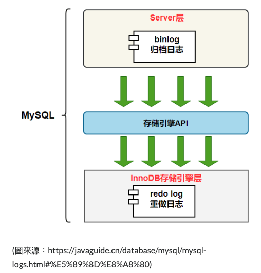
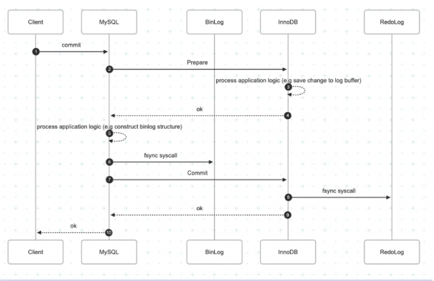
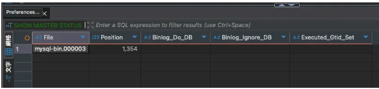
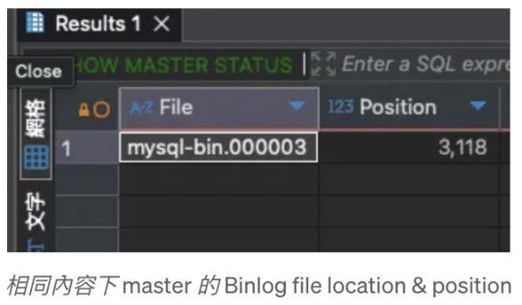
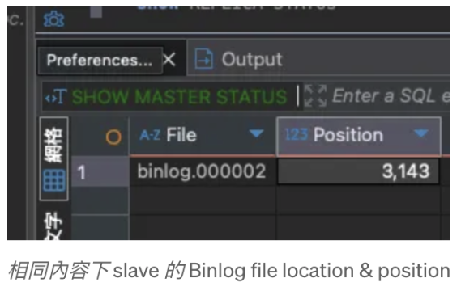

> 📌 此文件來自 https://ithelp.ithome.com.tw/users/20177857/ironman 的 IT 邦鐵人賽教程，僅針對個人學習用途進行筆記與修改。

# MySQL 如何應付大量查詢流量？(Binlog, Slave DB)

隨著系統業務量增加，即便將查詢優化到極致，系統仍會負荷不了瞬間大量查詢，此時只剩垂直與水平擴充兩個選項，垂直擴充相對簡單，提升硬體 CPU 和記憶體，但缺點是升級時需要停機，因此水平擴充較為常見，<span style="color: orange">MySQL 常見的 Cluster 架構就是 Master-Slave 架構，一台 Master 處理寫入請求並同步給多台 Slave，而多台 Slave 負責查詢請求。</span>

## 為何只需要一台 Master？寫入請求不需要分流嗎？

多 Master 的 Cluster 架構較複雜且容易出錯，例如：

- 多台 Master 同時更新相同資料時，誰的結果是最新的？
- 採用 Data Sharding 會造成跨 Server Transaction 實作 ACID 困難，且：
  - 寫入比讀取花更少 CPU 和記憶體
  - 通常查詢頻率又比寫入高，需要分流的通常是查詢請求
  - 因此單 Master 多 Slave 架構能降低複雜性，並分散查詢請求提升負載上限。

### Master 如何向 Slave 同步資料？

當 Master 收到更新請求 (e.g `INSERT`, `UPDATE`, `DELETE` ) 時，需要即時將修改內容同步給 Slave，同步方式有兩種，**Push & Pull**：

#### 同步方式比較：Push vs Pull

| 同步模式 | 運作方式 | 優點 (Pros) | 缺點 (Cons) |
| :--- | :--- | :--- | :--- |
| **Master Push** | Master 主動推送更新資料給 Slave | **資料同步延遲低**<br>(Real-time) | **Master 實作複雜**<br>(需紀錄每台 Slave 進度、多 Thread 推送) |
| **Slave Pull** | Slave 主動向 Master 拉取更新資料 | **Master 邏輯單純、資源消耗低**<br>(Slave 自行管理進度，Master 僅寫入 Queue) | **資料同步延遲較高**<br>(受 Polling 間隔影響) | 

在單 Master 架構中，Master 是唯一寫入點，其穩定性與效能很重要。為了降低 Master 的複雜度與負載風險，MySQL 採用 **Slave Pull** 的設計，雖然資料同步會有些許延遲，但優點是：
- Master 專注於寫入，不需追蹤每個 Slave 的進度或管理推送邏輯。
- Slave 可根據自身能力調整拉取頻率與批次大小，在資料量大時一次拉取更多資料，反而提高處理效率。

而在拉取模式下，<span style="color:orange">Master 要將**變更資料先寫入一個暫存區**，讓不同的 Slave 依照其進度拉取資料，而這個暫存區就是 **Binlog**</span>

## 為何需要新的儲存區？不能用 Redo Log 嗎？

既然所有寫入都會先寫到 `Redo Log` 中，Slave 不能直接去 Redo Log 拉資料同步嗎？

然而，直接用 `Redo Log` 同步資料有兩個缺點：

- `Redo Log` 屬於 InnoDB 是 Storage Engine 結構，如果換一個 Engine 需要修改 Slave 同步邏輯，缺乏系統彈性。
- 資料同步至 B+Tree 後就會從 `Redo Log` 清除，不會等到所有 Slave 成功同步在清除，不符合同步所需的持久性保障。

因此 MySQL 需要在 SQL Layer 層使用 `Binlog` 結構用來當作 Slave 同步的暫存區。



#### Binlog 儲存格式比較

| 格式 (Format) | 內容 (Content) | 優點 (Pros) | 缺點 (Cons) |
| :--- | :--- | :--- | :--- |
| **STATEMENT** | **直接儲存 SQL 指令** <br> (e.g. `INSERT ...`) | **空間極小**<br>(只存指令文字) | **資料不一致風險**<br>(非確定性函數如 `NOW()`, `RAND()` 在 Slave 可能算出不同值) |
| **ROW** | **儲存修改後的資料列** <br> (Row-based changes) | **資料絕對一致**<br>(精準複製變更結果，無需重新解析 SQL) | **空間巨大**<br>(每一筆受影響的 Row 都要記錄，大量 Update 時會暴增) |
| **MIXED** | **混合模式** <br> (MySQL 自動判斷) | **平衡空間與安全**<br>(預設用 Statement，遇到非確定性函數自動切換 Row) | **不可預測性**<br>(無法完全掌握 MySQL 當下決定用哪種格式) |

## 寫入要分別同步到 Redo Log ＆ Binlog 兩個結構，會不會有同步 Redo Log 成功但 Binlog 失敗的可能？

如果 `Redo Log` 成功 `Binlog` 失敗會造成 Master 和 Slave 資料不一致，因此 MySQL 透過 **2-Phased Commit** 解決 `Redo Log` & `Binlog` 同步議題：



其核心流程如下 (確保 Redo Log 與 Binlog 一致)：

1.  **Prepare Phase (InnoDB)**:
    寫入 Redo Log 並將 Transaction 標記為 `PREPARE` 狀態。
2.  **Commit Phase (Binlog + InnoDB)**:
    *   寫入 Binlog (這是真正的 Commit 點)。
    *   再回到 InnoDB 將 Redo Log 標記為 `COMMIT`。

**Crash Recovery 邏輯**：
*   若 Crash 發生在步驟 2 之前 (Binlog 未寫入) -> **Rollback**。
*   若 Crash 發生在步驟 2 之後 (Binlog 已寫入) -> **Commit** (即便 Redo Log 還在 Prepare 狀態，只要 Binlog 有，就算成功)。

---

### Group Commit (效能優化)

原本每筆 Transaction 都要執行多次 disk fsync (Redo Log prepare + Binlog + Redo Log commit)，導致 IOPS 瓶頸。
**Group Commit** 技術則是將多個同時提交的 Transaction 聚合起來：
1.  **Queue**: 收集多個 Transaction。
2.  **Batch Write**: 一次性將它們的 Binlog 寫入磁碟 (只要一次 fsync)。
3.  **Batch Commit**: 一次性在 InnoDB 完成 Commit。

這大幅減少了 fsync 次數，顯著提升高併發下的寫入效能。

可透過下面參數控制 SQL Layer 聚合方式：
- `binlog_group_commit_sync_delay` ：等待多久 (單位為微秒) 後執行 Prepare & Fsync
- `binlog_group_commit_sync_no_delay_count` ：累積多少個 Transaction Commit 後執行 Prepare & Fsync

## Slave 如何知道要從哪裡開始同步？ (Checkpoint 機制)

為了避免故障重啟後重頭同步，Slave 必須記錄「上一次同步到哪裡」。MySQL 有兩種紀錄方式：

### 1. 傳統方式：Binlog File & Position (物理座標)

這是最早期的方式 (MySQL 5.6 以前預設)，Slave 紀錄的是「檔案名稱 + 檔案內的位移量 (Offset/Bytes)」。可以透過 `SHOW MASTER STATUS` 查看。

*   **File**: Binlog 檔名 (e.g. `mysql-bin.000003`，遞增)
*   **Position**: 寫入的 Byte Offset (下一個寫入點的起始位置)



> [!CAUTION]
> **致命缺點：Failover 困難 (座標系不一致)**
> Position 是「物理座標」，會受到 Server 配置影響 (e.g. 檔名設、Header 長度、壓縮格式)。
> 即使兩台 DB 資料完全一樣，它們記錄同一筆 Transaction 的 Position 也可能完全不同。
>  *   舊 Master: Transaction A 寫在 `pos: 500`
>  *   新 Master (Slave A): Transaction A 寫在 `pos: 502` (因為 Header 可能多 2 bytes)
>
> **災難情境**：
> 1.  舊 Master 掛掉。
> 2.  Slave B 回報它同步到 `pos: 500` (拿著舊 Master 的地圖)。
> 3.  你把 Slave B 指向新 Master (Slave A)。
> 4.  Slave B 說：「請從 `500` 之後傳給我」。
> 5.  但對新 Master 來說，`500` 可能還在 Transaction A 的資料中間 (因为它結束在 `502`)
> 6.  **結果**：MySQL 噴錯，同步中斷。需要人工介入，手動找出這筆資料在新 Master 是對應到哪行。




### 2. 現代方式：GTID (Global Transaction ID) (邏輯座標)

為了解決上述問題，MySQL 5.6 引入了 GTID。這是一個 **跨 Server 唯一的邏輯 ID**，跟檔案位置無關。

*   **格式**: `source_uuid:transaction_id`
    *   `source_uuid`: 該 Transaction 來源 Server 的唯一 ID。
    *   `transaction_id`: 遞增序號。
*   **運作**: 每筆 Transaction 都有一個專屬 ID。Slave 只要紀錄「我已經執行過哪些 ID (GTID Set)」。
*   **優點**: **自動化 Failover**。Slave 切換 Master 時，MySQL 會自動比對 GTID Set，自動補齊缺少的資料，無需人工計算 Position。


如圖，即便 File Location & Position 不同，但 **Executed_Gtid_set** 是相同的，這讓 Cluster 管理變得簡單許多。

**GTID 相關變數**：
- `Retrieved_Gtid_Set`: 從 Master 拉下來的 GTID 集合 (Relay Log)。
- `Executed_Gtid_Set`: 已經執行並寫入 Binlog 的 GTID 集合。
- `Purged_Gtid_Set`: 已經被清除 (Purge) 掉的 GTID 集合。

## Slave 是怎麼同步資料進硬碟的？

Slave 從 Master Binlog 拉取資料後並不會直接寫入 InnoDB (Redo Log)，而是先循序寫入到 **Relay Log** 中，這主要有兩個考量：

1.  **效能與解耦 (Decoupling)**：
    *   **寫入成本低**：Relay Log 是邏輯日誌，同步過程僅是單純的**循序寫入 (Sequential Write)**，速度極快。若直接寫入 InnoDB，需處理 B+Tree 分裂、鎖競爭等開銷 (Random Write)，會嚴重拖慢拉取速度。
    *   **錯誤隔離**：將「拉取」與「回放」解耦。即使 SQL 執行失敗，Relay Log 依然存在，可以修正後重試，無需重新向 Master 請求資料。

2.  **雙執行緒模型 (Dual-Thread Model)**：
    透過 Relay Log，MySQL 將同步工作拆解為兩個獨立的 Thread：
    *   **Replica I/O Thread**：負責 **[拉取]**。連上 Master -> 讀取 Binlog -> 寫入 Relay Log。
    *   **Replica SQL Thread**：負責 **[回放]**。讀取 Relay Log -> 解析 SQL -> 寫入 Storage Engine。


> [!NOTE]
> **什麼是 Relay Log？**
> Relay Log (中繼日誌) 是 Slave Server 上的一組日誌檔案，其格式與 Binlog 完全相同。
> *   **儲存位置**：預設位於 Data Directory (`datadir`)，檔名格式通常為 `{hostname}-relay-bin.xxxxxx` (其中 `{hostname}` 為 Slave Server 的 OS 主機名稱)。
> *   **生命週期**：I/O Thread 負責寫入，SQL Thread 執行完畢後會自動刪除 (Purge)，通常不需手動維護。
> *   **內容**：包含從 Master 拉取過來的原始 Binlog Events。

### 同步效能優化 (I/O Thread vs SQL Thread)

Replica I/O & SQL Thread 作為同步核心，優化方向取決於其瓶頸：

| 組件 (Thread) | 工作特性 | 瓶頸 (Bottleneck) | 優化策略 (Optimization) |
| :--- | :--- | :--- | :--- |
| **I/O Thread** | **單執行緒 (Serial)**<br>需確保順序與 Master 一致，無法平行化。 | **網路吞吐量 (Network)**<br>跨網路傳輸大量資料。 | **Binlog 壓縮** (`binlog_transaction_compression`)<br>透過 CPU 換取頻寬，減少網路傳輸量 (MySQL 8.0.20+)。 |
| **SQL Thread** | **複雜運算 (Complex)**<br>需解析 SQL、檢查約束、更新索引。 | **CPU & Disk IOPS**<br>通常是同步延遲 (Lag) 的主因。 | <span style="color: orange">**MTS (Multi-Threaded Slave)**<br>將回放工作平行化，開啟多個 SQL Thread 同時寫入。 </span> |

要啟用 **MTS (Multi-Threaded Slave)** 並行回放，核心挑戰在於 **「如何識別資料依賴 (Data Dependency)」**。若兩個 Transaction 修改同一筆資料，執行順序將決定最終結果 (Race Condition)。

**1. 有依賴關係 (Dependency Exists) - 必須循序執行**

```sql
--- Transaction A: 將 User 1 狀態設為 2
UPDATE users SET status = 2 WHERE user_id = 1;

--- Transaction B: 將所有狀態為 2 的用戶改成 1
UPDATE users SET status = 1 WHERE status = 2;
```

*   **若順序為 A -> B**：User 1 最終狀態為 `1` (先變 2，隨後被 B 的條件命中變成 1)。
*   **若順序為 B -> A**：User 1 最終狀態為 `2` (B 先執行時 User 1 非 2，不受影響；隨後 A 執行將其設為 2)。
> [!WARNING] 
> 由於執行順序會嚴重影響資料一致性，這類 Transaction **禁止並行 (Must be Serialized)**。

**2. 無依賴關係 (Independent) - 可以並行執行**

最簡單的判別方式是檢查是否跨不同資料庫 (**Per-Database**)，因為不同 DB 的資料實體是隔離的：

```sql
--- Transaction A (操作 DB_A)
UPDATE db_a.users SET status = 2 WHERE user_id = 1;

--- Transaction B (操作 DB_B)
UPDATE db_b.users SET status = 1 WHERE status = 2;
```

*   無論誰先執行，`db_a` 與 `db_b` 的最終結果都互不影響。
*   這類操作 **可以安全並行 (Parallel Safe)**。

基於上述「跨 DB 必無依賴」的邏輯，MySQL 5.6 引入了 **Per-Database Replication** (基於庫的並行複製)。

> [!WARNING] 
> 但此技術的致命傷在於**並行顆粒度 (Granularity) 過大**——它僅以「資料庫」為單位進行隔離：
> *   **不同 Database** 的交易 -> **可並行**。
> *   **同一個 Database** 的交易 -> **必須循序執行 (Serialized)**。
> 由於現代應用架構多採 **單一資料庫 (Single Database)** 模式，這導致幾乎所有交易都擠在同一個佇列中，根本無法享受到並行加速的紅利，導致該優化實用性不足。

因此 MySQL 5.7 推出了基於 **Logical Clock** 的 **MTS (Multi-Threaded Slave)** 技術，將並行判斷的顆粒度縮小至 **Transaction** 等級：

### Logical Clock Replication (MySQL 5.7+)


> [!NOTE]
> 
> 只要能夠在 Master 上 [同時進入 Commit 階段] 的 Transactions，代表彼此沒有 Lock 競爭 (否則會被 Block 住)，因此在 Slave 上也可以 [並行回放]。

這個機制利用了 Master 的 **Group Commit** 行為來標記並行性。具體實作上，MySQL 在 Binlog Event 中加入了兩個欄位來追蹤依賴關係：
1.  **`sequence_number`**：交易的流水號 (遞增)。
2.  **`last_committed`**：該交易提交時，系統中 **「最新已完成」** 的交易流水號。


**判斷依據：**
如上圖，多筆 Transaction 若擁有**相同的 `last_committed`**，代表它們是在同一個時間區間內執行並準備提交的。這意味著：
*   它們之間沒有鎖衝突 (Lock Contention)。
*   Slave SQL Threads 可以安全地並行執行這些 Transaction，最後再依序 Commit。


## MySQL 如何架設高可用的 Master-Slave 架構？(ProxySQL & Orchestrator)

架設高可用的 MySQL Cluster 不只要讓多台 Slave 去接收 Master 的 Binlog 同步資料，還要做到當 Master **Crush** 時，Slave 能自動接替成為 Master 同時 Client 送出的寫入請求也能自動轉換。

那麼要如何建立多個 Slave 去監聽 Master 的 Binlog？

### 首先架設 Master & Slave 需要設定這些參數：

| 參數 (Parameter) | 說明 (Description) |
| :--- | :--- |
| `server-id` | **Server 唯一識別碼**<br>Cluster 成員識別身份用 (避免循環複製)。需固定為唯一整數，不建議綁定 IP/Hostname。 |
| `log-bin` | **開啟 Binlog 功能**<br>啟用後才能紀錄變更並同步給 Slave。 |
| `log-bin-basename` | **Binlog 檔名路徑前綴** (預設 `binlog`)<br>可指定路徑 (e.g. `/log_disk/binlog`) 將 Log 存於獨立硬碟，避免與資料讀寫搶 IO。 |
| `binlog-format` | **Binlog 紀錄格式**<br>建議設為 `ROW` 以確保資料一致性。 |
| `gtid-mode` | **啟用 GTID 模式**<br>開啟全域交易 ID 用於追蹤同步進度 (`ON`)。 |
| `enforce_gtid_consistency` | **強制 GTID 一致性**<br>禁止執行非 GTID-Safe 的語句 (如 `CREATE TABLE ... SELECT`)，確保同步安全性。 |
| `log_replica_updates` | **Slave 寫入 Binlog** (舊版為 `log_slave_updates`)<br>讓 Slave 重播 Master 資料時也寫入自己的 Binlog。用於串接 (A->B->C) 或 Slave 晉升為 Master 後供其他節點同步。 |
| `binlog_expire_logs_seconds` | **Binlog 保留時間 (秒)**<br>自動清除舊 Log，避免塞爆硬碟空間。 |
| `bind-address` | **監聽 IP 位址**<br>設為 `0.0.0.0` 允許外部 (Slave) 連線，預設 `127.0.0.1` 只能本機連線。 |

而 **Slave** 的設定跟 Master 一樣，只是多了 read-only 確保他不能處理寫入請求。

```yaml
services:  
   mysql1:  
    container_name: mysql1  
    image: mysql/mysql-server:8.0  
    platform: linux/amd64  
    networks:  
        - mysql_cluster  
    environment:  
        MYSQL_ROOT_PASSWORD: secret  
        MYSQL_ROOT_HOST: "%"  
        MYSQL_DATABASE: local_test  
        MYSQL_USER: test  
        MYSQL_PASSWORD: test  
    volumes:  
        - ./data/mysql1:/var/lib/mysql  
    ports:  
        - 127.0.0.1:3306:3306  
    command:  
    [  
        "--server-id=1",  
        "--log-bin=mysql1-bin",  
        "--binlog-format=ROW",  
        "--gtid-mode=ON",  
        "--enforce-gtid-consistency=ON",  
        "--log-replica-updates=ON",  
        "--binlog-expire-logs-seconds=604800",  
    ]  
  
   mysql2:  
    container_name: mysql2  
    image: mysql/mysql-server:8.0  
    platform: linux/amd64  
    networks:  
        - mysql_cluster  
    environment:  
        MYSQL_ROOT_PASSWORD: secret  
        MYSQL_ROOT_HOST: "%"  
        MYSQL_DATABASE: local_test  
        MYSQL_USER: test  
        MYSQL_PASSWORD: test  
    volumes:  
        - ./data/mysql2:/var/lib/mysql  
    ports:  
        - 127.0.0.1:3307:3307  
    command:  
    [  
        "--read_only=ON",  
        "--port=3307",  
        "--server-id=2",  
        "--log-bin=mysql2-bin",  
        "--binlog-format=ROW",  
        "--gtid-mode=ON",  
        "--enforce-gtid-consistency=ON",  
        "--log-replica-updates=ON",  
        "--binlog-expire-logs-seconds=604800",  
    ]  
  
networks:  
    mysql_cluster:  
    driver: bridge
```

執行 `docker compose -f ./mysql-cluster.yaml up -d` 啟動 server 後，需要進入 slave db 設定 Master DB 連線資訊：

```sql
CHANGE REPLICATION SOURCE TO  
SOURCE_HOST = 'mysql1',  
SOURCE_PORT = 3306,  
SOURCE_USER = 'root',  
SOURCE_PASSWORD = 'secret',  
SOURCE_AUTO_POSITION = 1;  
  
START REPLICA;  
```

`SOURCE_AUTO_POSITION=1` 代表使用 `gtid` 同，可執行 `SHOW SLAVE STATUS;` 檢查 Slave 同步狀況：

確認 Slave IO & SQL Thread 執行中，就沒問題了！

從頭建立 Cluster 簡單，但在既有的 Cluster 加入新 Slave 就有新的挑戰了。

當 Master Binlog 過期遺失後，新加入的 Slave 無法透過 Binlog 同步到完整資料時該怎麼辦？

**第一個方法是邏輯備份**，透過 `mysqldump` 將 Master DB 所有資料轉換成 SQL 指令輸出到特定檔案：

```shell!
mysqldump -h 127.0.0.1 -u root --password=secret  
--single-transaction \ <= 使用 snapshot transaction 讀資料  
--quick \ <= 使用批次處理避免一次載入大量資料到記憶體  
--skip-lock-tables \ <= 明確指定不要 Lock Table  
--set-gtid-purged=ON \ <= 產生 GTID_PURGED 指令  
local_test > backup.sql
```

執行後，會在 `backup.sql` 裡面看到 Master DB 將 Schema 以及資料轉成 `CREATE TABLE` 和 `INSERT` 的指令。

`SQL_LOG_BIN=0` 是避免執行下面指令時把資料寫入 binlog，由於是用 `mysqldump` 還原資料而不是 binlog replay，所以將 `backup.sql` 內容同步到 binlog 會造成 Cluster 內有相同 binlog 內容但不同 gtid 的情況。

設定 `GTID_PURGED` 為 `mysqldump` 拉資料當下 Master 已完成的 GTID Set，讓 Slave 在同步完 `backup.sql` 內容可以直接啟動 Replica 同步後續 binlog 資料，避開重複資料。

邏輯備份較耗時且資料量大時產生的 `backup.sql` 內容會特別大且複雜，備份過程也會消耗 master db 的 CPU。

**第二個方法是物理備份**，直接複製 MySQL `datadir` 底下資料，但備份方式不是單純執行 `cp` 指令就好，因為在複製的過程中，資料仍不斷在更新，單純複製會發生資料不一致的問題，例如 複製完前半段包含 id=100 的資料，隨後複製後半段 id=200 資料，此時同時更新了 `id = 100` & `id = 200` 資料會導致 `id=100` 為舊資料 `id=200` 為新資料。

為了解決這個問題需要使用 `Percona XtraBackup` 工具，其備份資料的也包含 redo log 內容，在備份完後，透過指令去 Replay redo log 內容就能讓資料更新到最新狀態。

```shell
# 使用 percona-xtrabackup 從 master 複製檔案到 backup folder 中  
docker run --rm \  
--network compose_mysql_cluster \  
--user=root \  
-v ./data/mysql4:/backup \  
--volumes-from mysql1 \  
percona/percona-xtrabackup:8.0 \  
xtrabackup --backup \  
--target-dir=/backup \  
--host=mysql \  
--user=root \  
--password=secret --no-lock  

# replay redo log 更新資料到最新狀態  
docker run --rm \  
--network compose_mysql_cluster \  
--user=root \  
-v ./data/mysql4:/backup \  
--volumes-from mysql1 \  
percona/percona-xtrabackup:8.0 \  
xtrabackup --prepare \  
--target-dir=/backup \  
--host=mysql \  
--user=root \  
--password=secret --no-lock
```

物理備份限制是版本跟設定要一致，避免出現對資料格式不兼容的情況，但備份速度比邏輯備份快上很多。

### 架設完 Cluster 後，要如何做到自動 Auto Fail Over？

[orchestrator](https://github.com/openark/orchestrator) 是一個 MySQL Cluster 管理工具，提供 GUI 管理 MySQL Server 的網路關係，並提供 Server 狀態追蹤以及 Auto Fail Over 的功能。


啟動 orchestrator 前要設定好配置：

基礎配置 - 連上 MySQL Server 的通用帳號密碼，以及 Orchestrator 用的 DB 配置，Orchestrator 會用額外 DB 來儲存 Cluster 資訊

```json
"MySQLTopologyUser": "root", => 連上 mysql server 通用帳號  
"MySQLTopologyPassword": "secret", => 連上 mysql server 通用密碼  
"DefaultInstancePort": 3306, => 連上 mysql server 預設 port  
"MySQLOrchestratorHost": "orchestrator_db", => orchestrator 儲存 cluster 資訊的 db host  
"MySQLOrchestratorDatabase": "orchestrator", => orchestrator 儲存 cluster 資訊的 db name  
"MySQLOrchestratorUser": "root", => orchestrator 儲存 cluster 資訊的 db 帳號  
"MySQLOrchestratorPassword": "secret", => orchestrator 儲存 cluster 資訊的 db 密碼  
"MySQLOrchestratorPort": 3309, => orchestrator 儲存 cluster 資訊的 db port  
"ListenAddress": ":3000", => orchestrator admin gui port number  
"InstancePollSeconds": 5,  
"UnseenInstanceForgetHours": 1,  
"HTTPAuthUser": "admin", => admin 帳號  
"HTTPAuthPassword": "secret", => admin 密碼
```

服務發現配置 - Orchestrator 會透過 Master DB 主動發現 Slave，可在 GUI 畫面上設定一個 Master DB 連線 host & port ，並用兩種方式發現 Slave：

- `DiscoverByShowSlaveHosts` 參數為 True - Orchestrator 會執行 show slave hosts 指令找 slave
- `DiscoverByShowSlaveHosts` 參數為 False - Orchestrator 會執行 `select substring_index(host, ‘:’, 1) as slave_hostname from information_schema.processlist where command IN (‘Binlog Dump’, ‘Binlog Dump GTID’)` Query 找 slave

當獲得 Master & Slave Host 後，透過 [HostnameResolveMethod](https://github.com/openark/orchestrator/blob/master/docs/configuration-discovery-resolve.md) ＆ [MySQLHostnameResolveMethod](https://github.com/openark/orchestrator/blob/master/docs/configuration-discovery-resolve.md) 參數將 Host 解析成 IP：

- HostnameResolveMethod：解析 master or slave hostname 的方式，例如在 docker 環境你會收到 mysql1 之類的，若 orchestrator 不在 docker 環境中你就需要將 mysql1 解析成 ip，此時可以將 HostnameResolveMethod 設定為 ip，也可設定成 none 不解析。

- MySQLHostnameResolveMethod：連上 Slave 後 Orchestrator 會執行 `SHOW SLAVE STATUS` 指令儲存 Slave 與 Master 關連，但如果 Orchestrator 是用 IP 連上 Master，但 Slave 是用 container (e.g mysql1) 連上 Master，資料比對會有問題，因此要透過該參數設定解析 MySQL IP 轉成 mysql1，例如設定參數為 report_host 會執行 `@@**global**.report_host` 獲取 MySQL 環境變數中 report_host 設定。

Auto Failover 配置 - Orchestrator 會定期檢查 Master 狀態，當有連線問題，且其他 Slave 也與他失聯後，就會啟動 Auto Failover：

- **ApplyMySQLPromotionAfterMasterFailover**：是否啟動 Failover，啟動後會透過 reset slave all & set read_only=0 指令將 slave 換成 master
- **PreventCrossDataCenterMasterFailover**：受否要避免相同 DataCenter 的 Slave 被提拔成 Master
- **PreventCrossRegionMasterFailover**：受否要避免相同 Region 的 Slave 被提拔成 Master
- **FailMasterPromotionIfSQLThreadNotUpToDate**：如果當 Slave Relay Log 都還沒 Replay 完是否要讓 Fail Over 失敗
- **FailMasterPromotionOnLagMinutes** : 當 Slave binlog lag 太久就要讓 Fail Over 失敗

另外也可以設置 Hook 來通知 Orchestrator 正在執行 Fail Over：

```json!
"PreFailoverProcesses": [  
"echo 'Will recover from {failureType} on {failureCluster}' >> /tmp/recovery.log"  
],  
"PostFailoverProcesses": [  
"echo '(for all types) Recovered from {failureType} on {failureCluster}. Failed: {failedHost}:{failedPort}; Successor: {successorHost}:{successorPort}' >> /tmp/recovery.log"  
],
```


## 最後，當 Master 替換後，Client 要如何在不替換連線的情況下將寫入請求送到新 Master？

可在 Cluster 前架設一個 [Proxy SQL](https://proxysql.com/)，透過 Proxy 自動分流，當 Master 替換成不同 Server，Proxy 也能自動偵測改變分流路線，程式端完全不需要修改配置。

Proxy SQL 除了分流 SQL 到不同 SQL Server 之外，還提供了：

- 統一管理連線池，避免太多 Server 各自建立大量連線，衝爆 MySQL Server 連線上限。
- 提供高度客製化的查詢快取，針對特定 Query 語法設定快取以及 TTL 時間。
- Query Rewrite 功能，例如把 SELECT * 改成 SELECT id, name。

Proxy SQL 本身自帶 SQLite 資料庫，會將 Cluster 連線資訊以及分流規則紀錄在裡面，此外也有很多系統參數可以微調行為，可以參考 https://proxysql.com/documentation/global-variables/。

以下提供基礎配置：

```json!
# 配置 sqlite 儲存路徑  
datadir="/var/lib/proxysql"  
  
# 配置 proxy sql admin 帳號密碼，以及模擬 mysql 介面的入口點  
# 使用者透過登入 admin 帳號來調整 proxy sql 設定  
admin_variables =  
{  
    admin_credentials="admin:admin"  
    mysql_ifaces="0.0.0.0:6032"  
}  
  
# 設定 mysql server 監控用的帳號密碼  
mysql_variables =  
{  
    monitor_username="root"  
    monitor_password="secret"  
}  
  
# 設定叢集資訊，hostgroup 1 為 master 2 為 slave，設定完後  
# proxysql 會定時監控 hostgroup 內的 mysql server read_only 參數  
# 並調整到正確的 host group id  
mysql_replication_hostgroups =  
(  
    {  
        writer_hostgroup=1  
        reader_hostgroup=2  
        comment="cluster1"  
    }  
)  
  
# 設定 mysql server 連線資訊，hostgroup 可以都設定成 1  
# 等 proxysql 透過 read_only 參數自行調整  
mysql_servers =  
(  
    {  
        address="mysql1"  
        port=3306  
        hostgroup=1  
        max_connections=200  
    },  
    {  
        address="mysql2"  
        port=3307  
        hostgroup=1  
        max_connections=200  
    },  
    {  
        address="mysql3"  
        port=3308  
        hostgroup=1  
        max_connections=200  
    }  
)  
  
# proxy sql 連上 mysql_servers 的帳號  
# application server 同時也會用該組帳號連上 proxysql  
# 再由 proxysql forward sql 到後面的 mysql server  
mysql_users =  
(  
    {  
        username = "root"  
        password = "secret"  
        default_hostgroup = 1  
        max_connections=1000  
        default_schema="information_schema"  
        active = 1  
    }  
)  
  
# 定義 query 分流規則，match_pattern 可以用 regex 去寫  
# 不用擔心每次分流都要通過一次 regex match 影響效能  
# proxy sql 會 cache 起來  
mysql_query_rules =  
(  
    {  
        rule_id=1  
        active=1  
        username="root"  
        match_pattern="^SELECT .* FOR UPDATE$"  
        destination_hostgroup=1  
        apply=1  
    },  
    {  
        rule_id=2  
        active=1  
        username="root"  
        match_pattern="^SELECT"  
        destination_hostgroup=2  
        apply=1  
    },  
    {  
        rule_id=3  
        active=1  
        username="root"  
        match_pattern="^INSERT|^UPDATE|^DELETE"  
        destination_hostgroup=1  
        apply=1  
    }  
)
```

詳細設定可參考：https://ithelp.ithome.com.tw/articles/10381791
