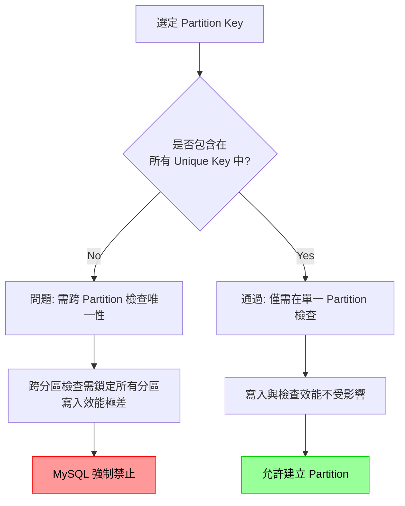
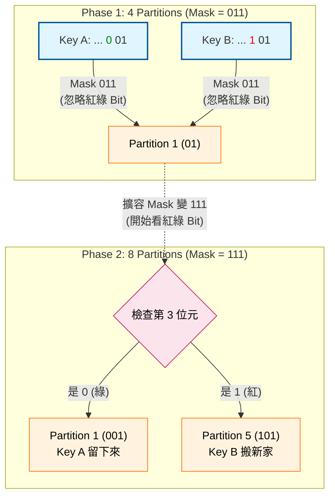

> 📌 此文件來自 https://ithelp.ithome.com.tw/users/20177857/ironman 的 IT 邦鐵人賽教程，僅針對個人學習用途進行筆記與修改。

# 利用 MySQL Partition 以優化大表查詢

當資料表到千萬筆資料即便有 Index 查詢速度仍可能不理想，就像 $O(\log N)$ 的演算法，當 $N$ 很大時程式仍會執行很慢，若要程式執行變快，其中一個方式是把 $N$ 拆成多個小的子集，然後並行處理，沿著這個思路，是否也可把一個大表拆成多個小表呢？

常見的分表策略是把一張 `orders` Table 依照時間拆成 N 張小表 `202505_orders` & `202504_orders` ，如果查詢 2025/5 月的訂單只要去 `202505_orders` Table 查詢，這時候 N 就變小了，速度就快多了，缺點是程式端需要修改邏輯，尤其需要跨表搜尋一整年訂單時邏輯會變得複雜。

## 那麼有沒有不需修改程式端邏輯就能有分表效果的功能呢？

**Partition 是 MySQL 的拆表技術，<span style="color: orange;">可將一個 Table 分成多個 .idb 檔案，這些 .idb 檔案稱為 Partition </span>，每個 .idb 檔案有獨立的 Clustered & Secondary B+Tree**，這些 `.idb` 檔案共用同一個 metadata 資料且被視為同一張表，程式端不需要修改 SQL 邏輯，因為 MySQL 會依照查詢條件判斷去哪個 `.idb` 檔案中搜尋。

## 使用 Partition 時，拆分資料的依據是什麼?

首先要指定 `Partition Key`，可選單個或多個欄位，不同 `Partition Key Value` 會被分到不同 `.idb` 檔。 但 Partition Key 的選擇有些限制：

### 1. Partition Key 必須是所有 Unique Key 的子集



例如：
```sql
CREATE TABLE orders (  
	id INT,  
	user_id INT,  
	zip_code INT,  
	uuid VARCHAR(100),  
	created_at DATETIME,  
	PRIMARY KEY id,  
	UNIQUE KEY idx_uuid uuid  
);
```

若要用 `created_at` 作為 orders Table Partition 的 Key 是不行的，因為 PK & Unique Key `idx_uuid` 都沒有包含到 `created_at` ，因此需要改成：

```sql
CREATE TABLE orders (  
	id INT,  
	user_id INT,  
	zip_code INT,  
	uuid VARCHAR(100),  
	created_at DATETIME,  
	-- ⚠️ 重點：PK 必須包含 Partition Key (created_at)
	PRIMARY KEY (id, created_at),  
	-- ⚠️ 重點：Unique Key 也必須包含 Partition Key 才能建立，否則無法確保分區內的唯一性
	UNIQUE KEY idx_uuid (uuid, created_at)  
);
```


**為什麼會有這個限制？** 主要原因是為了避免 **Global Uniqueness Check (跨分區唯一性檢查)** 帶來的巨大效能開銷。
1.  **若 PK 不包含 Partition Key**：
    當你 `INSERT` 一筆資料時，MySQL 為了確保 Primary Key 全域唯一，必須去 **每一個 Partition** 檢查該 ID 是否已經存在。這會導致大量的隨機 I/O 查詢，並可能鎖定所有分區，嚴重拖慢寫入效能。
2.  **若 PK 包含 Partition Key**：
    MySQL 可以根據 `Partition Key` 直接定位到特定的 **單一 Partition**。因為不同 Partition 的 `created_at` (Partition Key) 範圍互斥，只要在該 Partition 內確認 ID 唯一，就能保證全域唯一 (因為其他 Partition 不會有這個 `created_at` 的資料)。

這樣就將「本該做全域檢查的操作」優化為「局部檢查」，大幅提升效能。

### 2. Partition Key 不能為 BLOB 或 TEXT

因為上述限制，`Partition Table` 的 `PK` 都需要有 `Partition Key`，如果 `Partition` 為 `BLOBL` 或 `TEXT`，`PK` 就會變得很大，所有 `Secondary Index Tree` 的 `Leaf Node` 也會變大，表的總體資料量會變多不好管理，這也是使用 `Partition` 的缺點之一，`PK` 會變大，如果 `Index` 太多，總體資料量會變大很多。

### 3. Partition Table 不能有 Foreign Key

除了 `Partition Key` 限制以外，`Table` 本身也有限制：**InnoDB Partition Table 不支援 Foreign Key**。

這意味著：
1. Partition Table 不能包含 Foreign Key。
2. Partition Table 不能被其他 Table 的 Foreign Key 參照。

> [!NOTE]
> **為什麼不支援？**
> `Foreign Key` 依賴 `Referential Integrity Check` (參照完整性檢查)，每次操作 (Insert/Update) 都需要檢查關聯表。
> 若開放 Partition Table 使用 FK，檢查過程將涉及「跨 Partition」的隨機讀取與鎖定，這在實作上極其複雜且會導致嚴重的效能問題 (Performance Penalty)，因此 MySQL InnoDB 引擎目前選擇直接不支援。

## 指定完 Partition Key 後，我如何拆分資料？

MySQL 提供的四種 `Partitioning Types` (Range, List, Hash & Key)：

| 分區類型 (Type) | 核心概念 (Concept) | 分區依據 | 適用場景 (Use Case) | 特性與限制 (Notes) |
| :--- | :--- | :--- | :--- | :--- |
| **Range** | **範圍分區** | 連續區間值的範圍<br>(e.g. `VALUES LESS THAN`) | **時間序列資料**<br>(如 Log, Transaction, Orders) | 最常用。非常適合**批次刪除過期資料** (`DROP PARTITION` 亦即刪除該 `.idb`)，效能極快。 |
| **List** | **清單分區** | 明確的枚舉值列表<br>(e.g. `VALUES IN (1, 3, 5)`) | **類別、區域**<br>(如 Region, Category) | 適合離散值。**限制嚴格**，若插入的值不在定義清單中會直接報錯 (Error)。 |
| **Hash** | **哈希分區** | 取餘數自動分配<br>(e.g. `MOD(x, N)`) | **平均分散資料**<br>(Load Balancing) | 僅支援整數 (或可轉整數的表達式)。適合無需管理分區邏輯，只想把大表打散的場景。 |
| **Key** | **金鑰分區** | 類似 Hash，由 MySQL 內部 Hash 函數處理 | **多欄位 / 非整數分散** | 支援 **Multi-Column** 與 **Non-Integer** 欄位 (如 Strings, BLOB除外)。分佈通常比 Hash 更均勻，但運算成本稍高。 |

### 1. Range Partitioning  範圍分區: 依照資料不同連續範圍分區

例如依照  `orders` Table 的 `created_at` 欄位，每一年分一個 partition：

```sql
CREATE TABLE orders (  
	id INT,  
	user_id INT,  
	zip_code INT,  
	created_at DATETIME,
	PRIMARY KEY (id, created_at)
)  
PARTITION BY RANGE ( YEAR(created_at) ) (  
PARTITION p0 VALUES LESS THAN (2024),  
PARTITION p1 VALUES LESS THAN (2025),  
PARTITION p2 VALUES LESS THAN MAXVALUE,  
);
```

### 2. List Partitioning  清單分區 : 定義不同 Value 組別分區

例如需要用 `orders` Table 裡面的 `zip_code` 依照不同地區分類：

```sql
CREATE TABLE orders (  
	id INT,  
	user_id INT,  
	zip_code INT,  
	created_at DATETIME,
	PRIMARY KEY (id, zip_code)
)  
PARTITION BY LIST ( zip_code ) (  
PARTITION pNorth VALUES IN (1,2,3),  
PARTITION pSouth VALUES IN (4,5,6),  
PARTITION pEast VALUES IN (7,8,9),  
PARTITION pCentral VALUES IN (10,11,12)  
);
```

List 會限制 `INSERT` 行為，如果有 `zip_code` 無法被分區的情況會噴錯。

### 3. Hash Partitioning 哈希分區：依照 partition 數量透過 hash value 自動分區。

Range 或 List 會要手動擴充或調整 Partition，例如加新的一年到 Range Partition 或者新增新的 `zip_code` 到 List Partition，如果是單純要資料拆成固定 N 個子集，例如將 orders 依照 user_id 隨機分成 5 個 partition，可用 Hash：

```sql
CREATE TABLE orders (  
   id INT,   
   user_id INT,   
   zip_code INT,  
   created_at DATETIME,
   PRIMARY KEY (id, user_id)
)  
PARTITION BY HASH ( user_id )  
PARTITION 5;
```

Hash Partitioning 用取餘數的方式 ( e.g `id % 5` ) 將資料分配到不同的 partition，若 Partition 欄位非數字型別，會用 Hash 演算法 (e.g CRC32) 將資料轉成數字後取餘數分配。

### 4. Key Partitioning 金鑰分區：更高效的 Hash Partitioning

Hash Partitioning 只能用單欄位作為 Partition Key，且 Hash 算法較簡單容易碰撞，Key Partitioning 可用多個欄位搭配更複雜的 Hash 演算法，能更平均地分配資料，但也花更多效能。

```sql
CREATE TABLE orders (  
	id INT,  
	user_id INT,  
	zip_code INT,  
	created_at DATETIME,
	PRIMARY KEY (id, user_id)  
)  
PARTITION BY KEY ( user_id, id )  
PARTITION 5;
```


## 可以用多個 Partition Types 組合嗎？

**Sub Partitioning (Composite Partitioning)** 是一種「分區再分區」的技術，允許你在主要的 Partition 之下，再依據另一個規則切分出 Sub Partition。

> [!TIP]
> **常見的組合邏輯**
> 通常是 **Range** 或 **List** 作為「主分區」 (由管理員邏輯決定，如：年份、地區)，
> 再搭配 **Hash** 或 **Key** 作為「子分區」 (由系統自動打散，如：User ID) 以達到負載平衡。

**運作邏輯**：
1. 資料首先依據 `Range/List` 規則進入特定的 Main Partition (e.g. `p2024`)。
2. 在該 Partition 內部，資料再依據 `Hash/Key` 規則被分配到具體的 Sub Partition (e.g. `p2024_sp1`)。
3. 最終資料是儲存在 **Sub Partition 對應的 `.idb` 檔案中**，Main Partition 僅是一個邏輯容器。

例如：結合 `Range` (年份) + `Hash` (User ID) 的組合：

```sql
CREATE TABLE orders (  
	id INT,  
	user_id INT,  
	zip_code INT,  
	created_at DATETIME,
	PRIMARY KEY (id, user_id),
	UNIQUE KEY (id, created_at)
) PARTITION BY RANGE ( YEAR(created_at) )  
SUBPARTITION BY HASH(user_id)  
(  
	PARTITION p2023 VALUES LESS THAN (2024)  
		SUBPARTITIONS 3,  
	PARTITION p2024 VALUES LESS THAN (2025)  
		SUBPARTITIONS 3  
);
```

先依照 created_at 每年建立 Partition，每年的 Partition 底下再依照 user_id 建立三個 Hash Partition，總共會建立 6 個。

## 如果要調整 Partition 怎麼辦？
除了建立 (`CREATE`) 之外，維護 Partition 最常見的操作是新增與移除。但要注意 **Range/List** 與 **Hash/Key** 的維護邏輯截然不同。

#### 1. Range & List 管理 (針對特定分區)
這類操作針對「特定範圍」或「特定清單」，通常較具彈性。
*   **DROP Partition (刪除)**:
    *   指令: `ALTER TABLE ... DROP PARTITION pName;`
    *   行為: **直接刪除** 該分區的 Schema 定義與 **所有資料** (.idb 檔直接移除)。
    *   效能: **極快 (Instant)**，常用於秒殺過期資料 (e.g. 刪除 5 年前的 Log)。
*   **ADD Partition (新增)**:
    *   指令: `ALTER TABLE ... ADD PARTITION ...;`
    *   限制: 
        *   `Range` 只能在 **「尾端」** (最大值之後) 新增
        *   `List` 只能新增 **「新的值組合」**。
*   **REORGANIZE Partition (重組)**:
    *   指令: `ALTER TABLE ... REORGANIZE PARTITION ...;`
    *   用途: 修改 **「既有」** 分區的定義。例如：將一個大的 `p2024` 拆成 `p2024_01` ~ `p2024_12`，或是在 Range 中間插入新分區。
    *   代價: **昂貴 (Expensive)**。系統必須建立新分區並將舊分區資料 **Copy (搬移)** 過去，會鎖定並消耗 I/O。

#### 2. Hash & Key 管理 (全域數量調整)
這類無法指定「特定分區」，只能調整「分區總數量 (N)」。

*   **調整數量 (ADD / COALESCE)**:
    *   指令: `ADD PARTITION` (增加 N) / `COALESCE PARTITION` (減少 N)。
    *   代價: **極度昂貴 (Re-sharding)**。
    *   說明: 因為 Hash 算法通常是 `MOD(key, N)`，一旦 N 改變，**所有資料** 都需要重新計算 Hash 值並搬移到正確的新分區。這等同於重建整張表，大表請慎用。


### Linear Hash 或 Linear Key Partitioning 可以減少 Partition 數量變動時需要搬移的資料量：

```sql
CREATE TABLE orders (  
	id INT,  
	user_id INT,  
	zip_code INT,  
	created_at DATETIME,
	PRIMARY KEY (id, user_id)
)  

PARTITION BY LINEAR HASH ( user_id ) PARTITION 5;
```

Linear Hash 使用 **Bitwise Operation** (位元運算) 來分配 Partition，這比一般 Hash 取餘數 (`MOD`) 更適合動態擴充，因為它能確保擴容時 **只有少部分資料需要移動**。

**運作原理**：
Linear Hash 利用一個 **Mask (遮罩)** 來取出 Hash 值的後幾位元，用來決定資料屬於哪個 Partition。
當 Partition 數量 $N$ 為 2 的次方時 (e.g., 4, 8, 16)，**Mask 設定為 $N-1$**。
*   (數學小知識: 對 $2^k$ 取餘數 `x % 2^k` 等同於位元運算 `x & (2^k - 1)`)

**擴容範例**：
假設目前有 4 個 Partitions ($2^2$)，因此 **Mask** 為 $4-1 = 3$ (二進制 `11`, 代表只看最後 2 bits)。資料分配公式為 `Hash(Key) & Mask`。

當擴容到 8 個 Partitions ($2^3$) 時，**Mask** 變為 $8-1 = 7$ (二進制 `111`, 代表改看最後 3 bits)。
這時候只會多看一個 Bit，資料只有兩種結果：
1.  **保持原位**：如果多出來的那個 Bit 是 `0` (例如 `001` -> `001`)。
2.  **移動到新分區**：如果多出來的那個 Bit 是 `1` (例如 `001` -> `101`)。


歸納如下：
- 原本狀態 ($2^2 = 4$ Partitions)：
    - Mask 是 3 (二進制 11)。
    - 系統只看 Key 的 最後 2 個 Bit 決定去哪個桶 (00, 01, 10, 11)。
    - 這時候第 3 個 Bit 是什麼根本不重要 (被 Mask 濾掉了)。

- 擴容狀態 ($2^3 = 8$ Partitions)：
    - Mask 變成了 7 (二進制 111)。
    - 系統改成看 Key 的 最後 3 個 Bit。
    - 第 3 個 Bit (The 3rd Bit) 成為了關鍵。


| Hash(Key) (二進制) | 舊 Mask (`11`) 結果 <br> (4 Partitions) | 新 Mask (`111`) 結果 <br> (8 Partitions) | 是否需要搬移? |
| :--- | :--- | :--- | :--- |
| `...001` (1) | `01` (1) | `001` (1) | **否** (留在 p1) |
| `...101` (5) | `01` (1) | `101` (5) | **是** (搬到 p5) |




如上例，原本都在 Partition 1 的資料，擴容後只有一半 (Bit 為 1 的那些) 需要搬去 Partition 5，另一半留在原地。這比傳統 Hash (所有資料全部重算 `MOD N`) 的搬移量少得多。

> [!WARNING]
> Linear 缺點就是 Partition 數量建議為 2 的次方數 (雖然 MySQL 支援任意數量的 Linear Hash，但 2 的次方數最能發揮其演算法優勢)，且 bit operation 在某些場景下計算成本不一定比簡單取餘數低 (視 Hash 函數複雜度而定)。


## Partition Exchange
此外上述調整 Partition 內容都會涉及 Table Lock，可用 pt-online-schema-change 工具避免 Lock 太久，但如果是 Drop Partition，MySQL 支援一種更快更安全的方式，就是 Partition Exchange：

當需要 Drop 太舊的 Range 或者 List Partition，可先建立一張空 Table，該表不用 Partition 但 Schema 內容要跟 Partition Table 一模一樣，隨後執行 Exchange 指令將 Partition 與 Table 資料交換：

```sql
ALTER TABLE orders EXCHANGE PARTITION p_2000 WITH TABLE 2000_orders;
```

**Exchange** 指令只更改 Table Metadata 不搬移 Table 資料，因此 Table Lock 時間非常短暫，執行完後 `orders` 表的 p_2000 會變空，而 `2000_orders` 表會有原本 p_2000 的資料，此時 Drop 空的 p_2000 Partition 會非常快，而 Drop `2000_orders` 表也不會影響正在運行的 `orders` 表。

## Partition 有什麼缺點嗎？
### 1. 跨 Partition 查詢效能很差
首先是 **跨 Partition 查詢效能很差**，資料分散到不同 idb 中的 B+Tree ，除了要建立更多 File Socket 外還會增加 I/O 次數，如果資料量不大切 Partition 效能反而會更差。如果切完 Partition 後遇到**不得不做 Full Table Scan (全表掃描)** 的情況 (例如：報表統計、數據遷移)，直接 `SELECT *` 效能通常不佳，因為 MySQL 預設可能會依序掃描每個 Partition，或是平行度不足。

這時候建議使用 **Explicit Partition Selection (顯式指定分區)** 搭配 **Application-Side Parallelism (程式端並行處理)** 來加速：
*   **原理**：把一個大 Query 手動拆成多個針對特定 Partition 的小 Query。
*   **作法**：在程式端 (App) 開多個 Threads/Coroutines 同時發出查詢，模擬 Map-Reduce 的效果。

```sql
-- thread 1  
SELECT * FROM orders PARTITION (p1);  
-- thread 2  
SELECT * FROM orders PARTITION (p2);  
-- thread 3  
SELECT * FROM orders PARTITION (p3);
```

### 2. Secondary Index 查詢效能陷阱 (Local Index)

MySQL 的 Partition 是實作 **Local Index**，意思是 **每個 Partition 檔案 (`.idb`) 都有自己獨立的一套 Secondary Index B+Tree**，而不是全域只維護一顆大樹。

這代表索引是**被切碎的**。如果你查詢的條件 **不包含** Partition Key (e.g. `user_id`)，MySQL 無法知道資料在哪個 Partition，被迫去 **每一個 Partition 的 Index Tree** 都查一遍 (Scatter-Gather)，這比單一大表的 Index 查詢慢得多。

**範例**：

```sql
CREATE TABLE orders (  
	id INT,  
	user_id INT,  
	zip_code INT,  
	created_at DATETIME,  
	PRIMARY KEY (id, user_id),  
	KEY idx_created_at (created_at) -- Secondary Index
)  
PARTITION BY HASH ( user_id ) PARTITION 5;
```

**效能問題**：
執行 `SELECT * FROM orders WHERE created_at = '2025-01-01'` 時：
*   **預期**：以為有 `idx_created_at` 索引查詢會很快。
*   **實際**：因為 **查詢條件中沒有包含 Partition Key (`user_id`)**，MySQL 無法知道資料在哪個分區，只好被迫同時打開 5 個 Partition 的 `idx_created_at` 樹進行查找 (Scan 5 trees)，增加了 5 倍的 Random I/O。

**解決方案**：

1.  **加上 Partition Key (最佳解 - Partition Pruning)**：
    改寫 SQL，盡量帶上 Partition Key，讓 MySQL 能直接定位到特定分區。
    ```sql
    -- MySQL 只需要查 p1 這一個分區
    SELECT * FROM orders WHERE user_id = 100 AND created_at = '2025-01-01';
    ```

2.  **程式端並行查詢 (Explicit Partition Selection)**：
    如果業務邏輯真的無法提供 `user_id`，則建議在程式端使用多執行緒並行查詢，自己做 Map-Reduce：
    ```sql
    -- Thread 1 查 p0
    SELECT * FROM orders PARTITION (p0) WHERE created_at = ?;
    -- Thread 2 查 p1
    SELECT * FROM orders PARTITION (p1) WHERE created_at = ?;
    ...
    ```

