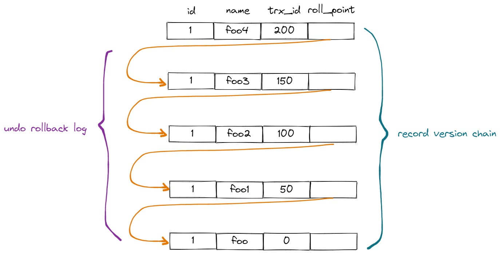
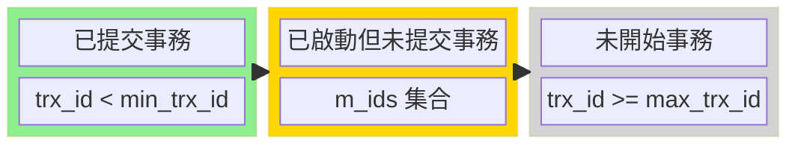

> 📌 這篇筆記整理自 https://zhuanlan.zhihu.com/p/656491926

# MySQL 事務、MVCC 與 ReadView 補充

這篇筆記旨在深入探討 MySQL InnoDB 引擎如何透過事務（Transaction）與多版本併發控制（MVCC）來保證資料的一致性與並發效能。

---

## 1. 什麼是 MySQL 事務？

**事務 (Transaction)** 是資料庫執行操作的最小邏輯單元。它將一組 SQL 語句包裝在一起，確保這組操作「要嘛全部成功，要嘛全部失敗回滾」，不存在中間狀態。

### 事務解決的核心問題
在無事務保護的情況下，多個用戶同時操作同一筆數據（並發操作）會導致數據混亂。例如：
- **轉帳情境**：A 轉帳 100 元給 B。如果 A 的帳戶扣款成功，但系統突然當機導致 B 的帳戶沒加錢，這 100 元就憑空消失了。事務能確保扣款與入帳這兩個動作發生「原子性」的聯繫。

## 2. 多事務並發引發的問題

當多個事務同時運行時，若缺乏隔離機制，會出現以下三種經典問題：

| 問題                                 | 說明                                                                                                   |
| :----------------------------------- | :----------------------------------------------------------------------------------------------------- |
| **髒讀 (Dirty Read)**                | 讀取到了其他事務「尚未提交」的資料。若該事務隨後回滾，讀到的就是無效數據。                             |
| **不可重複讀 (Non-Repeatable Read)** | 在同一個事務內，兩次讀取同一行資料的結果不同（因為期間有其他事務**更新**並提交了）。                   |
| **幻讀 (Phantom Read)**              | 在同一個事務內，兩次執行相同的範圍查詢，看到的記錄數量不同（因為期間有其他事務**插入**或刪除了數據）。 |

---

## 3. 事務隔離級別 (Isolation Levels)

為了在「效能」與「安全性」之間取得平衡，SQL 標準定義了四種等級：
- ✅ 可預防 ❌ 不可預防

| 隔離級別                        | 意義                                     | 髒讀  | 不可重複讀 | 幻讀  | 優缺點分析                                          |
| :------------------------------ | :--------------------------------------- | :---: | :--------: | :---: | :-------------------------------------------------- |
| **讀未提交 (Read Uncommitted)** | 允許讀取其他事務尚未提交的變更           |   ❌   |     ❌      |   ❌   | 效能最高，但完全不安全。                            |
| **讀已提交 (Read Committed)**   | 只能讀取其他事務已經提交的變更           |   ✅   |     ❌      |   ❌   | 解決髒讀。大多數資料庫（如 Oracle）的默認級別。     |
| **可重複讀 (Repeatable Read)**  | 同一事務內多次讀取同一資料，結果保持一致 |   ✅   |     ✅      |   ❌   | **MySQL InnoDB 預設級別**。能解決髒讀與不可重複讀。 |
| **序列化 (Serializable)**       | 事務完全隔離，如同依序逐一執行           |   ✅   |     ✅      |   ✅   | 強制事務順序執行，安全性最高但併發極差。            |

> [!NOTE]
> **注意**：InnoDB 在「可重複讀 (RR)」等級下，透過 **Next-Key Lock** 機制，在很大程度上也解決了幻讀問題。

---

## 4. MVCC 的核心實現原理

**MVCC (Multi-Version Concurrency Control)** 是 MySQL 實現隔離性的核心引擎。它讓「讀取」不加鎖，大大提升了並發效能。

### (1) 隱藏欄位 (Hidden Fields)
InnoDB 會在每一行記錄後面增加三個隱藏欄位：
- `db_row_id`：隱藏主鍵（若無定義主鍵時使用）。
- `db_trx_id`：最後一次修改此紀錄的**事務 ID**。
- `db_roll_ptr`：**回滾指針**，指向該記錄在 `undo log` 中的舊版本。

### (2) 版本鏈 (Version Chain)

每當資料被修改，舊版本會被保存到 `undo log` 中。透過 `db_roll_ptr` 指針，形成了一條由新到舊的「版本鏈表」。

### (3) Read View (讀取視圖)
當事務執行「快照讀（普通 SELECT）」時，會產生一個 Read View，存在 Memory 中用來判斷具體該看版本鏈中的哪一個版本。它包含四個關鍵屬性：
- `m_ids`：產生視圖時，系統中所有「活躍中」的事務 ID 集合。
- `min_trx_id`：`m_ids` 中最小的事務 ID。
- `max_trx_id`：下一個即將分配的事務 ID（代表未來）。
- `creator_trx_id`：創建此 Read View 的當前事務 ID。

## 5. 版本可見度判斷規則

當事務讀取某筆記錄時，會拿 Read View 與該版本的 `trx_id` 進行比對：

| 比對條件                         | 版本是否可讀 | 說明                                     |
| :------------------------------- | :----------: | :--------------------------------------- |
| `trx_id == creator_trx_id`       |      ✅       | 是我自己改的                             |
| `trx_id < min_trx_id`            |      ✅       | 此版本在事務開始前已提交                 |
| `trx_id >= max_trx_id`           |      ❌       | 此版本是在我產生視圖之後才產生的（未來） |
| `trx_id` **在** `m_ids` 集合中   |      ❌       | 代表此事務尚未提交                       |
| `trx_id` **不在** `m_ids` 集合中 |      ✅       | 代表此事務在我開始前已提交               |

> [!NOTE]
> 後兩項的前提條件為 `min_trx_id <= trx_id < max_trx_id`

**若不可看，則順著回滾指針往舊版本找，直到找到可看的為止。**

---

## 6. 不同級別下的 Read View 生成時機

這是區分 RC 與 RR 的關鍵：
- **RC (讀已提交)**：事務內**每次讀取 (SELECT)** 時都會重新生成一個 Read View。因此能讀到別人剛提交的資料。
- **RR (可重複讀)**：事務內**第一次讀取**時生成 Read View，之後整個事務過程中都**重複使用**同一個。因此保證了兩次讀取的結果一致。

---

## 7. 快照讀、當前讀與隔離級別的關係

快照讀與當前讀的行為差異，正是 MySQL 實作不同隔離級別（Isolation Level）的核心手段。
> [!NOTE]
> - **快照讀 (Snapshot Read)**：普通的 `SELECT`。不加鎖，利用 MVCC 讀取歷史版本。
> - **當前讀 (Current Read)**：`INSERT`, `UPDATE`, `DELETE`, `SELECT ... FOR UPDATE`。必須讀取最新版本，且會加鎖保護。

| 讀取模式 | 語法範例 | 在 Repeatable Read (RR) 的行為 | 在 Read Committed (RC) 的行為 |
| :--- | :--- | :--- | :--- |
| **Snapshot Read** (快照讀) | `SELECT ...` | **第一次**讀取時生成 Read View (整個事務共用一個，看到舊的) | **每次**讀取都生成 Read View (隨時能看到別人剛 Commit 的) |
| **Current Read** (當前讀) | `SELECT ... FOR UPDATE` `UPDATE` `DELETE` | 使用 **Next-Key Lock** (鎖記錄 + 鎖間隙，防幻讀) | 僅使用 **Record Lock** (只鎖記錄，不防幻讀) |
