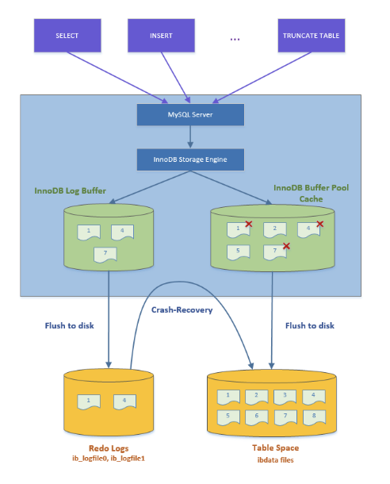
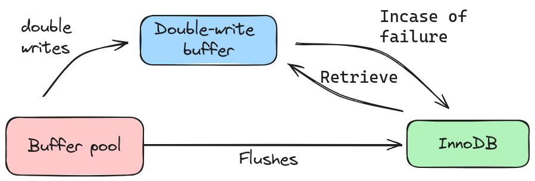
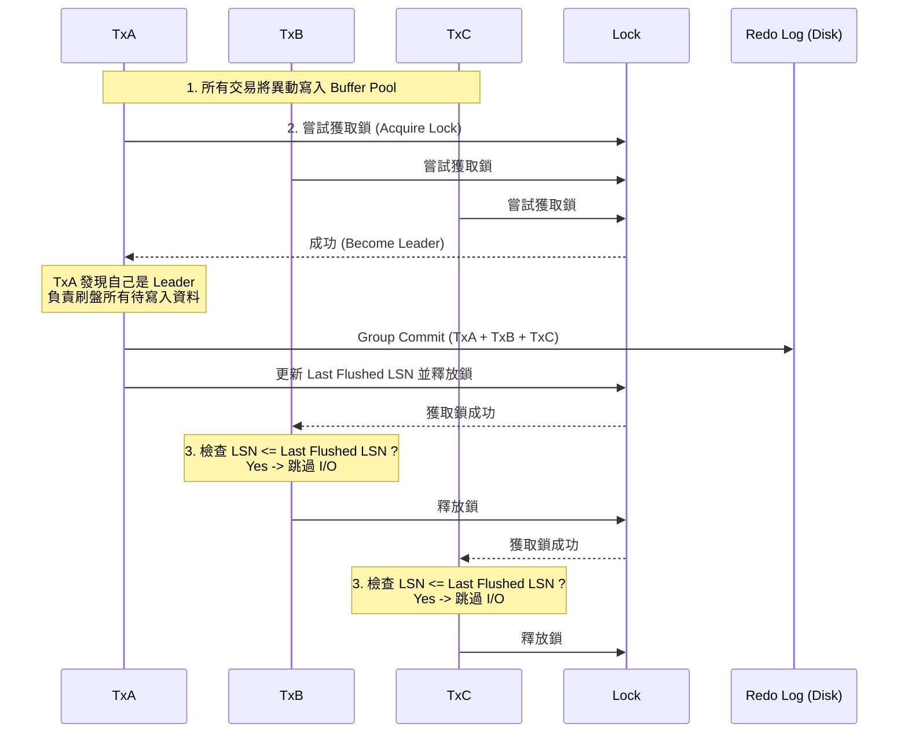
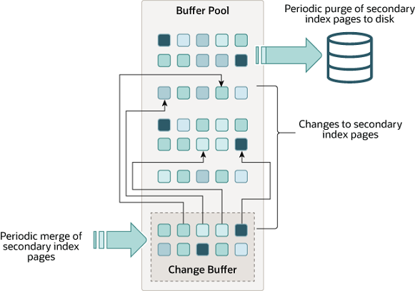

> 📌 此文件來自 https://ithelp.ithome.com.tw/users/20177857/ironman 的 IT 邦鐵人賽教程，僅針對個人學習用途進行筆記與修改。

# MySQL 的 write durability (WAL & Redo Log)
Transaction ACID 中 Durability 要求資料不可遺失，因此一旦 Commit 後，資料就要寫進硬碟，不能只放在記憶體中。

但 MySQL `INSERT` or `UPDATE` 都要找到 B+Tree 中的 Page 更新，不同資料位於不同 Page，頻繁更新時等於是 `Random I/O`，對硬碟效能影響很大，例如：
- 傳統硬碟的磁頭要前後移動，移動距離大。
- SSD 更新資料不能直接覆蓋，要先擦除既有資料才能更新。

如果是 **順序 I/O (Sequential I/O)** 寫入資料，傳統硬碟磁頭只要往前，而 `SSD` 只要不斷往空白區塊寫入不用擦除，效能都比 `Random I/O` 好。但由於資料往往會散落在不同區塊，更新時也會需要覆蓋既有的區塊，因此，善用 `Sequential I/O` 以提升效能就變成可考量的方案。

## 利用順序 I/O 提升寫入效能
> [!NOTE]
> MySQL 使用 `Write Ahead Log (WAL)` 結構優化寫入效能，`WAL` 是 `append-only` 的檔案，只能往檔案後面空白空間寫資料，不能覆蓋前面的內容，而 `Redo Log` 是 MySQL 實現 Durability 的 `WAL`。

當資料更新時，`MySQL` 會先把 `Page` 載入 `Buffer Pool` 並在記憶體中修改 `Page` 內容，隨後把修改的內容寫入 `Redo Log` 中，此時寫入就完成了，隨後會有 **異步 process (aka flush process)** 定期把被修改的 `Page` (aka Dirty Page) 寫入硬碟 `Tablespace` 中的 `B+Tree` 結構。

`Redo Log` 不會放整個 Page 資料，而是儲存 Page 的修改內容 (e.g. space_id, page_no, file offset, change payload)，當 DB Crash 後重啟，可重放 `Redo Log` 內容，將修改資料同步到 `B+Tree` 結構。


- **左側** (`Log Buffer` $\rightarrow$ `Redo Logs`)： 為了防止在髒頁寫入硬碟前系統就崩潰，InnoDB 會先把修改的「操作紀錄」快速寫入 `Log Buffer`，並強制先 flush 到硬碟上的 `Redo Logs`。
- **右側** (`Buffer Pool Cache` $\rightarrow$ `Table Space`)： 這是實際存放資料的地方。當你在 `SQL` 執行 `INSERT` 或 `UPDATE` 時，InnoDB 會先在記憶體（Buffer Pool）中修改資料。圖中 `Buffer Pool` 裡的 `Page` 上有紅色叉叉，這通常代表 「髒頁」（`Dirty Pages`），意思是這些資料在記憶體中已經被修改，但還沒有寫入硬碟的 `Table Space`。


> [!WARNING]
> ## Page 局部寫入問題 (Partial Page Write)
> `Redo Log` 只儲存修改內容，雖然可節省空間，但在 recovery 時帶來新的挑戰。由於 <span style="color: orange;"> Flush Process 寫入單位為整個 `Page` </span>，如果寫入一半時 `OS Crash` 或者硬碟出問題，會導致 `Page` 處於半更新狀態 (aka torn page)，`Header LSN` (Page 頭部紀錄的 LSN) 會與 `Trailer LSN` (Page 尾部紀錄的 LSN) 不一致，此時直接重放 `Redo Log` 可能無法正確恢復 `Torn Page`，因為 `Page` 內容與 `Redo Log` 紀錄的狀態不一致（例如，file offset 100 的數據預期是 `id=2`，但實際可能是 `id=3` 或損壞）。

為了解決上述**頁面局部寫入問題 (Partial Page Write)**, MySQL 用了另一個順序寫入結構 `Doublewrite Buffer` 解決這個問題。

> [!CAUTION]
> **注意：Doublewrite Buffer 雖然名字叫 Buffer，但它實際上是硬碟 (Disk) 上的一塊區域 (System Tablespace)。**
> 記憶體中確實也有 Doublewrite Buffer 的緩存，但其核心保護機制在於**寫入硬碟上的系統表空間**。

Flush Process 的運作順序：
1. 把 `Dirty Page` 寫入 `Doublewrite Buffer` (位於 System Tablespace 的 Disk 區域)。
2. 確保整個 Page 成功寫入 `Doublewrite Buffer` (fsync)。
3. 才會將資料更新到 `B+Tree` 結構中原本的 Page 位置 (Data File)。


- `Double writes（雙寫入）`： 當 Buffer Pool（記憶體緩衝池）中的髒頁（Dirty Pages，即被修改過的資料）準備要寫入硬碟時，InnoDB 不會直接寫入最終的資料檔，而是先將這些資料頁寫入 Double-write buffer。這是一個位於磁碟上的連續儲存空間（循序寫入，速度較快）。
- `Flushes（刷新）`： 只有在資料成功完整地寫入 Double-write buffer 之後，InnoDB 才會執行 fsync，將 Buffer Pool 中的資料正式寫入（Flush）到硬碟上真正的 InnoDB 資料表空間（Tablespace）。
- `Incase of failure / Retrieve（故障復原）`：為什麼需要這一步？ 資料庫的 `Page Size（通常 16KB）` 通常大於作業系統的 `Block Size（通常 4KB）`。
  - 如果在寫入真正的資料檔時發生斷電或崩潰，可能導致一個 16KB 的頁面只寫入了 4KB，造成物理層面的資料損毀（Partial Page Write）。這種損毀是無法透過 Redo Log 修復的 `Torn Page`。
  - **Retrieve（故障復原）**：如果在正式寫入（Flushes）的過程中發生崩潰，InnoDB 在重啟時會檢查資料頁是否損壞。如果發現損壞，它會從 Double-write buffer 中「取回」（Retrieve）那個完整的副本來覆蓋損壞的頁面，從而完成修復。
  - 如果 `Double-write Buffer` 裡的 page 為 `Torn Page` 就直接棄用，這樣 `B+Tree` 就不會有 `Torn Page`，重放 redo log 不會有問題。


> [!NOTE]
> **Torn Page (撕裂頁) ：Torn Page 就是寫入到一半時斷電，導致硬碟上的資料頁變成「部分新、部分舊」的物理損毀狀態，讓資料庫無法讀取。**


> [!WARNING]
> ## Undo Log vs Redo Log
> | 特性 | Redo Log | Undo Log |
> | :--- | :--- | :--- |
> | **ACID 對應** | **D**urability (持久性) | **A**tomicity (原子性) & **I**solation (隔離性) |
> | **主要功能** | **Crash Recovery** (當機恢復) <br> 確保已 Commit 的資料不會遺失 | **Rollback** (交易回滾) & **MVCC** (多版本控制) <br> 確保未 Commit 的交易可以撤銷，並提供舊版本讀取 |
> | **紀錄內容** | **物理日誌 (Physical Log)** <br> 紀錄 Page 的物理修改 <br> (例：Page 10, Offset 50, Value A -> B) | **邏輯日誌 (Logical Log)** <br> 紀錄 SQL 的反向操作 <br> (例：INSERT -> 記 DELETE, UPDATE x=1 -> 記 UPDATE x=0) |
> | **寫入順序** | 交易執行中不斷寫入 (WAL) | 交易修改資料**前**先寫入 Undo Log |
> | **當機重啟** | 用於**重做 (Redo)** <br> 把已 Commit 但還沒 Flush 到硬碟的 Page 寫回去 | 用於**撤銷 (Undo)** <br> 把 Crash 時尚未 Commit 的交易回滾 |


## 如果發現大量寫入影響效能怎麼辦？
此時可調整 `innodb_flush_log_at_trx_commit` 參數：

| 參數值 | 寫入時機 (Log Buffer $\to$ OS Cache) | 刷盤時機 (OS Cache $\to$ Disk) | 優缺點 (效能 vs 安全) |
| :---: | :--- | :--- | :--- |
| **1**  | **每次 Commit** <br> 立即寫入 Redo Log File | (預設) **每次 Commit** <br> 立即執行 `fsync` | **安全性最高，效能最差** <br> 最嚴格的 Durability，確保資料不遺失，但 I/O 開銷最大。 |
| **0**  | **每秒一次** <br> (由背景執行緒處理) | **每秒一次** <br> (由背景執行緒處理) | **效能最好，風險最高** <br> 減少了 I/O 操作。但 Process Crash 或 OS Crash 皆可能遺失約 1 秒內的資料。 |
| **2**  | **每次 Commit** <br> 立即寫入 Redo Log File | **每秒一次** <br> (由背景執行緒處理) | **折衷方案** <br> 只要 OS 不掛掉 (Process Crash) 資料就在 OS Cache 中不會遺失；只有 OS Crash/斷電才可能遺失約 1 秒資料。 |

預設 `innodb_flush_log_at_trx_commit=1` 最保險，但瞬間大量寫入造成大量 I/O 可能導致 `Redo Log` 寫入延遲，crash 時資料還是會丟失。

因此 MySQL 實作 `Group Commit` 優化，將瞬間多個寫入合併在一起，只執行一次 `I/O ＆ fsync syscall` 將多筆異動寫入 `Redo Log File`，實作方法是透過 `Shared Lock & LSN (更新版本)`：
1. 瞬間同時有三個寫入 (TxA, TxB, TxC) ，此時三個異動都會寫進 Buffer Pool
2. TxA , TxB & TxC 會競爭同一把鎖，假如 TxA 搶到了，TxA 就稱為 Leader Transaction 會負責把 Buffer Pool 所有資料寫入 Redo Log 並執行 fsync，並更新最後寫入的 LSN
3. TxB & TxC 拿到鎖後會檢查自身 LSN 是否小於最後寫入 LSN，小於就跳過不執行 I/O



## 建立太多 Index 是不是也會影響寫入效能？

假設 `orders` Table 有 (uid) 的 Index，在執行以下 SQL 時:
```sql
UPDATE orders SET uid=1, status=1 WHERE id = 2
```
- MySQL 會透過 Clustered Index 找到 Leaf Page 放進 Buffer Pool 更新
- 同時還要更新 (uid) 的 Secondary Index，因此也會把 `Secondary Index Leaf Page` 放進 Buffer Pool 更新
- 且除了 `Leaf Page` 查詢經過的 `Page` 也會被放進快取


$\rightarrow$ 因此建立太多 Index 不僅會提高寫進 Redo Log 的資料量，還會載入更多資料到記憶體擠壓到空間。

### Change Buffer (寫入緩衝)
MySQL 為避免上面提到的「單純寫入」導致大量 `Secondary Index Page` 被強制載入記憶體 (產生 Random I/O)的問題，使用了 `Change Buffer` 結構來實現 **延遲更新**。



**運作流程**：
當執行 `UPDATE orders SET uid=1...` 時：
1. **Clustered Index**：必須載入 Leaf Page 到 Buffer Pool 更新 (因為要存實際資料)。
2. **Secondary Index (uid)**：
   - 若 Page 已在 Buffer Pool：直接更新。
   - **若 Page 不在 Buffer Pool**：不讀取硬碟，而是將修改操作 (Change Payload) 紀錄到 `Change Buffer` 中。
3. **Merge (合併)**：
   - 當後續有 `SELECT` 查詢需要讀取該 Page 時，才會從硬碟載入，並套用 Change Buffer 的變更。
   - 若無查詢，Flush Process 也會定期將 Change Buffer 寫回 B+Tree Page。

| 特性 | 說明 |
| :--- | :--- |
| **優點** | **減少 Random I/O** <br> 寫入時不需要立即從硬碟載入 Secondary Index Leaf Page，節省 I/O 與 Buffer Pool 記憶體空間。 |
| **缺點** | **讀取時 Merge 開銷** <br> 讀取 Secondary Index 時，若有未合併的 Buffer，需要額外計算資源進行 Merge。 |
| **適用場景** | **寫多讀少** 的業務場景效益最大。 |
| **限制** | **僅用於 Non-Unique Index** <br> Unique Index 必須載入 Page 檢查唯一性衝突，因此無法使用 Change Buffer。 |

> [!WARNING]
> 雖然有 Change Buffer 優化，但只適用於 `Non-Unique Index`。建立太多 Index 仍會影響寫入效能 (Change Buffer 空間有限) 與查詢效能 (Buffer Pool 被擠壓)。


> [!NOTE]
> ### 補充1：Change Buffer vs Buffer Pool
> **Change Buffer 其實是 Buffer Pool 的一部分 (預設佔 25%)，但用途不同。**
>
> | 特性 | Buffer Pool (緩衝池) | Change Buffer (寫入緩衝) |
> | :--- | :--- | :--- |
> | **對象** | **所有類型的 Page** <br> (Data Page, Index Page, Undo Page, etc.) | **僅針對 Secondary Non-Unique Index Page** <br> (次級非唯一索引頁) |
> | **主要目的** | **加速讀取 & 寫入** <br> 減少磁碟 I/O，讀寫都先在記憶體操作。 | **加速寫入 (Write Optimization)** <br> 避免為了寫入小量 Index 資料而產生 Random Read I/O。 |
> | **觸發條件** | 任何查詢或更新需要該 Page 時，先載入這裡。 | 當要**寫入** Secondary Index 且**該 Page 不在 Buffer Pool 時**觸發。 |
> | **不存在時** | 若 Page 不在 Buffer Pool，會立即從磁碟讀入。 | 若 Page 不在 Buffer Pool，**不讀磁碟**，直接記在 Change Buffer。 |

> [!NOTE]
> ### 補充2：Change Buffer vs Doublewrite Buffer
> **Change Buffer 與 Doublewrite Buffer，作用完全相反。**
>
> | 特性 | Change Buffer (寫入緩衝) | Doublewrite Buffer (雙寫緩衝) |
> | :--- | :--- | :--- |
> | **核心目的** | **由硬轉軟 (效能優化)** <br> 為了省 I/O，把隨機寫入暫存在記憶體。 | **由軟轉硬 (資料安全)** <br> 為了資料安全，把記憶體資料多寫一份到硬碟。 |
> | **解決問題** | **Random Read I/O** <br> 避免頻繁讀取非必要的 Secondary Index Page。 | **Torn Page (撕裂頁)** <br> 避免 OS 寫入一半崩潰導致的物理損壞。 |
> | **讀寫行為** | **少讀硬碟** <br> 減少從硬碟讀入 Page 的次數。 | **多寫硬碟** <br> 寫入 Page 前先寫副本 (多了一倍的寫入量)。 |
> | **生效階段** | **寫入 Buffer Pool 前** <br> (決定要不要載入 Page) | **從 Buffer Pool 刷盤時** <br> (Dirty Page $\to$ Disk) |
